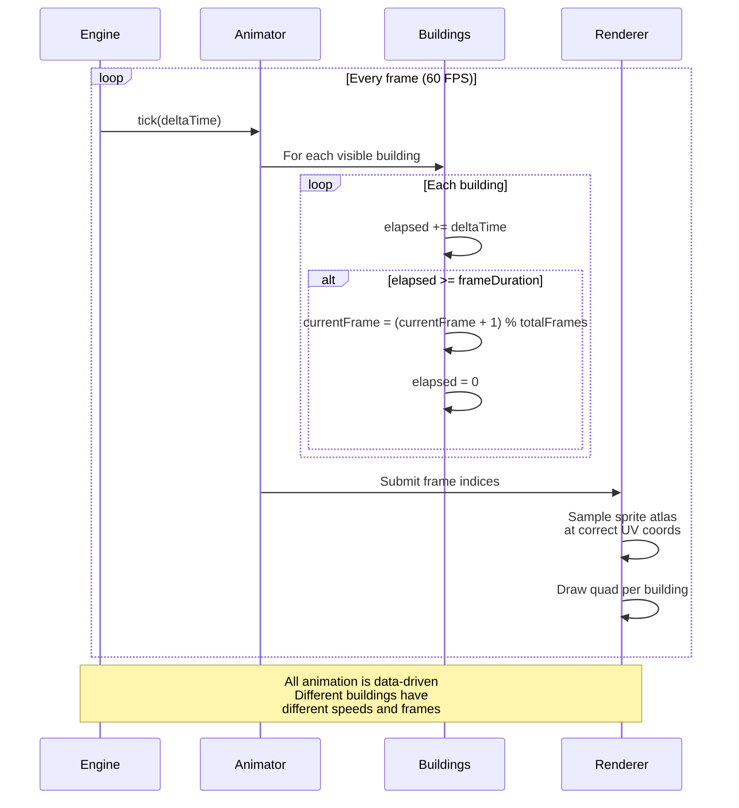

**Buildings have continuously looping idle animations.** Smoke from chimneys, banners waving, water flowing. Animation player updates every frame. Different buildings have different cycle lengths.

## Performance Notes

- One quad per visible building (~10-30 quads per town)
- All sprites in one atlas texture (1 GPU draw call possible)
- Animation state updated CPU-side, rendered GPU-side
- Off-screen buildings skip animation update
