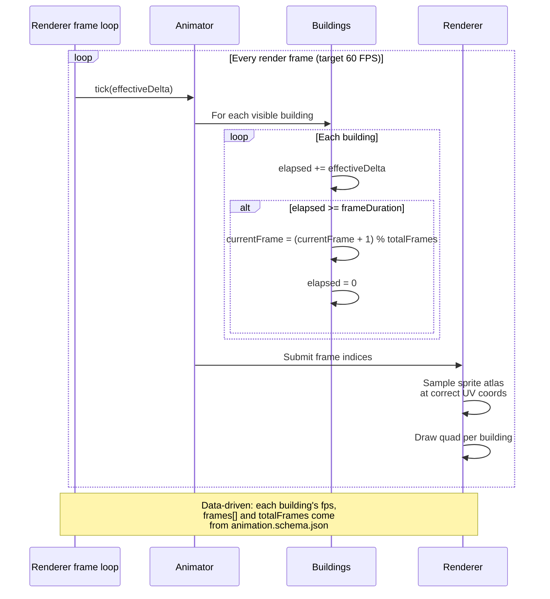

**Renderer-side idle loop for buildings.** Every render frame, the
renderer's frame loop ticks the animator; visible buildings advance
their `currentFrame` against per-sequence `frameDuration`, and the
resulting frame index is sampled into a shared sprite atlas. Off-
screen buildings skip the advance at degradation tier 1 or when the
adventure-map active-animation budget is exceeded. The simulation
engine is not on this path — building idle is presentation-only and
never written to the event log.

Companion docs:

- [`../animation-contract.md`](../animation-contract.md) — two-clock
  model, `deltaTime` clamp, animation-speed multiplier, degradation
  tiers, replay anchor on load.
- [`./06-town-animations.md`](./06-town-animations.md) — building
  body-channel state machine that schedules the `idle` clip looped
  by this diagram.
- [`../performance.md` § 5](../performance.md#5-entity-ceilings) —
  adventure-map active-animation ceilings (≤ 128 on-screen, ≤ 256
  total).
- [`../renderer-technology-choice.md`](../renderer-technology-choice.md)
  — WebGL2 atlas, per-animation budget caps, frame-time tiers.
- [`animation.schema.json`](../../../content-schema/schemas/animation.schema.json)
  — `sequences.<name>.{frames, fps, loop}` that drive `frameDuration`
  and `totalFrames`.

## Notes

- **Clock & speed.** `effectiveDelta = clamp(deltaTime, ≤ 100 ms) ×
  config.ui.animationSpeed` per
  [`../animation-contract.md` § 1](../animation-contract.md#1-two-clock-model).
  A tab pause holds the current frame instead of fast-forwarding;
  `battleSpeed` does not apply outside battle.
- **Per-building cycle length.** Each `sequence` declares its own
  `fps`; `frameDuration = 1 / fps`, `totalFrames = frames.length`.
  Buildings with different `fps` or `frames[]` lengths cycle
  independently — the loop is data-driven, not branched.
- **Determinism boundary.** Building idle dispatches no command and
  is never serialized. On save / replay load, playback resets to
  frame 0 at the last-applied event-log index (per
  [`../animation-contract.md` § 1](../animation-contract.md#1-two-clock-model),
  Replay anchor).

## Performance

- **Quads.** One quad per visible building (~10–30 per town).
- **Batching.** All building sprites share a single atlas page → 1
  GPU draw call per town (per
  [`../renderer-technology-choice.md` § Per-Animation Budget](../renderer-technology-choice.md#per-animation-budget)).
- **CPU / GPU split.** `currentFrame` and `elapsed` update CPU-side
  once per visible building per frame; atlas sampling and quad draw
  happen GPU-side.
- **Off-screen skip.** Off-screen buildings skip the frame-advance
  step under either trigger:
  (a) renderer at degradation tier 1 or worse, per
  [`../animation-contract.md` § 7](../animation-contract.md#7-degradation);
  (b) adventure-map active animations exceed the budget (≤ 128 on-
  screen, ≤ 256 total), per
  [`../performance.md` § 5](../performance.md#5-entity-ceilings).
  Skipping leaves `elapsed` untouched, so when a building becomes
  visible again the next tick resumes from the held frame.

## Related diagrams

- [`./06-town-animations.md`](./06-town-animations.md) — town
  building state machine (`NotBuilt`, `UnderConstruction`, `Idle`,
  `Active`, `Upgraded`, `Damaged`, `Demolishing`).
- [`./21-creature-states.md`](./21-creature-states.md) — sister
  body-channel state machine for battlefield creatures.

---

## 🔍 Sync Check

- **UI: ✔** — Diagram makes no UI-copy claims. Animation-speed and
  reduced-motion bindings flow through `config.ui.animationSpeed` /
  `config.ui.reducedMotion` per
  [`../animation-contract.md` § 1](../animation-contract.md#1-two-clock-model);
  no `wiki/screens/*` surface is asserted here.
- **Schema: ✔** —
  [`animation.schema.json`](../../../content-schema/schemas/animation.schema.json)
  defines `sequences.<name>.{frames, fps, loop}`; the diagram's
  `frameDuration = 1 / fps` and `totalFrames = frames.length`
  derivations match. Building `idle` is the body-channel `idle`
  sequence per
  [`./06-town-animations.md`](./06-town-animations.md). `AnimationSet`
  row resolves in
  [`../schema-matrix.md`](../schema-matrix.md). No building-loop-
  specific schema fields are claimed.
- **Tasks: ⚠** — The off-screen-skip rule is cited as an Acceptance
  Criterion of
  [`tasks/mvp/06-renderer/03-map-renderer-terrain-objects-units-layers.md`](../../../tasks/mvp/06-renderer/03-map-renderer-terrain-objects-units-layers.md)
  (the adventure-map renderer task) and mirrored in
  [`tasks/task-registry.json`](../../../tasks/task-registry.json).
  The renderer-side animation timeline
  ([`tasks/mvp/06-renderer/07-event-log-animation-timeline.md`](../../../tasks/mvp/06-renderer/07-event-log-animation-timeline.md))
  is the runtime owner of the body-channel scheduler that produces
  building `idle`, but does not list this diagram in *Read First*.
  See Issues.

## ⚠ Issues

- **Participant `Engine` relabeled to `Renderer frame loop`.** The
  original mermaid named the per-frame driver `Engine`. In this
  codebase "Engine" specifically denotes the deterministic
  simulation, which per
  [`../animation-contract.md` § 1](../animation-contract.md#1-two-clock-model)
  "Engine reducers do not see `deltaTime` at all" — so the
  `tick(deltaTime)` caller cannot be the engine. The renamed
  participant matches the decoupled-presentation-loop rule pinned
  in
  [`../renderer-technology-choice.md` § DO](../renderer-technology-choice.md#do)
  ("Decouple presentation from simulation step rate"). Conceptual
  flow preserved; no new facts introduced.
- **`tick(deltaTime)` → `tick(effectiveDelta)`.** The original
  passed `deltaTime` raw. The canonical render-side timeline
  driver is
  `effectiveDelta = clamp(deltaTime, ≤ 100 ms) × animationSpeed`
  per
  [`../animation-contract.md` § 1](../animation-contract.md#1-two-clock-model).
  Updated the diagram label so the audit-time reader does not have
  to look up the clamp + multiplier separately.
- **Off-screen-skip framing tightened.** The original said
  "Off-screen buildings skip animation update" without naming the
  trigger. Per
  [`../animation-contract.md` § 7](../animation-contract.md#7-degradation)
  the skip is gated on degradation tier 1+; per
  [`../performance.md` § 5](../performance.md#5-entity-ceilings) it
  is also triggered by the adventure-map ceiling. The Performance
  section now cites both triggers so the rule does not read as
  unconditional. No facts removed.
- **Renderer animation-timeline task does not cite this diagram in
  *Read First*.** A Grep across `tasks/` shows the diagram is
  referenced from
  [`tasks/mvp/06-renderer/03-map-renderer-terrain-objects-units-layers.md`](../../../tasks/mvp/06-renderer/03-map-renderer-terrain-objects-units-layers.md)
  (Acceptance Criteria) and
  [`tasks/task-registry.json`](../../../tasks/task-registry.json),
  but never from a *Read First* block. The animation-timeline task
  ([`tasks/mvp/06-renderer/07-event-log-animation-timeline.md`](../../../tasks/mvp/06-renderer/07-event-log-animation-timeline.md))
  is the runtime owner of the body-channel scheduler that produces
  building `idle`, so the diagram belongs in its *Read First*. Same
  cross-link gap is already flagged in
  [`../animation-contract.md` `## ⚠ Issues`](../animation-contract.md)
  and the sibling animation diagrams; the closing fix is shared.
  Skill did not edit the task file (anti-cheat rule D — never edit
  cross-checked files).
