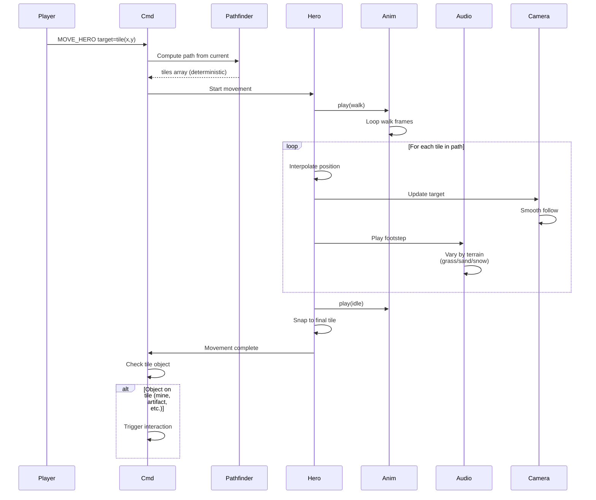

**Hero walks across the map.** When player issues MOVE_HERO, the engine computes the path. Hero plays walk animation while moving along path interpolation. Camera follows. Footstep sounds play.

## Movement Costs

All values are MP-cost ×100 integers (no floats anywhere on the
deterministic path):

- Road: 75
- Grass: 100
- Sand: 150
- Snow: 200
- Swamp: 200
- Water: 9999 (impassable)
- Mountain: 9999 (impassable)

Hero stops if MP runs out. Pathfinding uses these integer costs and
breaks ties on equal-cost paths by axial coord ascending: `q` first,
then `r`. See
[`tasks/mvp/05-adventure-map/03-hero-movement.md`](../../../tasks/mvp/05-adventure-map/03-hero-movement.md)
for the canonical table and tie-break rule.
