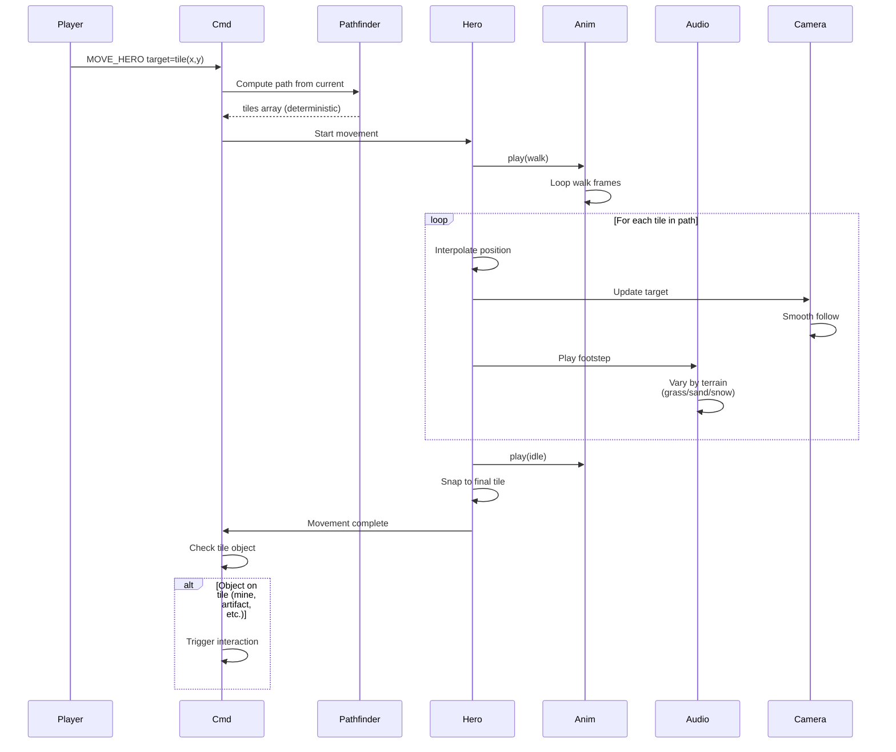

**Hero walks across the map.** When player issues MOVE_HERO, the engine computes the path. Hero plays walk animation while moving along path interpolation. Camera follows. Footstep sounds play.

## Movement Costs

Movement points consumed per tile depend on terrain:
- Road: 0.75 MP
- Grass: 1.0 MP
- Sand: 1.5 MP
- Snow: 2.0 MP
- Swamp: 2.0 MP

Hero stops if MP runs out. Pathfinding uses these costs.
