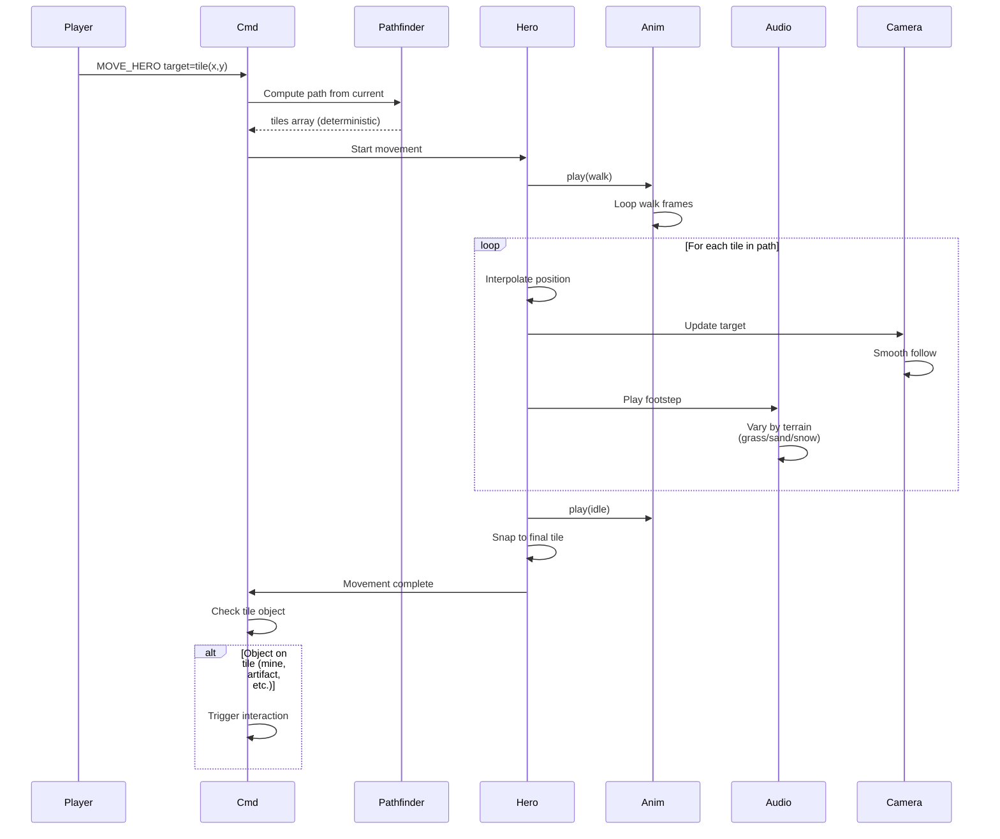

**Hero walks across the map.** The player picks a target hex; the UI
builds the deterministic path, dispatches `MOVE_HERO`, and plays the
walk animation while the hero interpolates tile-to-tile. Camera
follows; footstep sounds vary by terrain. On arrival, the engine
checks the destination tile for an interactable object.

Companion docs:
[`animation-contract.md`](../animation-contract.md) (two-clock model,
degradation),
[`command-schema.md` § MOVE_HERO](../command-schema.md#move_hero)
(canonical command shape),
[`tasks/mvp/05-adventure-map/03-hero-movement.md`](../../../tasks/mvp/05-adventure-map/03-hero-movement.md)
(runtime owner; canonical terrain-cost table and tie-break rule).

## Movement Costs

All values are MP-cost ×100 integers (no floats anywhere on the
deterministic path):

- Road: 75
- Grass: 100
- Sand: 150
- Snow: 200
- Swamp: 200
- Water: 9999 (impassable)
- Mountain: 9999 (impassable)

Hero stops if MP runs out mid-path. Pathfinding uses these integer
costs and breaks ties on equal-cost paths by axial coord ascending:
`q` first, then `r`. The canonical table and tie-break rule live in
[`tasks/mvp/05-adventure-map/03-hero-movement.md`](../../../tasks/mvp/05-adventure-map/03-hero-movement.md)
§ "Determinism contract".

---

## 🔍 Sync Check

- **UI: ✔** — Footstep / walk-anim / camera-follow choreography is
  presentation-only and does not bind to a UI screen contract; no
  drift to flag.
- **Schema: ✔** — `MOVE_HERO` is defined in
  [`command-schema.md`](../command-schema.md#move_hero) with payload
  `{ heroId, path: HexCoord[] }`; the mermaid label `target=tile(x,y)`
  is shown as the player-intent step, not the wire-level command.
- **Tasks: ✔** — Owning runtime task
  [`mvp.05-adventure-map.03-hero-movement`](../../../tasks/mvp/05-adventure-map/03-hero-movement.md)
  references this diagram for the canonical terrain-cost table;
  [`mechanics-coverage.md`](../mechanics-coverage.md) rows 33–34
  point here for "integer ×100" and the q-then-r tie-break.

## ⚠ Issues

- **Mermaid label uses `MOVE_HERO target=tile(x,y)` for the
  player-intent step.** The canonical engine command in
  [`command-schema.md` § MOVE_HERO](../command-schema.md#move_hero)
  carries `{ heroId, path: HexCoord[] }`, not `target`. The diagram
  uses the same name for the player click intent, which can read as
  the wire-level dispatch. Per anti-cheat rule A, the mermaid was
  preserved verbatim to avoid changing intent; a future tightening
  could rename the player edge to `CLICK target=tile(x,y)` and only
  use `MOVE_HERO` on the `Cmd` → engine dispatch edge. No code
  change implied.
- **Road-cost rule conflict inside the task file (not the diagram).**
  This diagram lists `Road: 75` (an absolute cost). The owning task
  [`mvp/05-adventure-map/03-hero-movement.md`](../../../tasks/mvp/05-adventure-map/03-hero-movement.md)
  lists `road: 75` in its JSON cost map *and* states "Roads reduce
  cost by 50 % (final cost = ceil(baseCost / 2))" — these two lines
  together are inconsistent (75 is already a discounted absolute,
  not a multiplier). The diagram is consistent with the task's JSON.
  Per anti-cheat rule D, the skill did not edit the task file;
  surfacing the contradiction so the runtime owner can pick one
  encoding (absolute cost vs. multiplier) and remove the other.
  Suggested fix: keep the absolute `road: 75` and delete the "50 %"
  line in the task's "Worked Example" section.
