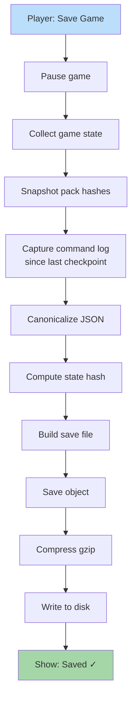

**Save preserves complete game state for replay.** Game state serialized canonically. Pack hashes pinned. Command log included. Save file is small (state + commands, not assets).



## Save File Format

```json
{
  "saveVersion": 1,
  "state": { ... game state ... },
  "packHashes": {
    "baseline-ruleset": "a1b2c3...",
    "emberwild-faction": "d4e5f6..."
  },
  "commandLog": [
    { "kind": "MOVE_HERO", ... },
    { "kind": "RECRUIT_UNITS", ... }
  ],
  "stateHash": "x7y8z9...",
  "metadata": {
    "saveDate": "2026-04-25",
    "playerName": "...",
    "currentDay": 42
  }
}
```

Saves are typically ~50-200 KB compressed (no asset data inside).
