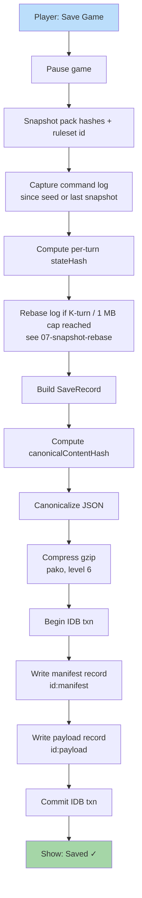

**Save preserves the inputs needed to replay the world, not the world
itself.** A save is **log-only**: metadata + canonical command log
(plus optional verified snapshots). Loading is replay. Pack hashes,
ruleset id, and seed are pinned. Save artifact is small (commands +
metadata, not assets, not state blobs).

> Canonical reference: the on-disk `SaveRecord` shape is owned by
> [`tasks/mvp/08-persistence/02-log-only-save-format.md`](../../../tasks/mvp/08-persistence/02-log-only-save-format.md).
> If this diagram and that task disagree, the task wins.



## Save Record Format

The on-disk shape is the canonical `SaveRecord` from
[`02-log-only-save-format.md`](../../../tasks/mvp/08-persistence/02-log-only-save-format.md).
The example below mirrors that shape — there is **no `state` blob**;
loading replays the log (optionally hydrating from the latest verified
snapshot) to reconstruct state.

```json
{
  "saveVersion": 1,
  "intent": "save",
  "id": "5b5f0e6e-…",
  "name": "Castle Run",
  "createdAt": 1714050000000,
  "savedAt": 1714053600000,
  "seed": "0xC0FFEE",
  "rulesetId": "baseline-ruleset",
  "contentPackHashes": ["a1b2c3…", "d4e5f6…"],
  "turnNumber": 14,
  "commandLog": [
    { "kind": "MOVE_HERO", "…": "…" },
    { "kind": "RECRUIT_UNITS", "…": "…" }
  ],
  "checkpoints": [
    { "logIndex": 1240, "stateHash": "x7y8z9…", "snapshot": "…optional…" }
  ],
  "stateHash": "x7y8z9…",
  "canonicalContentHash": "h0h1h2…"
}
```

A save is **typically < 50 KB compressed for a 7-day game**; the
worst-case cap is **1 MB compressed** enforced by the snapshot-rebase
policy ([`07-snapshot-rebase.md`](../../../tasks/mvp/08-persistence/07-snapshot-rebase.md)).
A save that would exceed the cap forces a rebase or surfaces a
"save too large — start a new chapter?" dialog.

## Atomicity

Manifest and payload are written **inside one IndexedDB transaction**
under sibling keys `${id}:manifest` and `${id}:payload`
([`01-indexeddb-wrapper.md`](../../../tasks/mvp/08-persistence/01-indexeddb-wrapper.md) §
"Atomic save transaction"). On commit, both appear; on abort, neither
does. Autosave additionally uses a verify-then-swap shadow key
(`${slot}.tmp`) so a tab kill mid-rotation cannot poison a live slot.

## Pre-Decompression Caps (Imports)

When a save is being **imported** (not created locally), the
importer enforces size, decompression-ratio, and wall-time caps
**before** the gzip step above. The caps and failure copy are pinned
in [`pack-trust.md` § Resource Limits](../pack-trust.md#1-resource-limits);
the pre-validate ordering (size → ratio → schema validate →
quarantine) lives in
[`25-load-flow.md`](./25-load-flow.md) and is the canonical
import contract. The exportable shape is also pinned by
[`save.schema.json`](../../../content-schema/schemas/save.schema.json),
with `minRuntimeSaveVersion` / `maxRuntimeSaveVersion` driving the
"reject newer / older without migration" terminals.
