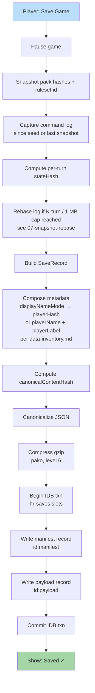

**Save preserves the inputs needed to replay the world, not the world
itself.** A save is **log-only**: metadata + canonical command log
(plus optional verified snapshots). Loading is replay. Pack hashes,
ruleset id, and seed are pinned. Save artifact is small (commands +
metadata, not assets, not state blobs).

> Canonical reference: the on-disk `SaveRecord` shape is owned by
> [`tasks/mvp/08-persistence/02-log-only-save-format.md`](../../../tasks/mvp/08-persistence/02-log-only-save-format.md).
> If this diagram and that task disagree, the task wins.



## Save Record Format

The on-disk shape is the canonical `SaveRecord` from
[`02-log-only-save-format.md`](../../../tasks/mvp/08-persistence/02-log-only-save-format.md).
The example below mirrors that shape — there is **no `state` blob**;
loading replays the log (optionally hydrating from the latest verified
snapshot) to reconstruct state.

```json
{
  "saveVersion": 1,
  "intent": "save",
  "id": "5b5f0e6e-…",
  "name": "Castle Run",
  "createdAt": 1714050000000,
  "savedAt": 1714053600000,
  "seed": "0xC0FFEE",
  "rulesetId": "baseline-ruleset",
  "contentPackHashes": ["a1b2c3…", "d4e5f6…"],
  "turnNumber": 14,
  "commandLog": [
    { "kind": "MOVE_HERO", "…": "…" },
    { "kind": "RECRUIT_UNITS", "…": "…" }
  ],
  "checkpoints": [
    { "logIndex": 1240, "stateHash": "x7y8z9…", "snapshot": "…optional…" }
  ],
  "stateHash": "x7y8z9…",
  "canonicalContentHash": "h0h1h2…"
}
```

A save is **typically < 50 KB compressed for a 7-day game**; the
worst-case cap is **1 MB compressed** enforced by the snapshot-rebase
policy ([`07-snapshot-rebase.md`](../../../tasks/mvp/08-persistence/07-snapshot-rebase.md)).
A save that would exceed the cap forces a rebase or surfaces a
"save too large — start a new chapter?" dialog.

## Atomicity

Manifest and payload are written **inside one IndexedDB transaction**
under sibling keys `${id}:manifest` and `${id}:payload`
([`01-indexeddb-wrapper.md`](../../../tasks/mvp/08-persistence/01-indexeddb-wrapper.md) §
"Atomic save transaction"). On commit, both appear; on abort, neither
does. Autosave additionally uses a verify-then-swap shadow key
(`${slot}.tmp`) so a tab kill mid-rotation cannot poison a live slot.

## Replay Export Sanitization

When a save is **exported** (crosses a peer / account boundary as a
shareable replay), an additional sanitizer runs after the canonical
JSON step and before the gzip step:

```text
serialize → canonical JSON
        ↓
   replay-export sanitizer
        ↓
        gzip
```

The sanitizer:

1. Reads `state.privacy.replayShareConsent.mode` (default
   `playerHashOnly`; declared in
   [`state-flow.md` § Privacy Slice](../state-flow.md#privacy-slice)).
2. Replaces `metadata.playerName` and every
   `state.players.byId.*.displayName` with the corresponding
   `playerHash` if `playerHashOnly`.
3. Surfaces a confirmation modal listing every PII field that
   *will* travel and a per-field "include / redact" toggle. The
   user must explicitly choose `playerNameCleartext` to ship raw
   names.
4. Routes the command log through the desync redactor declared in
   [`desync-redaction.md`](../desync-redaction.md) when
   `state.privacy.options.displayNameMode === 'hashed'`: hidden
   fields are replaced with their truncated hash + length-class
   label.
5. Writes a row to the local audit-log
   ([`audit-log-entry.schema.json`](../../../content-schema/schemas/audit-log-entry.schema.json))
   with `type: 'REPLAY_EXPORT'`, the chosen `mode`, and the
   digest of the exported file.

The save-import side does **not** un-redact; once a hash
leaves, it stays a hash.

## Pre-Decompression Caps (Imports)

When a save is being **imported** (not created locally), the
importer enforces size, decompression-ratio, and wall-time caps
**before** the gzip step above. The caps and failure copy are pinned
in [`pack-trust.md` § Resource Limits](../pack-trust.md#1-resource-limits);
the pre-validate ordering (size → ratio → schema validate →
quarantine) lives in
[`25-load-flow.md`](./25-load-flow.md) and is the canonical
import contract. The exportable shape is also pinned by
[`save.schema.json`](../../../content-schema/schemas/save.schema.json),
with `minRuntimeSaveVersion` / `maxRuntimeSaveVersion` driving the
"reject newer / older without migration" terminals.

---

## 🔍 Sync Check

- **UI: ✔** — The "Saved ✓" terminal, the "save too large — start a new chapter?" dialog, and the Replay-Export confirmation modal listing per-field include/redact toggles all defer to consumer specs ([`56-options`](../wiki/screens/56-options/), [`70-save-import`](../wiki/screens/70-save-import/)) without inventing copy here.
- **Schema: ⚠** — Two distinct `SaveRecord` shapes coexist: the **runtime** record (this diagram's example, matching [`02-log-only-save-format.md`](../../../tasks/mvp/08-persistence/02-log-only-save-format.md) — `contentPackHashes: string[]`, `canonicalContentHash`, `intent`, `checkpoints[]`) and the **exportable** record pinned by [`save.schema.json`](../../../content-schema/schemas/save.schema.json) (`packHashes: { id, version, contentHash }[]`, `engineHash`, `metadata.{playerHash,playerName,playerLabel,displayNameMode}`, no `intent`). Both are intentional; the diagram only shows the runtime side. Step 4 of the sanitizer was rewritten from `displayNameMode: 'hash'` to `displayNameMode === 'hashed'` to match the closed enum `["clear", "hashed"]` in [`save.schema.json`](../../../content-schema/schemas/save.schema.json) and [`privacy-options.schema.json`](../../../content-schema/schemas/privacy-options.schema.json) (snapshot in [`enums.snapshot.json`](../../../content-schema/enums.snapshot.json)). Detail in `## ⚠ Issues`.
- **Tasks: ✔** — Owning runtime task [`mvp.08-persistence.02-log-only-save-format`](../../../tasks/mvp/08-persistence/02-log-only-save-format.md) lists this diagram, and the sanitizer / hash steps line up with [`mvp.08-persistence.13-display-name-hash-and-salt`](../../../tasks/mvp/08-persistence/13-display-name-hash-and-salt.md). The diagram is named in [`scripts/check-diagram-task-parity.mjs`](../../../scripts/check-diagram-task-parity.mjs) so the log-only invariant is CI-asserted; no orphan tasks reference it without reciprocal mention.

## ⚠ Issues

- **Sibling drift: `desync-redaction.md` § 6 still uses `displayNameMode: 'hash'`.** Step 4 of the sanitizer here was rewritten to `'hashed'` to match the schema enum, but [`desync-redaction.md` § 6 Replay export reuse](../desync-redaction.md#6-replay-export-reuse) still cites the literal `'hash'` (it already flags the drift in its own Issues block). Per CLAUDE.md ("Stable IDs are public API"), the schema is canonical. Suggested fix: rename to `'hashed'` in `desync-redaction.md` § 6 in the same PR so the two arch docs land in lock-step. Surfaced rather than rewritten unilaterally (Hard Prohibition D — never edit cross-checked files).
- **Runtime vs exportable `SaveRecord` field-name skew.** The runtime record (`contentPackHashes: string[]`, top-level `canonicalContentHash`, `intent`) and the exportable record in [`save.schema.json`](../../../content-schema/schemas/save.schema.json) (`packHashes: { id, version, contentHash }[]`, `engineHash`, `metadata.*`) use different field names for overlapping concepts. Per CLAUDE.md ("Schema evolution is additive-first; alias before remove"), one of the two should be aliased or the projection from runtime → export should be pinned in a single place. Not a CI-blocking gap (both shapes have owning tasks: `02-log-only-save-format.md` for runtime, `mvp.02-content-schemas.28-save-schema.md` for export), but the absence of a written projection invites future drift. Suggested fix: add a "Runtime → Export projection" subsection to [`02-log-only-save-format.md`](../../../tasks/mvp/08-persistence/02-log-only-save-format.md) listing the field-name mapping. Surfaced rather than added here (Hard Prohibition B — never invent features).
