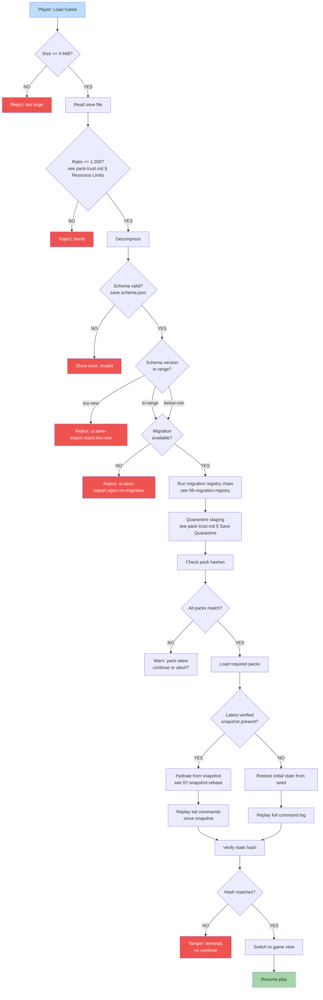

**Load reconstructs the world by replay.** Verify referenced packs
match their pinned hashes, hydrate from the latest verified snapshot
(else seed), replay the tail, then verify the resulting `stateHash`
before resuming play.

## Step Ownership

| Step | Canonical owner |
| --- | --- |
| Size + ratio pre-checks (first two caps of `SAVE_LIMITS`) | [`parser-hardening.md`](../parser-hardening.md); user-facing keys in [`pack-trust.md` § 1 Resource Limits](../pack-trust.md#1-resource-limits) |
| Schema validate + version-bound terminals (`too-new`, `no-migration`) and tamper terminal | [`pack-trust.md` § 3 Save Version Bounds](../pack-trust.md#3-save-version-bounds) |
| Migration registry chain (`MigA`) | task [`08-migration-registry`](../../../tasks/mvp/08-persistence/08-migration-registry.md) |
| Quarantine staging (`Q1`) | [`pack-trust.md` § 2 Save Quarantine](../pack-trust.md#2-save-quarantine) |
| Pack-hash gate → `skew` vs. `tamper` discriminated union | [`pack-trust.md` § 3](../pack-trust.md#3-save-version-bounds) |
| Snapshot hydrate (`J1`) + tail replay | task [`07-snapshot-rebase`](../../../tasks/mvp/08-persistence/07-snapshot-rebase.md) |
| Pre-replay command-log validation (between `MigA`/pack-hash gate and `K`/`K2`) | task [`17-pre-replay-command-validation`](../../../tasks/mvp/08-persistence/17-pre-replay-command-validation.md) |

Compatibility is reported as a discriminated union
(`ok | skew | tamper | unsupported`); screen
[`55-save-load`](../wiki/screens/55-save-load/) and screen
[`70-save-import`](../wiki/screens/70-save-import/) surface `skew`
vs. `tamper` distinctly. The full table of parser caps
(`maxCompressedBytes`, `maxUncompressedBytes`,
`maxDecompressionRatio`, `maxDepth`, `maxStringLength`,
`maxArrayLength`, `maxObjectKeys`, `maxNumericMagnitude`) and the
closed rejection vocabulary (`OVER_COMPRESSED`, `OVER_RATIO`,
`OVER_DEPTH`, …) are pinned in
[`parser-hardening.md`](../parser-hardening.md); the size and ratio
nodes in this diagram are the first two caps from that table.
Pre-replay command-log validation runs between the migration chain
and the reducer replay so a malformed command surfaces at a clean
rejection point with full context, not mid-replay.

## Why Replay Commands?

Saving the full game state is large and brittle. Instead:

1. Save initial scenario state (small).
2. Save the command log (compact, deterministic).
3. Optionally save verified snapshots every K turns / M commands.
4. On load: hydrate from the latest verified snapshot if present
   (else from seed) and replay the tail.
5. Verify the resulting `stateHash` matches → proves no tampering
   or pack drift.

This makes saves small AND tamper-evident. The contract:

> Replay from `(snapshot, log_since_snapshot)` is **bit-identical**
> to replay from `(seed, full_log)` for any verified snapshot.

See
[`tasks/mvp/08-persistence/07-snapshot-rebase.md`](../../../tasks/mvp/08-persistence/07-snapshot-rebase.md)
for the rebase semantics and the 1 MB compressed cap, and
[`tasks/mvp/08-persistence/08-migration-registry.md`](../../../tasks/mvp/08-persistence/08-migration-registry.md)
for the schema migration step that runs before the pack-hash gate.

---

## 🔍 Sync Check

- **UI: ✔** — Rejection keys `ui.save-import.reject.too-new` and
  `ui.save-import.reject.no-migration` match
  [`wiki/screens/70-save-import/data-contracts.md`](../wiki/screens/70-save-import/data-contracts.md)
  and
  [`wiki/screens/70-save-import/interactions.md`](../wiki/screens/70-save-import/interactions.md);
  `skew` vs. `tamper` distinction surfaces via the same screen and
  [`55-save-load`](../wiki/screens/55-save-load/data-contracts.md).
  Pack-skew warning copy is pinned in [`pack-trust.md` § 3](../pack-trust.md#3-save-version-bounds).
- **Schema: ✔** — Version-bound fields (`saveVersion`,
  `minRuntimeSaveVersion`, `maxRuntimeSaveVersion`), `packHashes`,
  `stateHash`, and the version-bound terminals match
  [`save.schema.json`](../../../content-schema/schemas/save.schema.json);
  parser caps + rejection vocabulary match
  [`parser-hardening.md`](../parser-hardening.md).
- **Tasks: ✔** — This diagram is named in Read First by
  [`07-snapshot-rebase`](../../../tasks/mvp/08-persistence/07-snapshot-rebase.md),
  [`10-save-schema-and-validator`](../../../tasks/mvp/08-persistence/10-save-schema-and-validator.md),
  [`16-parser-hardening`](../../../tasks/mvp/08-persistence/16-parser-hardening.md),
  [`17-pre-replay-command-validation`](../../../tasks/mvp/08-persistence/17-pre-replay-command-validation.md),
  and
  [`28-save-schema`](../../../tasks/mvp/02-content-schemas/28-save-schema.md);
  `tasks/task-registry.json` has matching entries.

## ⚠ Issues

- **`Show error: invalid` terminal has no canonical localization
  key.** The `D{Schema valid?} -->|NO| E[Show error: invalid]`
  branch surfaces a generic placeholder, but
  [`pack-trust.md` § 10 Error Codes](../pack-trust.md#10-error-codes)
  lists every other save-import reject (`too-large`, `too-new`,
  `no-migration`, `bomb`, `timeout`, `safe-mode-blocks-pack`,
  `tamper`) without a `ui.save-import.reject.schema-invalid` key.
  Non-blocking — `pack-trust.md` is the canonical user-facing
  vocabulary surface, so the gap is in that doc, not here. Per
  CLAUDE.md ("Stable IDs are public API"), the owning task
  [`tasks/mvp/08-persistence/11-save-import-screen-and-quarantine.md`](../../../tasks/mvp/08-persistence/11-save-import-screen-and-quarantine.md)
  should add a `ui.save-import.reject.schema-invalid` row to
  `pack-trust.md` § 10 and screen 70's data-contracts. Suggested
  value: `ui.save-import.reject.schema-invalid` (terminal, no
  click-through). Skill did not edit `pack-trust.md` or screen 70
  (Hard Prohibition D).
- **Pre-replay command-log validation step has no node in the
  Mermaid diagram.** The prose above states the step runs between
  the migration chain and the reducer, and task
  [`17-pre-replay-command-validation`](../../../tasks/mvp/08-persistence/17-pre-replay-command-validation.md)
  pins it "immediately after the pack-hash gate succeeds and before
  the reducer is invoked." The flowchart jumps from `I[Load
  required packs]` / `J1`/`J2` straight to `K`/`K2` (replay) with
  no validation node. Adding a node would alter the visualization;
  surfaced here per Hard Prohibition B rather than added
  unilaterally. The owning task (17) — or a follow-up doc-only PR —
  can add a `Vcmd{commandLog valid?}` node between the pack-hash
  gate and the snapshot fork to make the contract visible.
- **`Mig -->|NO|` reads as terminal but the schema-version `Vrange`
  fork can route here from both `too-new` and `below-min`.** The
  current edges send `too-new` straight to `Vnew` (terminal,
  correct) and both `in-range` and `below-min` into the `Mig?`
  gate; the `Mig` gate then surfaces `no-migration` for the
  `below-min` path. The `in-range` path falls into `Mig?` as well,
  which is technically harmless (a no-op migrator at the current
  version satisfies `Mig = YES` per
  [`08-migration-registry`](../../../tasks/mvp/08-persistence/08-migration-registry.md)
  "v1 no-op migrator exists in the registry so the wiring is
  exercised") but obscures the contract. Non-blocking; flagged so
  a future audit can fold the `in-range` edge directly to `MigA`
  or annotate the no-op pass.
