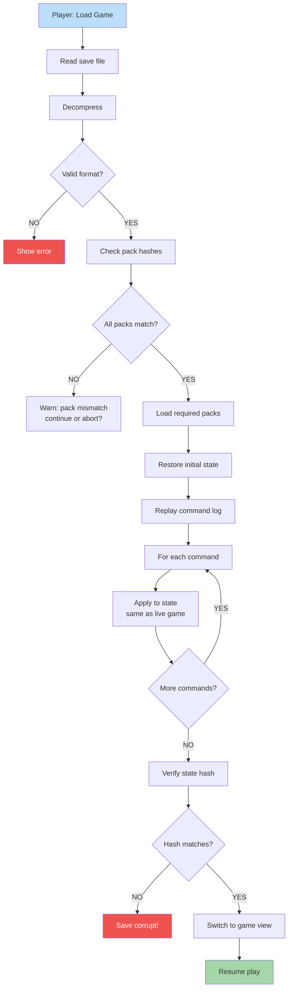

**Load reconstructs the world.** Verify all referenced packs exist with same hashes. Load assets. Replay commands from save. Verify state hash matches. Resume play.

## Why Replay Commands?

Saving the full game state is large and brittle. Instead:

1. Save initial scenario state (small)
2. Save command log (compact, deterministic)
3. On load: replay commands to reach current state
4. Verify hash matches → proves no tampering or pack drift

This makes saves small AND tamper-evident.
