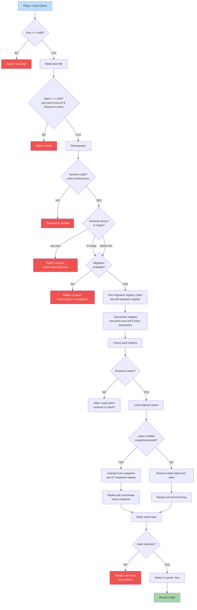

**Load reconstructs the world by replay.** Verify all referenced packs
exist with same hashes. Load assets. Hydrate from the latest verified
snapshot if present, otherwise from seed. Replay commands from the
snapshot or seed. Verify state hash matches. Resume play.

The size and ratio pre-checks, the four schema-validate terminals
(`schema_invalid`, `too-new`, `no-migration`, `tamper`), and the
quarantine staging step are all owned by
[`pack-trust.md`](../pack-trust.md). The full table of parser caps
(`maxCompressedBytes`, `maxUncompressedBytes`,
`maxDecompressionRatio`, `maxDepth`, `maxStringLength`,
`maxArrayLength`, `maxObjectKeys`, `maxNumericMagnitude`) and the
closed rejection vocabulary (`OVER_COMPRESSED`, `OVER_RATIO`,
`OVER_DEPTH`, ...) are pinned in
[`parser-hardening.md`](../parser-hardening.md); the size and ratio
nodes in this diagram are the first two caps from that table.
Compatibility is reported as a discriminated union
(`ok | skew | tamper | unsupported`) so screen 55 and screen 70
surface skew vs. tamper distinctly. Pre-replay command-log
validation (per Plan 27 Critical Fix 3) runs between the migration
chain and the reducer replay so a malformed command surfaces at a
clean rejection point with full context, not mid-replay.

## Why Replay Commands?

Saving the full game state is large and brittle. Instead:

1. Save initial scenario state (small)
2. Save command log (compact, deterministic)
3. Optionally save verified snapshots every K turns / M commands
4. On load: hydrate from the latest verified snapshot if present
   (else from seed) and replay the tail
5. Verify hash matches → proves no tampering or pack drift

This makes saves small AND tamper-evident. The contract:

> Replay from `(snapshot, log_since_snapshot)` is **bit-identical**
> to replay from `(seed, full_log)` for any verified snapshot.

See
[`tasks/mvp/08-persistence/07-snapshot-rebase.md`](../../../tasks/mvp/08-persistence/07-snapshot-rebase.md)
for the rebase semantics and the 1 MB compressed cap, and
[`tasks/mvp/08-persistence/08-migration-registry.md`](../../../tasks/mvp/08-persistence/08-migration-registry.md)
for the schema migration step that runs before the pack-hash gate.
