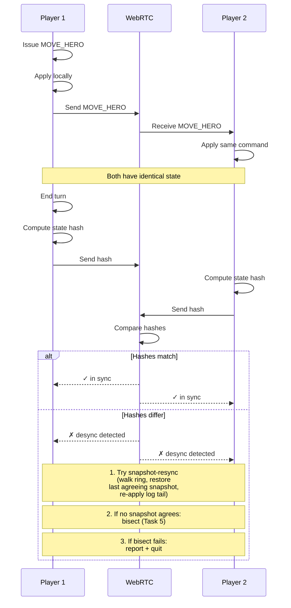

**Two players share deterministic state over WebRTC.** Each peer
dispatches every command locally; identical seed + identical
commands = identical state. End-of-turn state-hash exchange detects
divergence; recovery is a three-step ladder.

## Determinism Requirements

Both peers MUST:

- Pin the same pack and engine builds; `contentHash` and
  `engineHash` are mutually verified at handshake.
- Derive the shared seed from the three-phase commit-reveal
  handshake in
  [`match-handshake.md`](../match-handshake.md). The
  host-unilateral path is forbidden in multiplayer (see
  [`determinism.md` § Seed Establishment Protocol — Multiplayer](../determinism.md#seed-establishment-protocol--multiplayer)).
- Apply commands in canonical intra-turn order
  `(turn ↑, playerId lex ↑, seq ↑)`, keyed by `(playerId, seq)` —
  see
  [`determinism.md` § Canonical Command Key](../determinism.md#canonical-command-key).
- Use fixed-point integer math; JavaScript floats are forbidden in
  the deterministic core (see
  [`determinism.md` § Forbidden In Deterministic Paths](../determinism.md#forbidden-in-deterministic-paths)).

Wall-clock readings are forbidden inside `state.*`. Synchronized
clocks are not required because nothing in the canonical state
reads one — see
[`determinism.md` § Clock Policy](../determinism.md#clock-policy).

## Recovery Flow

`DESYNC_DETECTED` does not abort the match by default. The recovery
state machine is owned by
[Task 4](../../../tasks/phase-3/01-multiplayer/04-per-turn-hash-exchange-plus-desync-detection.md)
and runs as a three-step ladder:

1. **Snapshot-resync** — peers exchange a compact
   `(seqOffset, stateHash)` digest of the in-memory snapshot ring
   (last 5 snapshots, taken every 20 turns) and restore the newest
   `seqOffset` whose `stateHash` agrees on both sides, then re-apply
   commands from `seqOffset + 1`. Pinned in
   [`determinism.md` § Snapshot Cadence and Resync](../determinism.md#snapshot-cadence-and-resync);
   implemented by
   [Task 9](../../../tasks/phase-3/01-multiplayer/09-snapshot-resync-fallback.md).
2. **Bisect** — if no snapshot agrees, fall through to
   [Task 5](../../../tasks/phase-3/01-multiplayer/05-auto-bisect-on-hash-mismatch.md)'s
   binary search to locate the first diverging command for a
   filed-ready bug report.
3. **Report + quit** — if bisect cannot recover, hand the player
   the desync report.

---

## 🔍 Sync Check

- **UI: ✔** — Diagram-only file; no screen-spec copy strings asserted.
- **Schema: ✔** — `MOVE_HERO` matches [`command-schema.md`](../command-schema.md) (line 74, registry row line 831); snapshot artifact shape `{ seqOffset, turn, contentHash, engineHash, canonicalState, stateHash }` matches the contract pinned in [`determinism.md` § Snapshot Cadence and Resync](../determinism.md#snapshot-cadence-and-resync) and the Outputs block of [Task 9](../../../tasks/phase-3/01-multiplayer/09-snapshot-resync-fallback.md).
- **Tasks: ✔** — Both linked tasks exist; [Task 9](../../../tasks/phase-3/01-multiplayer/09-snapshot-resync-fallback.md) Read First and [Task 4](../../../tasks/phase-3/01-multiplayer/04-per-turn-hash-exchange-plus-desync-detection.md) Description cite this diagram and the same three-step ladder; `index.json` registers `26-multiplayer-sync` under category `multiplayer`.

## ⚠ Issues

- **Legacy "seed provided by host" claim corrected inline.** The previous bullet asserted "Use the same RNG seed (provided by host)", which contradicts [`determinism.md` § Seed Establishment Protocol — Multiplayer](../determinism.md#seed-establishment-protocol--multiplayer) ("the host-unilateral path is forbidden in multiplayer; both peers contribute equal entropy"). Rewrote to cite the three-phase commit-reveal handshake in [`match-handshake.md`](../match-handshake.md). Same pattern as the already-remediated "synchronized clocks" legacy note that [`determinism.md` § Clock Policy](../determinism.md#clock-policy) explicitly flagged in this file. No code change implied — the determinism doc and the handshake task were already canonical.
