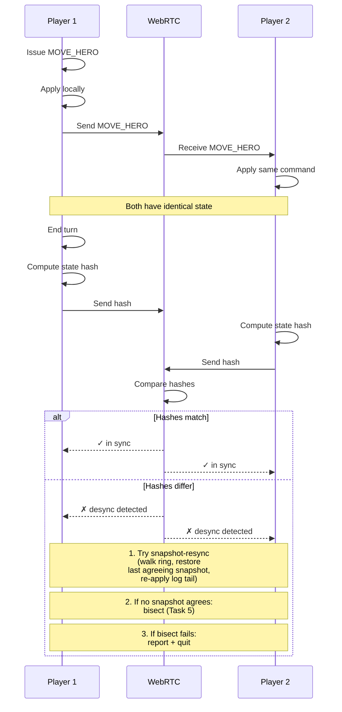

**Two players share deterministic state.** WebRTC peer connection. Each player sends commands, both apply locally. Identical seeds + commands = identical state. Hash check after each turn detects desync.

## Determinism Requirements

For multiplayer to work, both clients MUST:

- Use the same pack versions (verified by content hash)
- Use the same RNG seed (provided by host)
- Apply commands in the same order
- Use deterministic floating-point math (or fixed-point integers)

Wall-clock readings are forbidden in the deterministic slice — see
[`docs/architecture/determinism.md` § Clock Policy](../determinism.md#clock-policy).
Synchronized clocks are not required because nothing in `state.*`
reads one.

## Recovery Flow

`DESYNC_DETECTED` does not abort the match by default. Recovery
runs as a three-step ladder:

1. **Snapshot-resync** — both peers exchange a compact
   `(seqOffset, stateHash)` digest of the in-memory snapshot ring
   (last 5 snapshots, taken every 20 turns) and restore the newest
   offset whose hash agrees on both sides. Defined in
   [`docs/architecture/determinism.md` § Snapshot Cadence and Resync](../determinism.md#snapshot-cadence-and-resync)
   and implemented by [Task 9](../../../tasks/phase-3/01-multiplayer/09-snapshot-resync-fallback.md).
2. **Bisect** — if no snapshot agrees, fall through to
   [Task 5](../../../tasks/phase-3/01-multiplayer/05-auto-bisect-on-hash-mismatch.md)'s
   binary search to find the first diverging command for a bug
   report.
3. **Report + quit** — if bisect cannot recover, hand the player a
   filed-ready desync report.
