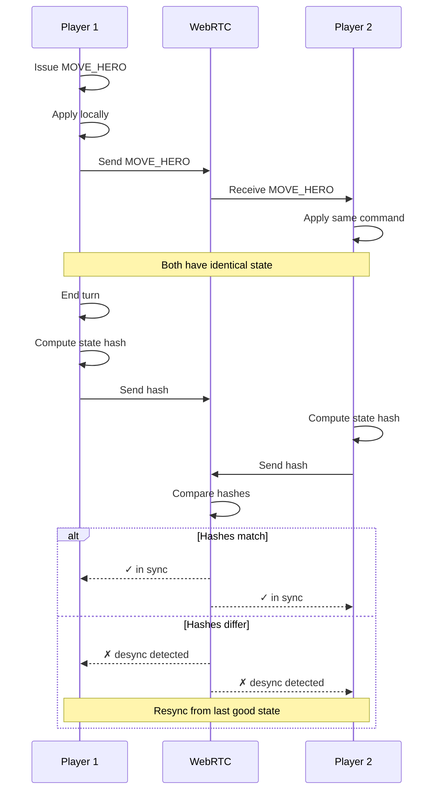

**Two players share deterministic state.** WebRTC peer connection. Each player sends commands, both apply locally. Identical seeds + commands = identical state. Hash check after each turn detects desync.

## Determinism Requirements

For multiplayer to work, both clients MUST:

- Use the same pack versions (verified by content hash)
- Use the same RNG seed (provided by host)
- Apply commands in the same order
- Use deterministic floating-point math (or fixed-point integers)
- Have synchronized clocks (for timestamps)

Any divergence is detected by hash comparison and triggers resync.
