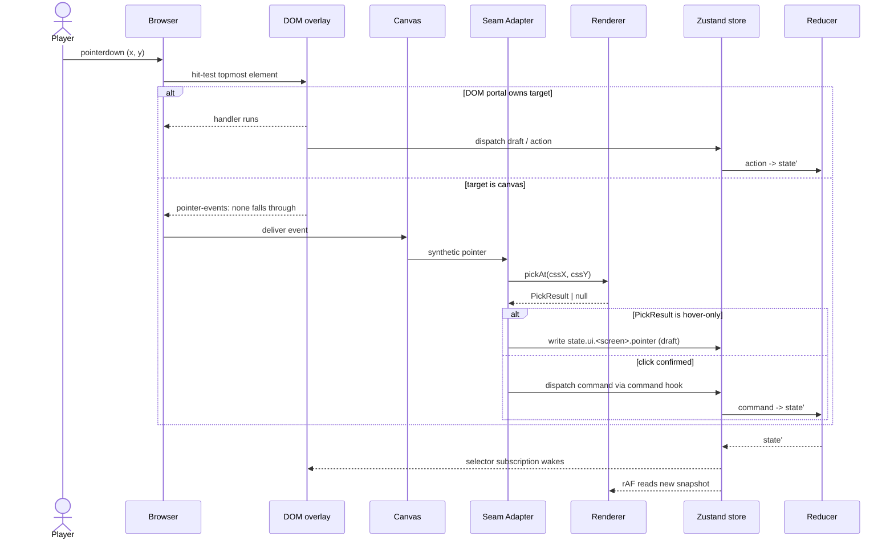

**Where a click goes.** The browser hit-tests DOM first; if the topmost
target is the canvas, the renderer's `pickAt` runs and the result
flows into the store as either a draft hover or a dispatched command.
Pinned in [`ui-renderer-seam.md`](../ui-renderer-seam.md).

## Rules

- DOM-first resolution. `pointer-events: none` is the only way the
  canvas sees an event under a DOM overlay.
- `pickAt` is read-only and synchronous. It is called from event
  handlers, never from React render bodies.
- Hover state is a **draft**. It lives under `state.ui.<screen>.*` and
  is never replayed or hashed.
- Confirmed clicks dispatch a command. The reducer is the only path
  that mutates authoritative state.

## Related diagrams

- [08 — Building Click → Action Flow](./08-building-click.md)
- [27 — Component Resolution](./27-component-resolution.md)
