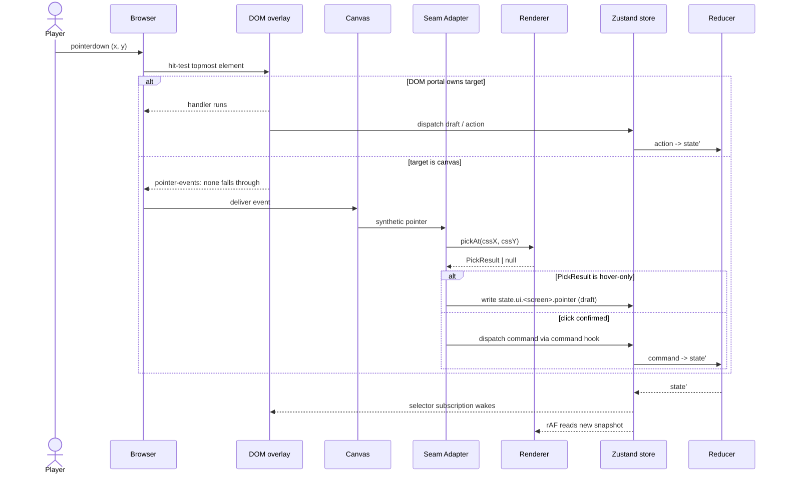

**Where a click goes.** The browser hit-tests DOM first; if the topmost
target is the canvas, the renderer's `pickAt` runs and the result
flows into the store as either a draft hover or a dispatched command.
Pinned in
[`ui-renderer-seam.md` § 2 Input Routing](../ui-renderer-seam.md#2-input-routing).

## Rules

- **DOM-first resolution.** A higher DOM layer wins by z-order;
  `pointer-events: none` is the only way the canvas sees an event
  under a DOM overlay
  ([seam § 2 Resolution Order](../ui-renderer-seam.md#2-input-routing)).
- **`pickAt` is read-only and synchronous.** Call it from event
  handlers, never from React render bodies (seam § 2 Anti-Patterns).
- **Hover state is a draft.** It lives under `state.ui.<screen>.*`,
  is session-only, and is excluded from the canonical hash per
  [`ui-frame-lag-contract.md` § 2 Optimistic UI](../ui-frame-lag-contract.md#2-optimistic-ui).
- **Confirmed clicks dispatch a command via the
  [command hook](../ui-technology-choice.md).** The reducer is the
  only path that mutates authoritative state.

## Related diagrams

- [08 — Building Click → Action Flow](./08-building-click.md)
- [27 — Component Resolution](./27-component-resolution.md)
- [29 — Input Arbitration](./29-input-arbitration.md)

---

## 🔍 Sync Check

- **UI: ✔** — DOM-first resolution, `pointer-events: none` fall-through, the synthetic-pointer draft, and `pickAt(cssX, cssY) → PickResult | null` all match [`ui-renderer-seam.md` § 2 Input Routing](../ui-renderer-seam.md#2-input-routing). Sibling diagrams [08](./08-building-click.md) (downstream click→command), [27](./27-component-resolution.md), and [29](./29-input-arbitration.md) reference this diagram reciprocally.
- **Schema: ✔** — `pickAt`, `PickResult`, and the `state.ui.<screen>.pointer` draft are runtime-only surfaces with no schema row; drafts are excluded from the canonical hash per [`ui-frame-lag-contract.md` § 2](../ui-frame-lag-contract.md#2-optimistic-ui) and owe no [`data-inventory.md`](../data-inventory.md) row. No commands are named here, so no [`command-schema.md`](../command-schema.md) entry is owed.
- **Tasks: ✔** — Implementation is owned by [`tasks/mvp/06-renderer/01-webgl2-context-setup-plus-resize-handler.md`](../../../tasks/mvp/06-renderer/01-webgl2-context-setup-plus-resize-handler.md) and [`tasks/mvp/07-ui-shell/01-react-18-app-shell-with-canvas-overlay.md`](../../../tasks/mvp/07-ui-shell/01-react-18-app-shell-with-canvas-overlay.md), both of which cite `ui-renderer-seam.md` in Read First. Diagrams are normatively secondary per [README § Normative Status](./README.md#normative-status); no task references this diagram directly, which is consistent with that policy.

## ⚠ Issues

- **Reciprocal link to diagram 29 added.** [`29-input-arbitration.md`](./29-input-arbitration.md) lists this diagram in its *Related diagrams* but the reverse link was missing. Add-only operation per § 9 Hard Prohibition C; no claim changed.
- **Possible drift between two upstream arch docs on draft path (not this diagram's to resolve).** [`ui-renderer-seam.md` § 2 Synthetic Events](../ui-renderer-seam.md#2-input-routing) shows the pointer draft as `state.ui.adventure.pointer`, while [`ui-frame-lag-contract.md` § 2](../ui-frame-lag-contract.md#2-optimistic-ui) declares drafts live under `state.ui.<screen>.draft.*`. This diagram quotes the seam parent verbatim (`state.ui.<screen>.pointer`), so it stays consistent with its pin; resolving the parent-vs-frame-lag wording is a follow-up for those arch docs, not for the diagram (Hard Prohibition D — never edit cross-checked files).
