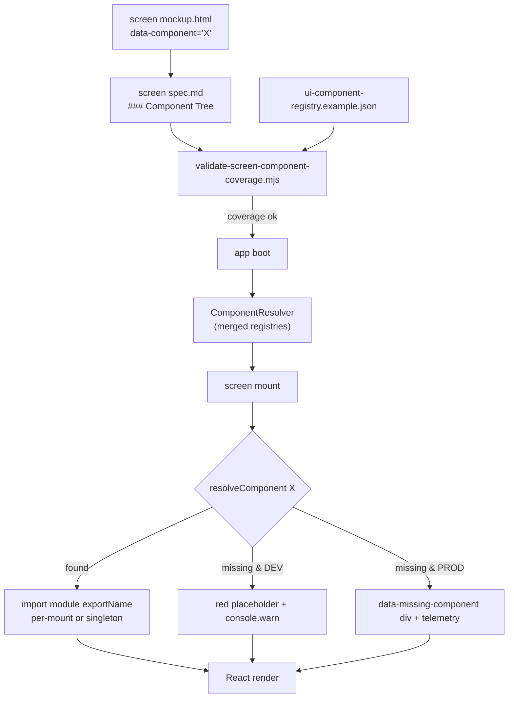

**How a `data-component` annotation becomes a runtime component.**
Pinned in [`ui-component-resolver.md`](../ui-component-resolver.md) and
backed by
[`content-schema/schemas/ui-component-registry.schema.json`](../../../content-schema/schemas/ui-component-registry.schema.json).

## Rules

- The mockup and spec are the **visual contract**; the registry is
  the **runtime contract**. The validator binds them.
- One `componentId` resolves to exactly one constructor. Pack
  registries layer additively; no overrides at MVP.
- Reuse policy: per-mount instantiation by default; `singleton: true`
  shares one instance across the app.
- Missing-component behaviour is non-throwing in both DEV and PROD;
  it is loud in DEV and quiet (with telemetry) in PROD.

## Related diagrams

- [26 — Pointer Event Routing](./26-pointer-event-routing.md)
- [18 — Localization String Resolution](./18-string-resolution.md)
