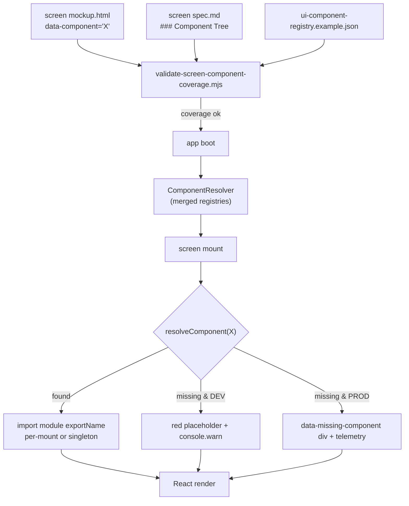

**How a `data-component` annotation becomes a runtime component.**
Pinned in [`ui-component-resolver.md`](../ui-component-resolver.md);
schema:
[`content-schema/schemas/ui-component-registry.schema.json`](../../../content-schema/schemas/ui-component-registry.schema.json).
Companion diagrams:
[26 — Pointer Event Routing](./26-pointer-event-routing.md),
[18 — Localization String Resolution](./18-string-resolution.md).

## Contracts

- **Visual contract** — the mockup `data-component="X"` and the
  spec's `### Component Tree` (authored under `wiki/screens/*/`).
- **Runtime contract** — the registry entries validated against
  [`ui-component-registry.schema.json`](../../../content-schema/schemas/ui-component-registry.schema.json).
- **Bind** — [`scripts/validate-screen-component-coverage.mjs`](../../../scripts/validate-screen-component-coverage.mjs)
  fails `npm run validate` on any missing, orphan, or conflicting
  `componentId` (full ruleset in
  [`ui-component-resolver.md` § 5](../ui-component-resolver.md#5-coverage-validation)).

## Rules

- One `componentId` resolves to exactly one constructor. Pack
  registries layer **additively** (namespaced `<pack>.<Name>`); no
  overrides at MVP.
- Default mount behaviour is **per mount point**. `singleton: true`
  on the registry entry shares one instance across the app — use
  sparingly (typical: global tooltips, debug overlay).
- Resolution is **synchronous and non-throwing**. The resolver is
  built once per boot from the merged registry; `resolveComponent`
  never blocks render.

## Missing-component fallback

| Build flag                | Render                                                | Side-effects                                            |
|---------------------------|-------------------------------------------------------|---------------------------------------------------------|
| `import.meta.env.DEV`     | Red placeholder `
` with the missing `componentId` | `console.warn("missing component", id)`; debug-overlay counter |
| `import.meta.env.PROD`    | `
` (zero-size)       | Telemetry counter; no console output                    |

Both modes return `{ kind: "missing", componentId }` and never throw.
The validator is the primary guard; the DEV placeholder catches gaps
that slip in between validations (see
[`ui-component-resolver.md` § 4](../ui-component-resolver.md#4-missing-component-fallback)).

## Related diagrams

- [26 — Pointer Event Routing](./26-pointer-event-routing.md)
- [18 — Localization String Resolution](./18-string-resolution.md)
- [29 — Input Arbitration](./29-input-arbitration.md)

---

## 🔍 Sync Check

- **UI: ✔** — Mockup `data-component`, spec `### Component Tree`, validator, DEV/PROD fallback branches, and the `singleton` policy all mirror [`ui-component-resolver.md`](../ui-component-resolver.md) §§ 1–5; sibling diagrams [26](./26-pointer-event-routing.md) and [29](./29-input-arbitration.md) reciprocally link.
- **Schema: ✔** — [`ui-component-registry.schema.json`](../../../content-schema/schemas/ui-component-registry.schema.json) defines `componentId / module / exportName / singleton / requiredProps / owner / tags`; row `UIComponentRegistry` is present in [`schema-matrix.md`](../schema-matrix.md) and confirmed in the parent arch doc's audit trailer.
- **Tasks: ⚠** — Owning runtime tasks under [`tasks/mvp/07-ui-shell/`](../../../tasks/mvp/07-ui-shell/) cite the parent [`ui-component-resolver.md`](../ui-component-resolver.md) (`Read First`); no task references this diagram directly, which is consistent with [diagrams/README § Normative Status](./README.md#normative-status). The diagram is not registered in [`diagrams/index.json`](./index.json) — see Issues.

## ⚠ Issues

- **`27-component-resolution` missing from `diagrams/index.json`.** This file declares `id: "27-component-resolution"` and is linked from [`ui-component-resolver.md`](../ui-component-resolver.md) and [diagram 26](./26-pointer-event-routing.md), but [`diagrams/index.json`](./index.json) contains no entry. Per [`diagrams/README.md` § Adding A New Diagram](./README.md#adding-a-new-diagram) (`Add <id> to the appropriate category's diagrams array`), the diagram will not surface in the bundled wiki viewer (`npm run generate:wiki`) until registered. Suggested values: category `ui-input` (alongside `29-input-arbitration`); no new category required. Owner is the task that authored this diagram (no per-doc task ID currently registered). Skill did not add the entry — Hard Prohibition D (never edit cross-checked files).
- **Reciprocal Related-diagrams gap with diagram 29.** [`29-input-arbitration.md`](./29-input-arbitration.md) lists this diagram in its *Related* block, but the prior version of this file did not reciprocate. Added the back-link in the rewrite (add-only, no claim changed; Hard Prohibition C — links survive).
- **Sibling `26-pointer-event-routing` also unregistered in `index.json`.** The `multiplayer` category lists `26-multiplayer-sync`, and the `ui-input` category does not list `26-pointer-event-routing`. Not this diagram's to fix; owned by the audit of diagram 26 (already noted in its trailer). Mentioned only to make clear the index gap is not local to this file.
