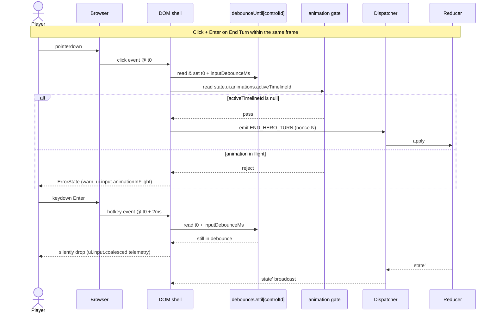

**How a click and a hotkey on the same control are resolved into one
command.** Pinned in
[`ui-input-arbitration.md`](../ui-input-arbitration.md). The
debounce token is per-control; the first event reaches the reducer,
the second hits the gate and is dropped. The animation gate
(`state.ui.animations.activeTimelineId`) blocks turn-affecting
commands while a timeline is playing. Replay safety follows because
the dispatch path is identical regardless of input modality.

## Rules

- The debounce token is **per control**, not global. Two different
  controls may emit in the same frame.
- First event wins by browser timestamp. The "modality wins" rule
  does **not** exist — that would let a single physical action emit
  twice depending on which modality the player happens to use.
- Animation gate rejection is loud (an `ErrorState` with
  `severity: "warn"` and `messageKey: "ui.errors.waitForCurrentTurn"`).
  Silent rejections are reserved for the debounce gate, since the
  user has not typed a "real" second action.
- Esc and modal-open commands bypass the animation gate but still
  honor debounce.

## Related diagrams

- [26 — Pointer Event Routing](./26-pointer-event-routing.md)
- [27 — Component Resolution](./27-component-resolution.md)
