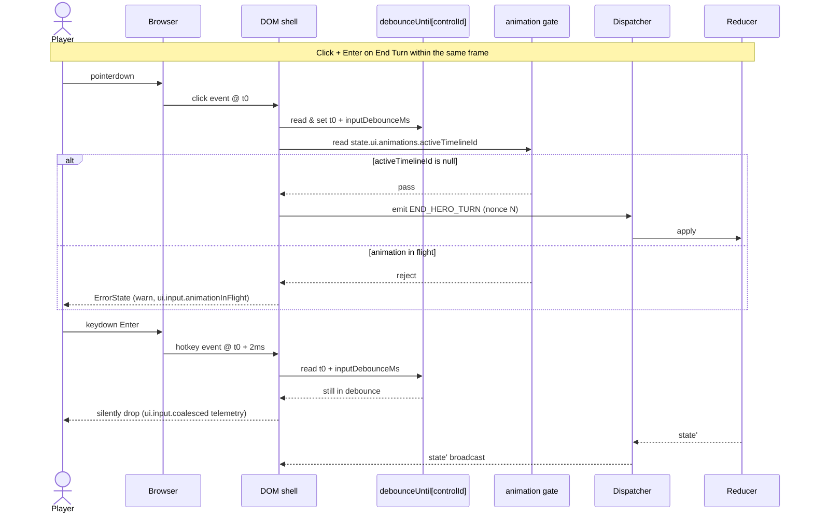

**How a click and a hotkey on the same control resolve into one
command.** Pinned in
[`ui-input-arbitration.md`](../ui-input-arbitration.md). The
debounce token is **per control**; the first event by browser
timestamp reaches the reducer, the second hits the gate and is
dropped. The animation gate
(`state.ui.animations.activeTimelineId`) blocks turn-affecting
commands while a timeline is playing. Replay safety follows
because the dispatch path is identical regardless of input
modality.

## Rules

- **Per-control debounce.** `debounceUntil[controlId]` is local
  to a control. Two different controls may emit in the same frame
  without coalescing. The window comes from
  `ruleset.ui.timing.inputDebounceMs` (default `50` ms), pinned in
  [`ui-input-arbitration.md` § Single-emit Rule](../ui-input-arbitration.md#single-emit-rule).
- **First event wins by browser-event timestamp.** There is no
  "modality wins" (e.g. mouse > keyboard) — that would let one
  physical action emit one or two commands depending on which
  modality the player happens to use.
- **Animation-gate rejection is loud.** The rejected command yields
  an `ErrorState` with `code: "ui.input.animationInFlight"`,
  `severity: "warn"`, `messageKey: "ui.errors.waitForCurrentTurn"`.
  Silent drops are reserved for the debounce gate (the user has
  not typed a "real" second action).
- **Debounce-coalesce drops are telemetry only.** `code:
  "ui.input.coalesced"`, `severity: "info"`, no user-facing toast.
- **Bypass list.** Hover, tooltip, modal-open, and Esc-ladder
  commands bypass the animation gate — none mutate gameplay state.
  Per-control debounce still applies to any of these that dispatch
  through the standard pipeline. Full gated-`kind` list lives in
  [`ui-input-arbitration.md` § Animation Gate](../ui-input-arbitration.md#animation-gate).

## Related diagrams

- [26 — Pointer Event Routing](./26-pointer-event-routing.md)
- [27 — Component Resolution](./27-component-resolution.md)

---

## 🔍 Sync Check

- **UI: ✔** — Single-emit rule, first-event-wins, the animation
  gate's `code` / `severity` / `messageKey`, the
  `ui.input.coalesced` telemetry code, and the bypass list all
  match [`ui-input-arbitration.md`](../ui-input-arbitration.md)
  §§ Single-emit Rule, Modality Precedence, Animation Gate.
  Reciprocal links to sibling diagrams
  [26](./26-pointer-event-routing.md) and
  [27](./27-component-resolution.md) are present in both
  directions.
- **Schema: ✔** — `inputDebounceMs` is defined under `ui.timing`
  in
  [`ruleset.schema.json`](../../../content-schema/schemas/ruleset.schema.json)
  (sourced via the parent doc, which the diagram links). No
  commands are introduced here, so no
  [`command-schema.md`](../command-schema.md) row is owed; the
  parent doc already enumerates and verifies the gated `kind`
  values.
- **Tasks: ✔** — Owning task
  [`mvp.07-ui-shell.15-input-arbitration`](../../../tasks/mvp/07-ui-shell/15-input-arbitration.md)
  lists this file in Owned Paths and Outputs and pins the
  click-plus-hotkey-through-debounce scenario in its Acceptance
  Criteria. Diagram is registered in
  [`diagrams/index.json`](./index.json) under category
  `ui-input`. State referenced here is under `state.ui.*` and
  excluded from saves/replays per
  [`ui-routing.md` § Save / Replay Rule](../ui-routing.md#save--replay-rule);
  no [`data-inventory.md`](../data-inventory.md) row is owed.

## ⚠ Issues

- **Bypass-list wording tightened to parent parity.** The prior
  Rules section said "Esc and modal-open commands bypass the
  animation gate," which was narrower than
  [`ui-input-arbitration.md` § Animation Gate](../ui-input-arbitration.md#animation-gate)
  ("Hover, tooltip, and modal-open commands are **not** gated …
  Esc-ladder layers also bypass the gate"). Rewrote to the
  parent's full list — meaning preserved, scope widened to match
  the canonical source. No code or claim change downstream.
