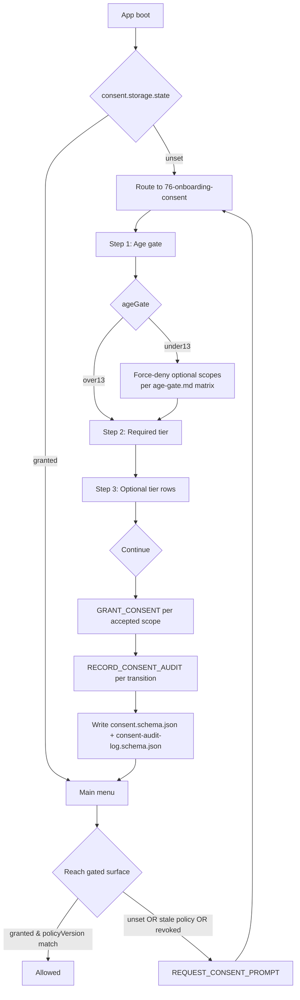

First-run onboarding captures consent before any network, AI, telemetry,
or crash-report surface becomes reachable. Per
[`onboarding.md`](../onboarding.md) and screen
[`76-onboarding-consent`](../wiki/screens/76-onboarding-consent/).

## Re-Prompt Triggers

| Trigger                                          | Outcome                                       |
|--------------------------------------------------|-----------------------------------------------|
| `consent.<scope>.state === 'unset'`              | route through `76-onboarding-consent`        |
| `consent.<scope>.policyVersion < onboarding`     | invalidate `granted`; re-prompt the scope     |
| user revoked from Privacy tab                    | gated surface re-prompts on next entry        |
| save import with `ConsentSnapshot`               | `method: 'import'` re-prompt per scope        |

## Save / Replay Determinism

Consent state is **profile-side**, not gameplay-side:

- Never enters the engine command log.
- Never enters `stateHash` or `canonicalContentHash`.
- Save export embeds `ConsentSnapshot`; import dispatches
  `IMPORT_CONSENT_SNAPSHOT`, which routes through onboarding.
