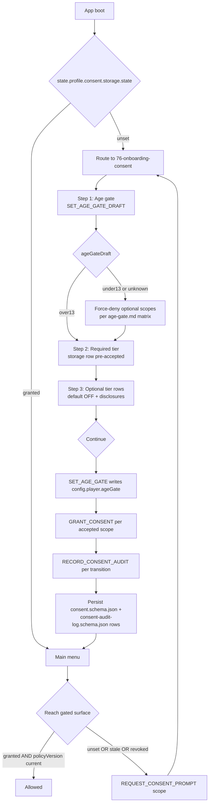

**First-run capture of the age gate and tiered consent, before any
network, AI, telemetry, or crash-report surface activates.** Pinned
in [`onboarding.md`](../onboarding.md) and screen
[`76-onboarding-consent`](../wiki/screens/76-onboarding-consent/).
Re-prompts trigger on `unset`, stale `policyVersion`, Privacy-tab
revoke, and save imports.

## Re-prompt triggers

| Condition                                                            | Outcome                                                                    |
|----------------------------------------------------------------------|----------------------------------------------------------------------------|
| `consent.<scope>.state === 'unset'` at gated surface                 | `REQUEST_CONSENT_PROMPT(scope)` → routes through `76-onboarding-consent`. |
| `consent.<scope>.policyVersion < onboarding.policyVersion`           | runtime invalidates `granted`; re-prompts the affected scope.              |
| User revoked from the Privacy tab in [`56-options`](../wiki/screens/56-options/) | next entry to the gated surface re-prompts.                                |
| Save import carries `ConsentSnapshot`                                | `IMPORT_CONSENT_SNAPSHOT(snapshot)` → re-prompt per scope, `method: 'import'`. |

`method` values come from
[`consent.schema.json`](../../../content-schema/schemas/consent.schema.json)
(`explicit | import | legacy | session`); commands are defined in
[`command-schema.md`](../command-schema.md).

## Save / replay determinism

Consent state is **profile-side**, not gameplay-side — parallel to
the age-gate rule in
[`age-gate.md` § 5](../age-gate.md#5-persistence):

- Lives under `state.profile.consent[scope]` and
  `state.profile.consentAuditLog` (rows in
  [`data-inventory.md`](../data-inventory.md): `consent records`,
  `consent audit log`).
- Never enters the engine command log, `stateHash`, or
  `canonicalContentHash`.
- Save export embeds `ConsentSnapshot` (see
  [`consent.schema.json#/$defs/ConsentSnapshot`](../../../content-schema/schemas/consent.schema.json));
  import dispatches `IMPORT_CONSENT_SNAPSHOT`, which routes the user
  back through this flow with `method: 'import'`. Imports never
  auto-grant.

## Related diagrams

- [24 — Save Flow](./24-save-flow.md) — where `ConsentSnapshot` is
  embedded in exported saves.
- [25 — Load Flow](./25-load-flow.md) — where
  `IMPORT_CONSENT_SNAPSHOT` enters this onboarding flow.

---

## 🔍 Sync Check

- **UI: ✔** — Tiered rows (`AgeGateRow`, `RequiredTierGroup` for
  `storage`, `OptionalTierGroup` for the five optional scopes), the
  `Continue` action's `GRANT_CONSENT` → `RECORD_CONSENT_AUDIT`
  ordering, and the four re-prompt cases match
  [`76-onboarding-consent/spec.md`](../wiki/screens/76-onboarding-consent/spec.md)
  and
  [`interactions.md`](../wiki/screens/76-onboarding-consent/interactions.md).
- **Schema: ✔** —
  [`consent.schema.json`](../../../content-schema/schemas/consent.schema.json)
  `state` enum (`unset | granted | revoked | denied`), `method` enum
  (`explicit | import | legacy | session`), and `ConsentSnapshot`
  shape align with this diagram;
  [`consent-audit-log.schema.json`](../../../content-schema/schemas/consent-audit-log.schema.json)
  is the audit-log target. Both rows are registered in
  [`schema-matrix.md`](../schema-matrix.md) (`Consent`,
  `ConsentAuditLog`); the three persisted slices have rows in
  [`data-inventory.md`](../data-inventory.md) (`consent records`,
  `consent audit log`, `age gate`).
- **Tasks: ✔** — Owning runtime task
  [`mvp.07-ui-shell.27-onboarding-consent-screen`](../../../tasks/mvp/07-ui-shell/27-onboarding-consent-screen.md)
  lists this diagram in *Read First*; schema task
  [`mvp.02-content-schemas.42-consent-and-peer-allowlist-schemas`](../../../tasks/mvp/02-content-schemas/42-consent-and-peer-allowlist-schemas.md)
  owns the schemas. Commands `SET_AGE_GATE` / `SET_AGE_GATE_DRAFT`,
  `GRANT_CONSENT`, `REVOKE_CONSENT`, `RECORD_CONSENT_AUDIT`,
  `REQUEST_CONSENT_PROMPT`, `IMPORT_CONSENT_SNAPSHOT`, and
  `CANCEL_CONSENT_PROMPT` are defined in
  [`command-schema.md`](../command-schema.md). Diagram is registered
  in [`diagrams/index.json`](./index.json) under `lifecycle`.

## ⚠ Issues

- **No command writes `consent[scope].state = 'denied'` from an
  explicit user decline.** This diagram inherits the gap already
  surfaced in
  [`onboarding.md` § ⚠ Issues](../onboarding.md) and
  [`76-onboarding-consent/interactions.md`](../wiki/screens/76-onboarding-consent/interactions.md):
  the `Decline optional` action dispatches `REVOKE_CONSENT`, which
  per [`consent.schema.json`](../../../content-schema/schemas/consent.schema.json)
  writes `'revoked'`, but onboarding's audit-trail rule
  (§ 3 of [`onboarding.md`](../onboarding.md)) records
  `unset → denied`, and the schema reserves `'denied'` for
  age-gate / policy default-off. Per CLAUDE.md root contract
  (closed enums, fail-loud), the gap must close before this flow
  ships. Resolution belongs in
  [`command-schema.md`](../command-schema.md) (add `DENY_CONSENT`)
  or in the parent doc + interactions (rewrite to
  `unset → revoked`); owning task is
  [`mvp.07-ui-shell.27-onboarding-consent-screen`](../../../tasks/mvp/07-ui-shell/27-onboarding-consent-screen.md).
  Diagram preserved the parent's wording (Hard Prohibition A —
  never change meaning) and references the parent doc rather than
  duplicating the fix here.
