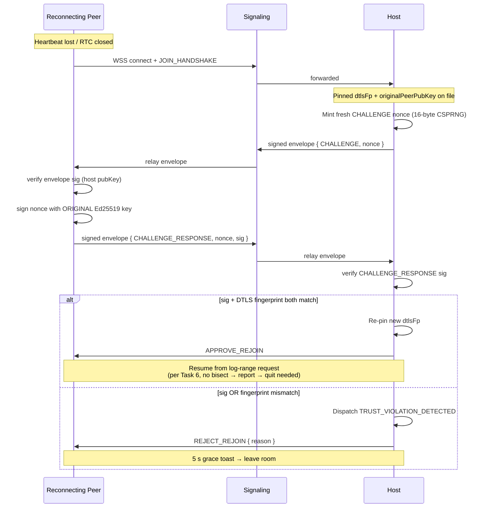

Reconnecting peer must prove identity continuity. When a peer drops
and re-signals, the host issues a fresh nonce; the peer signs it with
the **original** Ed25519 keypair (the one that signed the original
`JOIN_ROOM`). The host re-pins the new SDP's DTLS fingerprint **only
if** both the signature check **and** the pinned-fingerprint
comparison agree. Canonical rule lives in
[`dtls-fingerprint-pinning.md` § 4](../dtls-fingerprint-pinning.md#4-reconnect-continuity-challenge).

Companion docs:
[`docs/architecture/dtls-fingerprint-pinning.md`](../dtls-fingerprint-pinning.md),
[`docs/architecture/signaling-envelope.md`](../signaling-envelope.md),
[`docs/architecture/peer-identity.md`](../peer-identity.md),
[`docs/architecture/abandon-penalty.md`](../abandon-penalty.md),
[`tasks/phase-3/01-multiplayer/06-reconnection-log-range-request-plus-replay.md`](../../../tasks/phase-3/01-multiplayer/06-reconnection-log-range-request-plus-replay.md).

## State Transitions

| Source state | Trigger | Destination |
|---|---|---|
| `connected` | heartbeat lost ≥ 30 s | `awaitingRejoin` |
| `awaitingRejoin` | host emits `CHALLENGE` | `awaitingChallengeResponse` |
| `awaitingChallengeResponse` | both gates pass | `connected` (re-pinned) |
| `awaitingChallengeResponse` | either gate fails | `awaitingTrustViolationDecision` (per [`dtls-fingerprint-pinning.md` § 5](../dtls-fingerprint-pinning.md#5-failure-surface)) |
| `awaitingChallengeResponse` | 120 s with no response | `verifiedDisconnect` (forfeit per [`abandon-penalty.md`](../abandon-penalty.md)) |

## Why two gates

- **Ed25519 signature gate** — prevents a fresh attacker from
  impersonating the dropped peer (the attacker lacks the original
  private key).
- **DTLS fingerprint gate** — prevents a man-in-the-middle from
  interposing during the rejoin WebRTC handshake (the original peer's
  keypair is unchanged but the channel they think they reopened is
  now MITM'd).

Either gate alone is bypassable; both together close the swap window.

---

## 🔍 Sync Check

- **UI: ✔** — The 5-second grace toast and the
  `awaitingTrustViolationDecision` transition match
  [`dtls-fingerprint-pinning.md` § 5](../dtls-fingerprint-pinning.md#5-failure-surface)
  and the lobby spec at
  [`wiki/screens/64-network-lobby/spec.md`](../wiki/screens/64-network-lobby/spec.md).
  The diagram cites no other UI strings.
- **Schema: ✔** — `CHALLENGE` and `CHALLENGE_RESPONSE` are pinned in
  the closed `payloadType` enum at
  [`signaling-envelope.md` § 2](../signaling-envelope.md#2-payload-type-enum)
  with inner shapes `{ nonce }` and `{ nonce, sig }`; the 16-byte
  CSPRNG nonce and the two-gate rule match
  [`dtls-fingerprint-pinning.md` § 4](../dtls-fingerprint-pinning.md#4-reconnect-continuity-challenge);
  the original-keypair rule matches
  [`peer-identity.md` § 9](../peer-identity.md#9-reconnect-continuity-challenge).
  `TRUST_VIOLATION_DETECTED` and `RECORD_CONTINUITY_CHALLENGE` are
  defined in
  [`command-schema.md` § Multiplayer Trust & Identity Commands](../command-schema.md#multiplayer-trust--identity-commands).
- **Tasks: ✔** — Owning task
  [`06-reconnection-log-range-request-plus-replay`](../../../tasks/phase-3/01-multiplayer/06-reconnection-log-range-request-plus-replay.md)
  Reads First this diagram and pins both gates in its reconnect-flow
  bullet; the 30 s / 120 s windows match
  [`abandon-penalty.md` § 2](../abandon-penalty.md#2-heartbeat--forfeit-windows).
  [`27-dtls-fingerprint-pinning`](../../../tasks/phase-3/01-multiplayer/27-dtls-fingerprint-pinning.md)
  owns the runtime that implements the two-gate check.

## ⚠ Issues

- **`APPROVE_REJOIN` / `REJECT_REJOIN` are diagram-local labels, not
  in the closed `payloadType` enum.** The sequence shows the host
  emitting `APPROVE_REJOIN` and `REJECT_REJOIN` after the gate
  check, but neither label appears in
  [`signaling-envelope.md` § 2](../signaling-envelope.md#2-payload-type-enum)
  (which closes the enum at `CHALLENGE` / `CHALLENGE_RESPONSE` plus
  the standard SDP/ICE/host-changed set) nor in
  [`command-schema.md`](../command-schema.md). This mirrors the
  informal `APPROVE_PEER` / `REJECT_PEER` shorthand in
  [`peer-identity.md` § 6](../peer-identity.md#6-join_room-envelope)
  — i.e. pedagogical names for the host's signaling response, not
  formal payload types. Not CI-blocking; FYI. If the runtime ends up
  needing a distinct envelope type for the rejoin verdict (rather
  than reusing an existing channel), the owning task —
  [`27-dtls-fingerprint-pinning`](../../../tasks/phase-3/01-multiplayer/27-dtls-fingerprint-pinning.md)
  or
  [`26-signed-signaling-envelope`](../../../tasks/phase-3/01-multiplayer/26-signed-signaling-envelope.md)
  — should add the values to the enum per
  [`enum-lifecycle-policy.md`](../enum-lifecycle-policy.md). Skill
  did not amend the enum (Hard Prohibition D).
- **State machine names (`awaitingRejoin`,
  `awaitingChallengeResponse`, `verifiedDisconnect`) are only
  defined in this diagram.** `awaitingTrustViolationDecision` is
  pinned in
  [`dtls-fingerprint-pinning.md` § 5](../dtls-fingerprint-pinning.md#5-failure-surface)
  but the other three appear nowhere else (grep across
  `docs/architecture/`,
  [`tasks/phase-3/01-multiplayer/06-reconnection-log-range-request-plus-replay.md`](../../../tasks/phase-3/01-multiplayer/06-reconnection-log-range-request-plus-replay.md),
  and
  [`wiki/screens/64-network-lobby/spec.md`](../wiki/screens/64-network-lobby/spec.md)
  returns only this file). Not CI-blocking — diagrams are pedagogical
  and these are local labels — but if the runtime exposes a
  peer-state enum, the owning task
  [`27-dtls-fingerprint-pinning`](../../../tasks/phase-3/01-multiplayer/27-dtls-fingerprint-pinning.md)
  should reconcile the names. Skill did not unify the vocabulary
  (Hard Prohibition B — never invent features).
