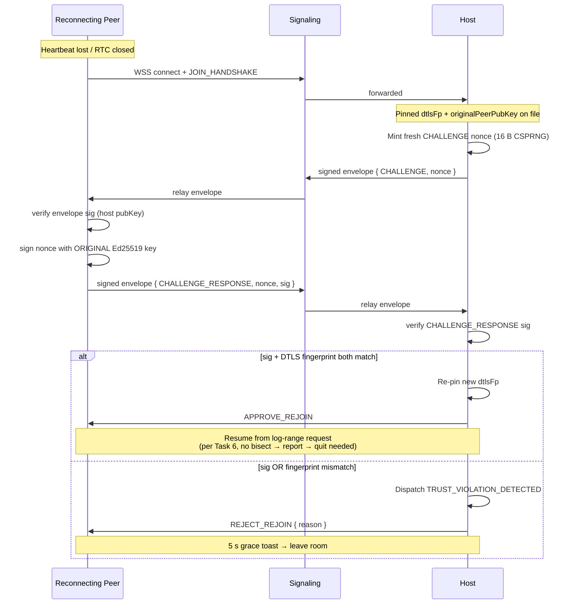

**Reconnecting peer must prove identity continuity.** When a peer
drops and re-signals, the host issues a fresh nonce. The reconnecting
peer signs the nonce with the **original** Ed25519 keypair (the one
that signed the original `JOIN_ROOM`). The host then re-pins the new
DTLS fingerprint **only if** both the keypair signature and the
pinned-fingerprint comparison agree.

Companion docs:
[`docs/architecture/dtls-fingerprint-pinning.md`](../dtls-fingerprint-pinning.md),
[`docs/architecture/signaling-envelope.md`](../signaling-envelope.md),
[`docs/architecture/peer-identity.md`](../peer-identity.md),
[`tasks/phase-3/01-multiplayer/06-reconnection-log-range-request-plus-replay.md`](../../../tasks/phase-3/01-multiplayer/06-reconnection-log-range-request-plus-replay.md).

## State Transitions

| Source state | Trigger | Destination |
|---|---|---|
| `connected` | heartbeat lost ≥ 30 s | `awaitingRejoin` |
| `awaitingRejoin` | host emits `CHALLENGE` | `awaitingChallengeResponse` |
| `awaitingChallengeResponse` | both gates pass | `connected` (re-pinned) |
| `awaitingChallengeResponse` | either gate fails | `awaitingTrustViolationDecision` |
| `awaitingChallengeResponse` | 120 s with no response | `verifiedDisconnect` (forfeit per [`abandon-penalty.md`](../abandon-penalty.md)) |

## Why two gates

The Ed25519 signature gate prevents a fresh attacker from
impersonating the dropped peer. The DTLS fingerprint gate
prevents a man-in-the-middle from interposing during the rejoin
WebRTC handshake (the original peer's keypair is unchanged but
the channel they think they reopened is now MITM'd). Either
gate alone is bypassable; both together close the swap window.
