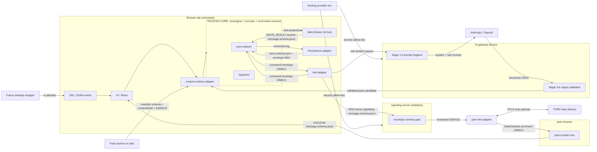

# Diagram — Trust Zones

> Source plan:
> [`docs/implementation-plans/31-trust-boundaries-and-logging-monitoring-plan.md`](../../implementation-plans/31-trust-boundaries-and-logging-monitoring-plan.md).
> Owner doc: [`trust-boundaries.md`](../trust-boundaries.md).

The diagram below names every cross-zone arrow and the gate that
validates it. Read together with
[`trust-boundaries.md`](../trust-boundaries.md) § 3 (per-component
matrix).

The diagram is read-only; modifications must edit
[`trust-boundaries.md`](../trust-boundaries.md) § 3 first and then
mirror the change here.
