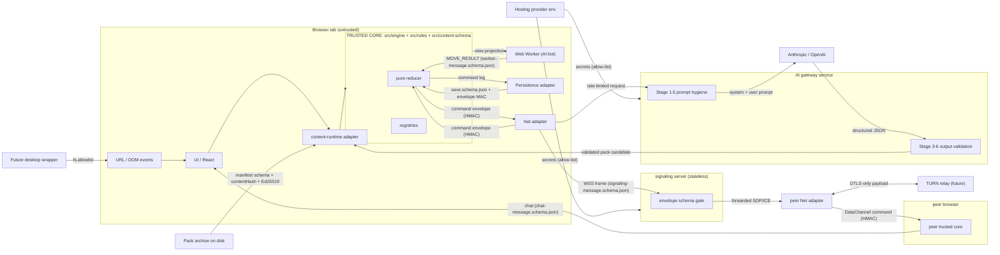

# Diagram — Trust Zones

> Owner doc: [`../trust-boundaries.md`](../trust-boundaries.md) § 3
> (per-component matrix). This file is the visual mirror only.

Companion docs:

- [`../trust-boundaries.md`](../trust-boundaries.md) — the closed
  per-component matrix; every arrow below maps to one row there.
- [`../command-stream-integrity.md`](../command-stream-integrity.md) —
  HMAC keying for the `Reducer ↔ Net` envelope.
- [`../ai-contract.md`](../ai-contract.md) — view-projection and
  `MOVE_RESULT` contract on the `Engine ↔ Worker` arrow.
- [`../signaling-message-schema.md`](../signaling-message-schema.md)
  — wire-shape gate for the `Net → signaling server` arrow.
- [`../pack-contract.md`](../pack-contract.md) — manifest schema,
  `contentHash`, Ed25519 signature on the `Pack → content-runtime`
  arrow.
- [`./README.md`](./README.md) — registration / numbering convention
  for diagrams.

---

## 1. Diagram

---

## 2. Text-only arrow legend

For AI consumers and renderers that do not parse Mermaid, the
diagram encodes the following cross-zone arrows. Each row resolves
to one row of [`../trust-boundaries.md`](../trust-boundaries.md)
§ 3, which owns the canonical gate + on-violation rule.

| From → To | Gate referenced in diagram label |
|---|---|
| `URL / DOM events` → `UI` | React-default escape; URL allow-list. |
| `UI` → `content-runtime adapter` | id-pattern check. |
| `Pack archive` → `content-runtime adapter` | manifest schema + `contentHash` + Ed25519. |
| `content-runtime adapter` → `Engine` | per-record schema validation. |
| `Engine` → `Worker` | view projection (ai-contract). |
| `Worker` → `Reducer` | `worker-message.schema.json`. |
| `Persistence adapter` → `Reducer` | `save.schema.json` + envelope MAC. |
| `Reducer` ↔ `Net adapter` | command envelope + HMAC. |
| `Net adapter` → `signaling server` | `signaling-message.schema.json` (WSS frame). |
| `signaling server` → `peer Net adapter` | forwarded SDP / ICE, re-validated. |
| `peer Net adapter` → `peer trusted core` | DataChannel command + HMAC. |
| `peer trusted core` → `UI` | `chat-message.schema.json`. |
| `Net adapter` → `AI gateway` | rate-limited request. |
| `AI gateway` → `Anthropic / OpenAI` | Stage 1.5 prompt hygiene. |
| `Anthropic / OpenAI` → `AI gateway` | Stages 3–6 output validation. |
| `AI gateway` → `content-runtime adapter` | validated pack candidate. |
| `peer Net adapter` ↔ `TURN relay` | DTLS-only payload (future). |
| `Hosting env` → `AI gateway` / `signaling server` | secrets allow-list. |
| `Future desktop wrapper` → `URL / DOM events` | `fs.allowlist`. |

---

## 3. Change rule

The diagram is read-only with respect to design intent: a new
cross-zone arrow or a changed gate **must** land first in
[`../trust-boundaries.md`](../trust-boundaries.md) § 3 (the closed
matrix), then be mirrored here. PRs that touch this file without a
matching matrix row will fail review.

---

## 🔍 Sync Check

- **UI: ✔** — No UI surface is owned by this diagram; cross-zone
  arrows touching the `UI` node resolve to
  [`../trust-boundaries.md`](../trust-boundaries.md) § 3 rows and
  [`../url-routing.md`](../url-routing.md) /
  [`../untrusted-strings.md`](../untrusted-strings.md).
- **Schema: ✔** — Every schema cited in an arrow label exists on
  disk:
  [`worker-message.schema.json`](../../../content-schema/schemas/worker-message.schema.json),
  [`save.schema.json`](../../../content-schema/schemas/save.schema.json),
  [`signaling-message.schema.json`](../../../content-schema/schemas/signaling-message.schema.json),
  [`chat-message.schema.json`](../../../content-schema/schemas/chat-message.schema.json).
  The implicit `command envelope` label resolves to
  [`lockstep-envelope.schema.json`](../../../content-schema/schemas/lockstep-envelope.schema.json)
  (current) /
  [`command-envelope.schema.json`](../../../content-schema/schemas/command-envelope.schema.json)
  (superseded; kept for historical wire compat).
- **Tasks: ✔** — The diagram has no direct task owner; gates are
  owned by the tasks named in [`../trust-boundaries.md`](../trust-boundaries.md)
  § 3–4 (notably
  [`phase-3.05-observability.02-worker-message-validation`](../../../tasks/phase-3/05-observability/02-worker-message-validation.md)
  for the worker arrow).

## ⚠ Issues

- **Diagram not registered in `index.json`.** This file is not
  listed in [`./index.json`](./index.json) and carries no diagram
  frontmatter (it uses the `# Diagram — Trust Zones` prose form
  instead of an `<NN>-<slug>` filename). The orphan is already
  flagged in [`./README.md`](./README.md) `## ⚠ Issues` and is the
  cross-checked file's concern, not this target's. Per § 2 / § 5
  of [`./README.md`](./README.md), a future maintainer must either
  (a) rename to a numbered slug + add a row to `index.json`, or
  (b) exclude this filename in
  [`generate-architecture-wiki.mjs`](../../../scripts/generate-architecture-wiki.mjs).
  No code change implied by this audit (Hard Prohibition D — the
  fix belongs in the cross-checked file).
- **Signaling envelope encodes inner-only label.** The arrow
  `Net → SigEnv` is labelled `signaling-message.schema.json`, but
  [`../trust-boundaries.md`](../trust-boundaries.md) § 3 row
  `Browser → signaling server` runs two gates in sequence: outer
  [`signaling-envelope.schema.json`](../../../content-schema/schemas/signaling-envelope.schema.json)
  + inner
  [`signaling-message.schema.json`](../../../content-schema/schemas/signaling-message.schema.json),
  plus a 64 KiB per-frame size cap. The diagram label is not
  wrong, just less precise than the matrix; the text-only legend
  in § 2 preserves the inner-only wording so meaning matches the
  Mermaid source. If a future edit tightens the diagram, prefer
  the form `signaling-envelope + signaling-message (64 KiB cap)`.
- **`Desktop → UIs` arrow target.** The diagram routes the future
  desktop wrapper's `fs.allowlist` arrow into the `URL / DOM
  events` node, but [`../trust-boundaries.md`](../trust-boundaries.md)
  § 3 row `Future desktop wrapper → OS filesystem` makes the
  filesystem the boundary partner, not the browser-tab event node.
  The Mermaid source has no `OS filesystem` node today; the
  semantic gap is in the diagram, not the matrix. A future
  Mermaid revision should add an `OS filesystem` external node and
  redirect the arrow per
  [`../desktop-sandboxing.md`](../desktop-sandboxing.md); no
  matrix or schema change implied. Flagged here per Hard
  Prohibition B (never invent the missing node from inside the
  audit).
