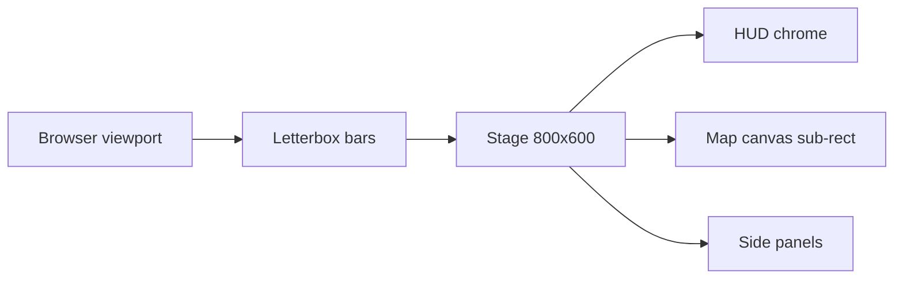

# Screen Scaling — Resolution, Aspect, Hi-DPI, Filter Modes

**Status:** Approved for MVP
**Date:** 2026-05-02
**Source decisions:**
[`renderer-technology-choice.md`](./renderer-technology-choice.md),
[`ui-renderer-seam.md`](./ui-renderer-seam.md).

Reconciles the fixed 800×600 layout authored in every screen's
`mockup.html` with the 16:9 map canvas pinned by
[`renderer-technology-choice.md` § Camera Control](./renderer-technology-choice.md#camera-control)
and the desktop + tablet delivery target. Defines the virtual stage,
letterbox policy, hi-DPI handling, atlas filter modes, and breakpoint
behaviour.

---

## 1. Virtual Coordinate System

The 800×600 stage is a **virtual** coordinate system in CSS pixels.
Every screen authors its `mockup.html` against `(800, 600)`.

At runtime:

- The DOM root is sized to the browser viewport.
- A single CSS transform scales the 800×600 stage to fit the viewport
  while preserving the 4:3 stage aspect.
- All `data-component` regions in `mockup.html` keep their authored
  pixel rectangles; the browser handles the scale.

```text
viewport (any size) ─► letterbox ─► stage 800×600 (virtual) ─► components
```

The virtual stage is the canonical hit-test space for DOM. The seam
adapter ([`ui-renderer-seam.md` § 4 Resize Protocol](./ui-renderer-seam.md#4-resize-protocol))
translates between virtual and physical coordinates as needed.

---

## 2. Aspect Handling

Off-aspect viewports are **letterboxed**, never stretched.

- 16:9 (e.g. 1920×1080): vertical bars on left/right.
- 21:9 ultrawide: vertical bars on left/right, wider than 16:9.
- 4:3 (e.g. 1024×768, iPad in landscape): no bars.
- Viewports narrower than 4:3 (portrait): refuse to start with the
  rotate-device overlay (see [§ 6 Breakpoints](#6-breakpoints)).

HUD elements anchored to stage edges remain inside the letterbox.
Letterbox bars use a flat solid colour from the active locale pack's
chrome theme; no decorative content lives in the bars.



### Safe-Area Insets

Stage anchors that must stay visible across all aspect ratios live in
the virtual safe-area inset rect:

| Edge | Virtual range | Purpose |
|---|---|---|
| Top | `y = 0..36` | resource date bar |
| Right | `x = 608..800` | right command panel |
| Bottom | `y = 540..600` | status line |
| Left | `x = 0..18` | frame |

Components positioned outside this rect must declare a safe-area
fallback in their `spec.md` or render only on configurations where
the wider stage is guaranteed.

---

## 3. Map Canvas Sub-Region

The 16:9 map canvas is a sub-region of the 800×600 stage.

- **Default rect:** `(18, 18, 590, 528)` in virtual pixels — matches
  the authored canvas position in
  `wiki/screens/07-adventure-map/mockup.html`,
  `wiki/screens/08-kingdom-overview/mockup.html`, and the other
  adventure screens.
- The renderer's hex viewport scales hex content to fill that rect at
  16:9 internally; stage chrome continues to occupy the remaining
  space (right command panel, top resource bar, status line).
- For ultrawide viewports (≥ 21:9), the stage stays 4:3 letterboxed.
  The map canvas does **not** widen with the viewport in MVP. A
  Phase 3 ultrawide responsive mode is reserved as future work.

⚠️ Assumption: the `(18, 18, 590, 528)` rect is taken from the curated
`wiki/screens/07-adventure-map/mockup.html` chrome rectangle. If a
screen authors a different map sub-rect, that screen's `spec.md` MUST
cite the override and the renderer task MUST honour it.

---

## 4. Hi-DPI

Each screen renders at the device pixel ratio (DPR) reported by the
browser.

### Canvas

- WebGL backing store: `cssWidth × dpr` × `cssHeight × dpr`.
- CSS size of the canvas element: `cssWidth × cssHeight`.
- `renderer.resize(w, h, dpr)` is the single update path
  ([`ui-renderer-seam.md` § 4 Resize Protocol](./ui-renderer-seam.md#4-resize-protocol)).

### Asset Variants

Sprite atlases ship in 1× and 2× variants indexed by manifest entry.
Atlas selection rule:

| DPR | Variant | Up-sampling |
|---|---|---|
| ≤ 1.25 | 1× | n/a |
| > 1.25 and ≤ 2.5 | 2× | n/a |
| > 2.5 | 2× | `NEAREST` for tile atlases; `LINEAR` for UI atlases (see [§ 5 Filter Modes](#5-filter-modes)) |

The asset-manifest schema may extend to expose `dpiVariants[]`. The
authoritative shape is owned by the asset-pipeline task; see
[`tasks/mvp/02b-asset-pipeline/`](../../tasks/mvp/02b-asset-pipeline/).

⚠️ Assumption: `content-schema/schemas/asset-index.schema.json` does
not currently encode DPI variants. Adding `dpiVariants[]` is deferred
to the asset-pipeline task; this doc is the architectural rule until
the schema lands.

### DOM

- DOM components rely on the browser's automatic CSS-pixel scaling at
  hi-DPI.
- Pixel-art DOM images use `image-rendering: pixelated`. Icon, text,
  and ornament images use the default rendering.

---

## 5. Filter Modes

Texture filtering is split between gameplay and UI atlases.

| Atlas kind | Filter | Mipmaps | Notes |
|---|---|---|---|
| Tile (terrain, hex grid) | `gl.NEAREST` | no | Pixel-perfect tiles; no blur on zoom-in |
| Unit / map sprite | `gl.NEAREST` | no | Frame-based animation depends on integer offsets |
| UI atlas (icons, ornaments) | `gl.LINEAR` | yes | Smooth scaling at non-integer DPR |
| Font SDF atlas | `gl.LINEAR` | yes | Distance-field text |

### Atlas Naming Convention

- `tiles.<world>@1x.png`, `tiles.<world>@2x.png`
- `units.<faction>@1x.png`, `units.<faction>@2x.png`
- `ui.<theme>@1x.png`, `ui.<theme>@2x.png`
- `fonts.<script>.sdf.png`

The asset manifest binds each ID to its variants; runtime code never
constructs a path from the ID itself (per the
[Hard constraints](../../CLAUDE.md#hard-constraints-ci-enforced) rule
that gameplay records never embed raw asset paths).

---

## 6. Breakpoints

| Viewport size (logical CSS px) | Behaviour |
|---|---|
| ≥ 1024 × 768 | Run full stage; default supported viewport |
| 1024 × 600..767 (short landscape) | Run, but warn in debug overlay; HUD safe-area inset still satisfied |
| < 1024 width OR portrait orientation | Show the rotate-device overlay; do not start the engine |
| Width or height < 480 | Refuse to start; show "Display too small" error |

The portrait-mode overlay is part of the loading screen package
([`wiki/screens/59-loading-screen/`](./wiki/screens/59-loading-screen/));
it surfaces a localized "Please rotate your device" message.

---

## 7. Anti-Patterns

- ❌ Authoring mockups against any size other than 800×600.
- ❌ Stretching the stage to fill ultrawide. Always letterbox.
- ❌ Reading `window.innerWidth` directly inside a component.
  Subscribe to `state.ui.viewport` instead
  ([`ui-renderer-seam.md` § 4 Resize Protocol](./ui-renderer-seam.md#4-resize-protocol)).
- ❌ Embedding hi-DPI variant paths in gameplay records. Asset IDs
  resolve through the manifest.
- ❌ Using `gl.LINEAR` for tile atlases. Pixel art must stay crisp.
- ❌ Mixing pixel-art and anti-aliased UI in the same atlas.
- ❌ Reacting to a DPR change by recreating the WebGL context.
  `renderer.resize` is non-destructive.

---

## Related Files

- [`renderer-technology-choice.md`](./renderer-technology-choice.md)
- [`ui-technology-choice.md`](./ui-technology-choice.md)
- [`ui-renderer-seam.md`](./ui-renderer-seam.md)
- [`wiki/README.md`](./wiki/README.md)
- [`tasks/mvp/06-renderer/01-webgl2-context-setup-plus-resize-handler.md`](../../tasks/mvp/06-renderer/01-webgl2-context-setup-plus-resize-handler.md)
- [`tasks/mvp/06-renderer/02-hex-tile-atlas-plus-axialscreen-transform.md`](../../tasks/mvp/06-renderer/02-hex-tile-atlas-plus-axialscreen-transform.md)
- [`tasks/mvp/07-ui-shell/01-react-18-app-shell-with-canvas-overlay.md`](../../tasks/mvp/07-ui-shell/01-react-18-app-shell-with-canvas-overlay.md)

---

## 🔍 Sync Check

- **UI: ⚠** — The `(18, 18, 590, 528)` map sub-rect matches the authored `data-component="MapViewport"` rect in [`wiki/screens/07-adventure-map/mockup.html`](./wiki/screens/07-adventure-map/mockup.html) and the analogous canvas in [`wiki/screens/08-kingdom-overview/mockup.html`](./wiki/screens/08-kingdom-overview/mockup.html). § 6 Breakpoints claims the rotate-device overlay lives in [`wiki/screens/59-loading-screen/`](./wiki/screens/59-loading-screen/), but the package's `spec.md`, `interactions.md`, `architecture.md`, `data-contracts.md`, and `mockup.html` carry no `rotate` / `portrait` / "Please rotate your device" surface — see Issues.
- **Schema: ⚠** — No schema is owned by this doc; the only schema claim is the deferred `dpiVariants[]` extension to [`content-schema/schemas/asset-index.schema.json`](../../content-schema/schemas/asset-index.schema.json), which the doc self-flags as not yet encoded. No row is owed in [`data-inventory.md`](./data-inventory.md) for `state.ui.viewport` — per [`ui-renderer-seam.md` § 4](./ui-renderer-seam.md#4-resize-protocol) and [`ui-frame-lag-contract.md` § 2 Optimistic UI](./ui-frame-lag-contract.md#2-optimistic-ui), the viewport slice is a session-only UI draft (non-persisted, non-replayed, non-hashed).
- **Tasks: ✔** — Ten task files reference this doc (the eight `tasks/mvp/06-renderer/` tasks plus [`tasks/mvp/07-ui-shell/01-react-18-app-shell-with-canvas-overlay.md`](../../tasks/mvp/07-ui-shell/01-react-18-app-shell-with-canvas-overlay.md)); reciprocal *Related Files* mention covers `06-renderer/01`, `06-renderer/02`, and `07-ui-shell/01`. Registered in [`tasks/task-registry.json`](../../tasks/task-registry.json); no orphan references.

## ⚠ Issues

- **Rotate-device overlay claim not honoured by the loading-screen package.** § 6 Breakpoints asserts the portrait-mode overlay is part of [`wiki/screens/59-loading-screen/`](./wiki/screens/59-loading-screen/), but a case-insensitive grep of the package's `spec.md`, `interactions.md`, `architecture.md`, `data-contracts.md`, and `mockup.html` returns no match for `rotate`, `portrait`, `orientation`, or "Please rotate your device". Per `.agents/rules/tasks.md` ("every described logic has a task") and the screen-package contract, either the package must surface the overlay or this doc must point at a different owner. Suggested fix: add a `RotateDeviceOverlay` component row to [`wiki/screens/59-loading-screen/spec.md`](./wiki/screens/59-loading-screen/spec.md) and a `loading.rotate-device` runtime-only entry to [`wiki/screens/59-loading-screen/interactions.md`](./wiki/screens/59-loading-screen/interactions.md), with a localized "Please rotate your device" string and entry rules tied to the `width < 1024` / portrait breakpoints in § 6. Owner: the loading-screen task ([`tasks/mvp/07-ui-shell/09-loading-screen.md`](../../tasks/mvp/07-ui-shell/09-loading-screen.md)), which should also add `docs/architecture/screen-scaling.md` to its *Read First* block. Skill did not edit those files (Hard Prohibition D — never edit cross-checked files).
- **No task owns the `dpiVariants[]` schema extension.** § 4 Hi-DPI / Asset Variants defers the schema work to [`tasks/mvp/02b-asset-pipeline/`](../../tasks/mvp/02b-asset-pipeline/), but a scan of the eighteen `02b-asset-pipeline` tasks (`01..18`) shows none with `dpiVariants` under *Owned Paths*, *Acceptance Criteria*, or *Description*. Per `.agents/rules/tasks.md` ("every described logic has a task") and the CLAUDE.md root contract that "schema evolution is additive-first; alias before remove" (driven by [`enum-lifecycle-policy.md`](./enum-lifecycle-policy.md)), the asset-pipeline directory needs a task that owns the `dpiVariants[]` addition to [`content-schema/schemas/asset-index.schema.json`](../../content-schema/schemas/asset-index.schema.json) and the 1× / 2× selection rule in this doc's § 4 Hi-DPI / Asset Variants table. Suggested fix: a new task with *Owned Paths* covering the schema file plus the manifest loader, *Read First* citing this doc (§ 4) and [`asset-normalization.md`](./asset-normalization.md), and acceptance criteria tied to the three DPR thresholds (`≤ 1.25`, `> 1.25..2.5`, `> 2.5`) and the renderer up-sampling rule. Skill did not author the task (Hard Prohibition D).
- **Broken anchor `CLAUDE.md#protect-these-rules` repaired in place.** The § 5 Filter Modes / Atlas Naming Convention paragraph linked `../../CLAUDE.md#protect-these-rules`, but the actual heading in [`CLAUDE.md`](../../CLAUDE.md) is `## Hard constraints (CI-enforced)` (GitHub-rendered anchor `#hard-constraints-ci-enforced`); that section still carries the "gameplay records never embed raw asset paths" rule the original cited, so the meaning is preserved. Repointed under Hard Prohibition C ("remove only when the link is genuinely broken or duplicated"). Logged here for transparency since the orchestrator captures the diff via git.
