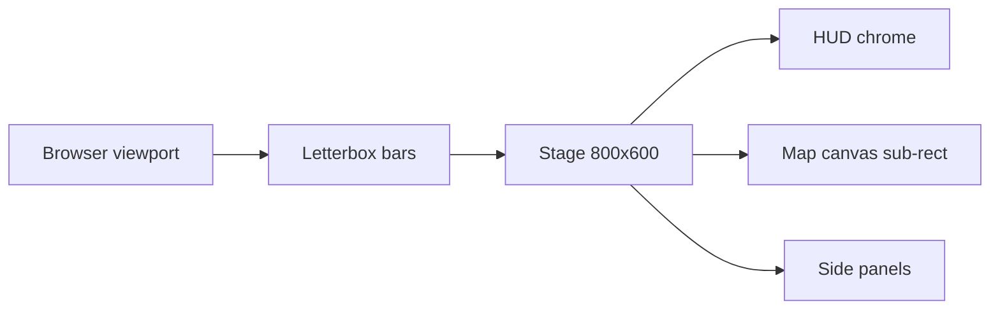

# Screen Scaling — Resolution, Aspect, Hi-DPI, Filter Modes

**Status:** Approved for MVP
**Date:** 2026-05-02

Reconciles the contradictions between `mockup.html` (fixed 800×600
layout), [`renderer-technology-choice.md`](./renderer-technology-choice.md)
(16:9 responsive map canvas), and the desktop+tablet delivery target.

---

## 1. Virtual Coordinate System

The 800×600 stage is a **virtual** coordinate system in CSS pixels.
Every screen package authors mockups against `(800, 600)`. At runtime:

- The DOM root is sized to the browser viewport.
- A single CSS transform scales the 800×600 stage to fit the viewport
  while preserving the 4:3 stage aspect.
- All `data-component` regions in `mockup.html` keep their authored
  pixel rectangles; the browser handles the scale.

```text
viewport (any size) ─► letterbox ─► stage 800×600 (virtual) ─► components
```

The virtual stage is the canonical hit-test space for DOM. The seam
adapter ([`ui-renderer-seam.md`](./ui-renderer-seam.md)) translates
between virtual and physical coordinates as needed.

---

## 2. Aspect Handling

Off-aspect viewports are **letterboxed**, never stretched.

- 16:9 (e.g. 1920×1080): vertical bars on left/right.
- 21:9 ultrawide: vertical bars on left/right, wider than 16:9.
- 4:3 (e.g. 1024×768, iPad portrait via landscape rotation): no bars.
- Viewports narrower than 4:3 (portrait): refuse to start with the
  rotate-device overlay (see [Breakpoints](#6-breakpoints)).

HUD elements anchored to stage edges remain inside the letterbox.
Letterbox bars use a flat solid colour from the active locale pack's
chrome theme; no decorative content lives in the bars.



### Safe-Area Insets

Stage anchors that must stay visible across all aspect ratios live in
the virtual safe-area inset rect:

- Top: `y = 0..36` (resource date bar)
- Right: `x = 608..800` (right command panel)
- Bottom: `y = 540..600` (status line)
- Left: `x = 0..18` (frame)

Components positioned outside this rect must declare a safe-area
fallback in their `spec.md` or render only on configurations where
the wider stage is guaranteed.

---

## 3. Map Canvas Sub-Region

The 16:9 map canvas is a sub-region of the 800×600 stage.

- Default rect: **`(18, 18, 590, 528)`** in virtual pixels — matches
  the authored canvas position in `screens/07-adventure-map/mockup.html`,
  `screens/08-kingdom-overview/mockup.html`, and the other adventure
  screens.
- The renderer's hex viewport scales hex content to fill that rect at
  16:9 internally; stage chrome continues to occupy the remaining
  space (right command panel, top resource bar, status line).
- For ultrawide (≥ 21:9 viewport) the stage stays 4:3 letterboxed.
  The map canvas does **not** widen with the viewport in MVP. A
  Phase 3 ultrawide responsive mode is reserved as future work.

⚠️ Assumption: the `(18, 18, 590, 528)` rect is taken from the curated
`screens/07-adventure-map/mockup.html` chrome rectangle. If a screen
authors a different map sub-rect, that screen's `spec.md` MUST cite
the override and the renderer task MUST honour it.

---

## 4. Hi-DPI

Each screen renders at the device pixel ratio reported by the browser.

### Canvas

- WebGL backing-store: `cssWidth * dpr` × `cssHeight * dpr`.
- CSS size of the canvas element: `cssWidth` × `cssHeight`.
- `renderer.resize(w, h, dpr)` is the single update path
  ([`ui-renderer-seam.md` § Resize Protocol](./ui-renderer-seam.md#4-resize-protocol)).

### Asset Variants

Sprite atlases ship in 1× and 2× variants indexed by manifest entry.
Atlas selection rule:

- DPR ≤ 1.25: use 1× variant.
- DPR > 1.25 and ≤ 2.5: use 2× variant.
- DPR > 2.5: use 2× variant; the renderer up-samples with `NEAREST`
  for tile atlases or `LINEAR` for UI atlases (see
  [Filter Modes](#5-filter-modes)).

Asset-manifest schema may extend to expose `dpiVariants[]`. The
authoritative shape is owned by the asset-pipeline task; see
[`tasks/mvp/02b-asset-pipeline/`](../../tasks/mvp/02b-asset-pipeline/).

⚠️ Assumption: `content-schema/schemas/asset-index.schema.json` does
not currently encode DPI variants. Adding `dpiVariants[]` is deferred
to the asset-pipeline task; this doc is the architectural rule until
the schema lands.

### DOM

- DOM components rely on the browser's automatic CSS-pixel scaling at
  hi-DPI.
- Pixel-art DOM images use `image-rendering: pixelated`. Icon, text,
  and ornament images use the default rendering.

---

## 5. Filter Modes

Texture filtering is split between gameplay and UI atlases.

| Atlas kind | Filter | Mipmaps | Notes |
|---|---|---|---|
| Tile (terrain, hex grid) | `gl.NEAREST` | no | Pixel-perfect tiles; no blur on zoom-in |
| Unit / map sprite | `gl.NEAREST` | no | Frame-based animation depends on integer offsets |
| UI atlas (icons, ornaments) | `gl.LINEAR` | yes | Smooth scaling at non-integer DPR |
| Font SDF atlas | `gl.LINEAR` | yes | Distance-field text |

### Atlas Naming Convention

- `tiles.<world>@1x.png`, `tiles.<world>@2x.png`
- `units.<faction>@1x.png`, `units.<faction>@2x.png`
- `ui.<theme>@1x.png`, `ui.<theme>@2x.png`
- `fonts.<script>.sdf.png`

The asset manifest binds each ID to its variants; runtime code never
constructs a path from the ID itself (the
[Protect These Rules](../../CLAUDE.md#protect-these-rules) constraint
that gameplay records never embed raw asset paths).

---

## 6. Breakpoints

| Viewport size | Behaviour |
|---|---|
| ≥ 1024 × 768 logical | Run full stage; default supported viewport |
| 1024 × 600..767 logical (short landscape) | Run, but warn in debug overlay; HUD safe-area inset still satisfied |
| < 1024 logical width OR portrait orientation | Show the rotate-device overlay; do not start the engine |
| Width or height < 480 logical | Refuse to start; show "Display too small" error |

The portrait-mode overlay is part of the loading screen package
([`screens/59-loading-screen/`](./wiki/screens/59-loading-screen/));
it surfaces a localized "Please rotate your device" message.

---

## 7. Anti-Patterns

- ❌ Authoring mockups against any size other than 800×600.
- ❌ Stretching the stage to fill ultrawide. Always letterbox.
- ❌ Reading `window.innerWidth` directly inside a component.
  Subscribe to `state.ui.viewport` instead
  ([`ui-renderer-seam.md` § Resize Protocol](./ui-renderer-seam.md#4-resize-protocol)).
- ❌ Embedding hi-DPI variant paths in gameplay records. Asset IDs
  resolve through the manifest.
- ❌ Using `gl.LINEAR` for tile atlases. Pixel art must stay crisp.
- ❌ Mixing pixel-art and anti-aliased UI in the same atlas.
- ❌ Reacting to a DPR change by recreating the WebGL context.
  `renderer.resize` is non-destructive.

---

## Related Files

- [`renderer-technology-choice.md`](./renderer-technology-choice.md)
- [`ui-technology-choice.md`](./ui-technology-choice.md)
- [`ui-renderer-seam.md`](./ui-renderer-seam.md)
- [`wiki/README.md`](./wiki/README.md)
- [`tasks/mvp/06-renderer/01-webgl2-context-setup-plus-resize-handler.md`](../../tasks/mvp/06-renderer/01-webgl2-context-setup-plus-resize-handler.md)
- [`tasks/mvp/06-renderer/02-hex-tile-atlas-plus-axialscreen-transform.md`](../../tasks/mvp/06-renderer/02-hex-tile-atlas-plus-axialscreen-transform.md)
- [`tasks/mvp/07-ui-shell/01-react-18-app-shell-with-canvas-overlay.md`](../../tasks/mvp/07-ui-shell/01-react-18-app-shell-with-canvas-overlay.md)
