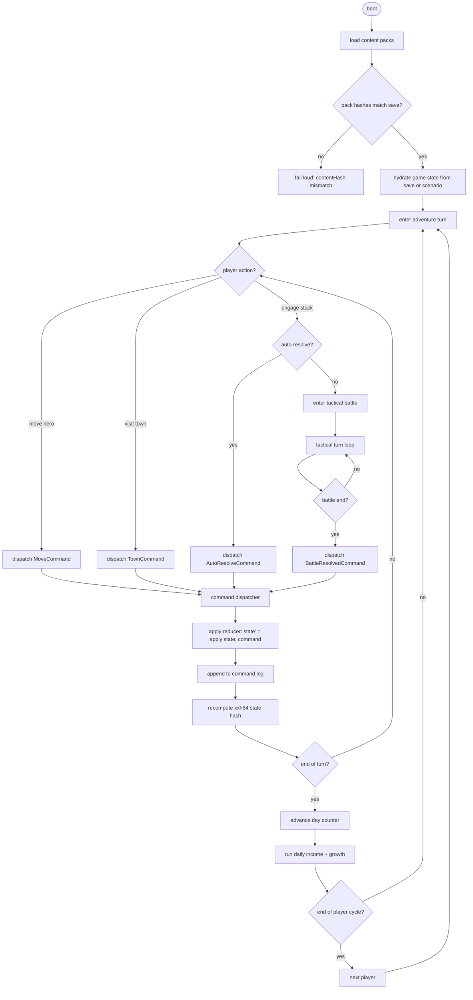

# Game State Flow

One diagram, one pass of the turn loop. This file pins down how the
engine, content runtime, and UI hand off state during a single
player turn so that new contributors (and AI agents) can read the
flow without tracing through task docs.

## High-Level Loop

## Boundary Responsibilities

| Boundary | Owned by | Notes |
|---|---|---|
| Content load + validation | [`src/content-runtime/`](../../src/content-runtime/) | Manifest resolution, dependency graph, pack-hash pin |
| State hydration | [`src/engine/`](../../src/engine/) | Replay from command log OR initialize from scenario |
| Command dispatch | [`src/engine/`](../../src/engine/) | Pure reducer; no I/O, no timing |
| Formula evaluation | [`src/rules/`](../../src/rules/) | AST walker over the formula schema |
| Tactical battle step | [`src/engine/`](../../src/engine/) | Nested reducer with its own command alphabet |
| Rendering (read-only) | [`src/renderer/`](../../src/renderer/) | Subscribes to state; never mutates |
| UI shell | [`src/ui/`](../../src/ui/) | Emits commands; never mutates state directly |

The arrow from `F → O` is the only path state changes take.
Rendering reads state; the UI emits commands; the engine owns the
reducer. No other mutation path exists.

## Why the loop looks this way

- **Command log = source of truth.** Replays, multiplayer lockstep,
  and desync detection all pin on `(seed, content hashes, command
  log)`. Removing state mutation outside the dispatcher is what
  keeps that triple canonical.
- **Tactical battle is nested, not forked.** Stepping into a battle
  doesn't branch control flow; it enters an inner reducer that
  eventually emits one `BattleResolvedCommand` back up. Save/replay
  works identically whether or not a tactical battle was fought.
- **Auto-resolve and real combat share the same formulas.** The
  `I → J` short-cut runs the same `attackBonus` and `defenseMitigation`
  AST (from [`baseline.ruleset.json`](../../content-schema/examples/records/rulesets/baseline.ruleset.json))
  that the tactical loop uses per strike. One ruleset edit, not two
  code paths.

## Related docs

- [`determinism.md`](./determinism.md) — why this loop is pure
- [`effect-registry.md`](./effect-registry.md) — what commands may produce
- [`pack-contract.md`](./pack-contract.md) — how packs enter at step B
