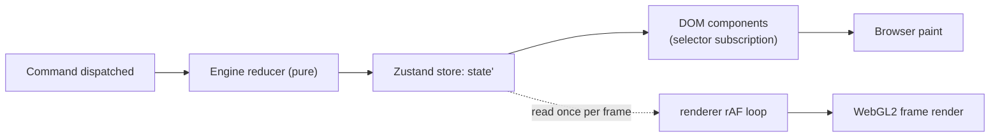

# Game State Flow

One diagram, one pass of the turn loop. Pins how the engine, content
runtime, and UI hand off state during a single player turn so new
contributors (and AI agents) can read the flow without tracing
through task docs.

## High-Level Loop

The `apply version-policy matrix` branch (refuse / migrate / degrade
across six mismatch kinds, three contexts) is owned by
[`version-policy.md`](./version-policy.md); not duplicated here. The
diagram nodes use prose verbs (`MoveCommand`, `TownCommand`, …); the
canonical `kind` values they map to live in
[`command-schema.md`](./command-schema.md) (`MOVE_HERO`,
`RECRUIT_UNITS` / `BUILD_BUILDING` / `LEARN_SPELL`,
`AUTO_RESOLVE_BATTLE`, `BATTLE_RESOLVED`).

## Boundary Responsibilities

> Who can mutate what. The per-module ledger of which side effects
> each boundary may use lives in
> [`side-effect-matrix.md`](./side-effect-matrix.md).

| Boundary | Owned by | Notes |
|---|---|---|
| Content load + validation | [`src/content-runtime/`](../../src/content-runtime/) | Manifest resolution, dependency graph, pack-hash pin |
| State hydration | [`src/engine/`](../../src/engine/) | Replay from command log OR initialize from scenario |
| Command queue | [`src/engine/`](../../src/engine/) | Bounded FIFO per engine instance; dedups by nonce. See [`command-schema.md` § Dispatcher Queue](./command-schema.md#dispatcher-queue). |
| Command dispatch | [`src/engine/`](../../src/engine/) | Pure reducer; no I/O, no timing. Cross-actor ordering rule in [`command-schema.md` § Cross-Actor Ordering](./command-schema.md#cross-actor-ordering). |
| Multi-engine desync detection | [`src/engine/`](../../src/engine/) test harness | Two `createEngine()` instances apply the same log; hashes compared per step. See [`multi-engine-harness.md`](./multi-engine-harness.md). |
| Formula evaluation | [`src/rules/`](../../src/rules/) | AST walker over the formula schema |
| Tactical battle step | [`src/engine/`](../../src/engine/) | Nested reducer with its own command alphabet |
| Rendering (read-only) | [`src/renderer/`](../../src/renderer/) | Subscribes to state; never mutates. Iterates the per-dispatch event log per [`event-system.md`](./event-system.md). |
| UI shell | [`src/ui/`](../../src/ui/) | Emits commands; never mutates state directly |

`F → O` is the only path state changes take: the UI emits commands,
the engine owns the reducer, the renderer reads. No other mutation
path exists.

## Why the loop looks this way

- **Command log = source of truth.** Replays, multiplayer lockstep,
  and desync detection all pin on `(seed, content hashes, command
  log)`. Removing state mutation outside the dispatcher is what
  keeps that triple canonical.
- **Tactical battle is nested, not forked.** Stepping into a battle
  enters an inner reducer that eventually emits one
  `BATTLE_RESOLVED` back up. Save/replay works identically whether
  or not a tactical battle was fought.
- **Auto-resolve and tactical combat share one formula.** The
  `I → J` short-cut runs the same `attackBonus` and
  `defenseMitigation` AST (from
  [`baseline.ruleset.json`](../../content-schema/examples/records/rulesets/baseline.ruleset.json))
  the tactical loop uses per strike. One ruleset edit, not two code
  paths.

## Renderer + UI Subscription Cadence

The reducer is event-driven; the renderer is frame-driven. Both
read the same Zustand store on different cadences. Pinned in
[`ui-technology-choice.md` § State Binding](./ui-technology-choice.md#state-binding);
DOM/WebGL seam in
[`ui-renderer-seam.md`](./ui-renderer-seam.md).

- DOM components wake only when the slice they observe changed;
  selectors are pure, equality defaults to shallow.
- The WebGL viewport reads `store.getState()` once per
  `requestAnimationFrame` and never subscribes through React.
- Lag bounds, optimistic UI, and lockstep behaviour are pinned in
  [`ui-frame-lag-contract.md`](./ui-frame-lag-contract.md).

## Command Lifecycle (UI side)

A user gesture flows through four UI-visible phases — drafting,
pending confirmation, applied, animating — pinned in
[`ui-state-contract.md` § Command Lifecycle](./ui-state-contract.md#command-lifecycle).
Turn-affecting commands are gated by
`state.ui.animations.activeTimelineId` per
[`ui-input-arbitration.md` § Animation Gate](./ui-input-arbitration.md#animation-gate);
the dispatcher rejects them while the slot is non-null so renderer
animations cannot lap the reducer.

## Save eligibility

`canSaveNow(state): { allowed: boolean, reason?: SaveDisabledReason }`
is the pure predicate the system menu and Save/Load screens consult
before enabling Save. It returns `{ allowed: false, … }` during
active battle, multiplayer turn lock, an open choice modal, or
mid-end-of-day animation. Canonical reason IDs and triggers live in
[`content-schema/save-eligibility.md`](../../content-schema/save-eligibility.md);
cross-cutting framing in
[`edge-cases-policy.md` § 8](./edge-cases-policy.md#8-save-gating).

On load, the command log replays silently to the saved offset; the
animation timeline starts empty (no in-flight animations) and
re-emitted events execute synchronously. The first post-load
command schedules animations normally.

## AI Side Channels

Gameplay-AI workers emit one `Command` per `requestAIMove` call;
that command is the only thing that lands in the canonical command
log. AI players act sequentially in turn order; multi-worker
parallel compute is allowed only as an internal optimization that
does not affect the order of `Command`s appended to the log (see
[`ai-contract.md` § 6 Parallelism](./ai-contract.md#6-parallelism)
and
[`command-schema.md` § Cross-Actor Ordering](./command-schema.md#cross-actor-ordering)).

The worker boundary consumes the projected per-player
`AdventureView` (per
[`ai-contract.md` § 1 Input View](./ai-contract.md#1-input-view)),
not raw `AdventureState`; dispatcher legality validation still runs
against full state.

The `aiDecisionLog` ring buffer (per
[`ai-contract.md` § 7 Decision Log](./ai-contract.md#7-decision-log))
is **not** part of the command log: enabling the
`Engine.config.aiDecisionLog` runtime flag does not change the
replay hash or save format.

## Privacy Slice

`state.privacy.*` is the in-memory mirror of the persisted privacy
options
([`privacy-options.schema.json`](../../content-schema/schemas/privacy-options.schema.json))
plus the consent-version state. Consumers (analytics SDK loader,
replay-export sanitizer, privacy disclosure modal) **must** read
this slice; reading the persisted IndexedDB row directly is
forbidden.

- `state.privacy.options` — `displayNameMode`, `analyticsOptIn`,
  `allowMatureContent`, `saltFingerprint` (mirrors the persisted
  `hr-profile.privacy` row).
- `state.privacy.acceptedPolicyVersion: integer` — the
  `policyVersion` the user has explicitly accepted; mirrors
  [`privacy.md`](./privacy.md) top-of-file.
- `state.privacy.currentDisclosureVersion: integer` — compile-time
  constant; increments on any material change to
  [`privacy.md`](./privacy.md). When
  `acceptedPolicyVersion < currentDisclosureVersion`, the
  disclosure modal in screen
  [`56-options`](./wiki/screens/56-options/) re-opens on next launch
  and re-records consent.
- `state.privacy.replayShareConsent` —
  `{ mode: 'playerHashOnly' | 'playerNameCleartext', exportedAt }`.
  Default `playerHashOnly`. Consumed by the replay-export sanitizer
  declared in
  [`diagrams/24-save-flow.md`](./diagrams/24-save-flow.md).

## Error Sinks

Every UI sink originating from a thrown error routes through
[`error-formatter.md`](./error-formatter.md):

- `formatUserError` is the only function that may produce the text
  bound into a UI sink.
- `formatDevError` is the only function that may produce the text
  bound into a developer sink.
- The build-mode policy in
  [`production-build.md`](./production-build.md) rules out any
  other path in production.

`state.privacy.*` is not consulted by the formatter; redaction is
data-shape-driven (allowlist patterns + the `redact: true` tag).

## Related docs

- [`event-system.md`](./event-system.md) — event-log runtime contract (emission, consumption, no-veto, retention, save/load, error isolation, re-entry guard rules)
- [`event-schema.md`](./event-schema.md) — closed event vocabulary, payloads, emitters, consumers
- [`version-policy.md`](./version-policy.md) — refuse / migrate / degrade matrix for save and pack mismatches
- [`ai-contract.md`](./ai-contract.md) — gameplay-AI runtime contract (input view, worker protocol, budgets, cancellation, parallelism, decision log)
- [`determinism.md`](./determinism.md) — why this loop is pure
- [`effect-registry.md`](./effect-registry.md) — what commands may produce
- [`pack-contract.md`](./pack-contract.md) — how packs enter at step B
- [`ui-technology-choice.md`](./ui-technology-choice.md) — DOM-side framework + selectors
- [`ui-renderer-seam.md`](./ui-renderer-seam.md) — DOM/WebGL seam
- [`ui-frame-lag-contract.md`](./ui-frame-lag-contract.md) — UI lag bounds
- [`ui-state-contract.md`](./ui-state-contract.md) — command lifecycle, selector purity, component-state matrix
- [`ui-input-arbitration.md`](./ui-input-arbitration.md) — single-emit, Esc ladder, animation gates
- [`ui-routing.md`](./ui-routing.md) — screen-router FSM and modal stack
- [`animation-contract.md`](./animation-contract.md) — two-clock model, DAMAGE_FRAME ownership, gameplay-vs-visual state table

---

## 🔍 Sync Check

- **UI: ✔** — `state.ui.animations.activeTimelineId`, the four-phase command lifecycle, screen [`56-options`](./wiki/screens/56-options/) disclosure re-prompt, and the system-menu / save-load Save gating all match [`ui-input-arbitration.md` § Animation Gate](./ui-input-arbitration.md#animation-gate), [`ui-state-contract.md` § Command Lifecycle](./ui-state-contract.md#command-lifecycle), and [`content-schema/save-eligibility.md`](../../content-schema/save-eligibility.md).
- **Schema: ✔** — `state.privacy.options` field set (`displayNameMode`, `analyticsOptIn`, `allowMatureContent`, `saltFingerprint`) matches [`privacy-options.schema.json`](../../content-schema/schemas/privacy-options.schema.json); `replayShareConsent` shape matches [`diagrams/24-save-flow.md`](./diagrams/24-save-flow.md); the `aiDecisionLog` exclusion from save format is consistent with [`ai-contract.md` § 7 Decision Log](./ai-contract.md#7-decision-log).
- **Tasks: ✔** — Inbound references from `tasks/mvp/05-adventure-map/*` (`02-turn-structure`, `03-hero-movement`, `06-auto-resolve-combat`, `07-victory-defeat-conditions`, `21-map-object-visit-and-battle-initiation-commands`, …) match the loop nodes; the doc is registered in [`tasks/task-registry.json`](../../tasks/task-registry.json); no orphan tasks reference it without reciprocal mention.

## ⚠ Issues

- **Save-gating anchor was broken in the original.** The original linked `[`edge-cases-policy.md` § 8](./edge-cases-policy.md#8-save-gating-q212)`, but the actual heading is `## 8. Save gating` (anchor `#8-save-gating`). Per Hard Prohibition C ("remove only when the link is genuinely broken"), the rewrite repointed the anchor in place; no other file edited. If a `q212` suffix is wanted, the fix belongs in [`edge-cases-policy.md`](./edge-cases-policy.md), not here.
- **Diagram pseudo-names vs. canonical command kinds.** The `flowchart TD` uses `MoveCommand`, `TownCommand`, `AutoResolveCommand`, `BattleResolvedCommand`. The canonical closed enum in [`command.schema.json`](../../content-schema/schemas/command.schema.json) and the per-kind entries in [`command-schema.md`](./command-schema.md) use `MOVE_HERO`, `RECRUIT_UNITS` / `BUILD_BUILDING` / `LEARN_SPELL`, `AUTO_RESOLVE_BATTLE`, `BATTLE_RESOLVED`. The diagram is intentionally pseudocode for readability and the rewrite added a clarifying line beneath it; flagged here rather than rewritten because changing the diagram's labels is a doc-style decision the owning task ([`tasks/mvp/05-adventure-map/02-turn-structure.md`](../../tasks/mvp/05-adventure-map/02-turn-structure.md)) should make.
- **`canSaveNow` reason type is broader in this doc than in the schema source.** The original returned `reason?: string`; the canonical signature in [`content-schema/save-eligibility.md`](../../content-schema/save-eligibility.md) is `reason?: SaveDisabledReason` (closed enum: `save.disabled.in_battle`, `save.disabled.not_your_turn`, `save.disabled.modal_open`, `save.disabled.animating`). The rewrite tightened to `SaveDisabledReason` to match the canonical source; no schema change implied.
