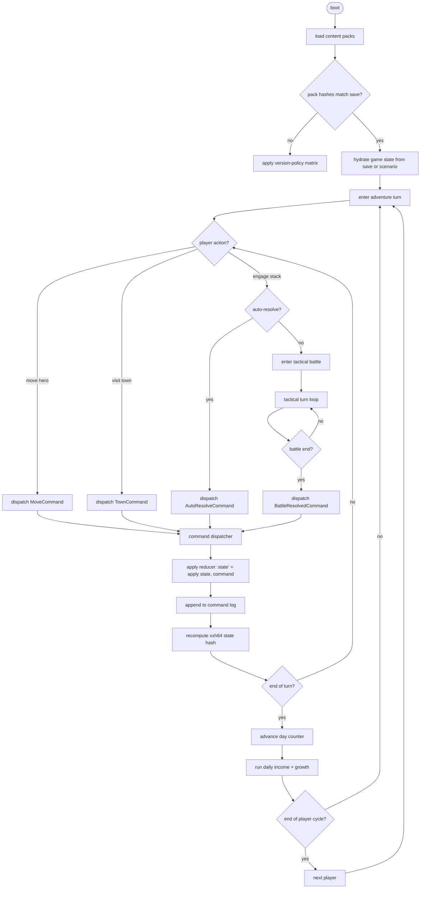
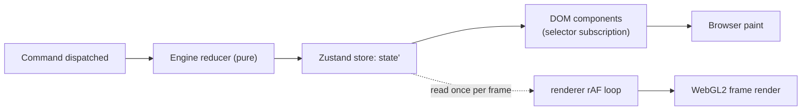

# Game State Flow

One diagram, one pass of the turn loop. This file pins down how the
engine, content runtime, and UI hand off state during a single
player turn so that new contributors (and AI agents) can read the
flow without tracing through task docs.

## High-Level Loop

The behaviour of the `apply version-policy matrix` branch (refuse,
migrate, or degrade) is pinned in
[`version-policy.md`](./version-policy.md). That matrix covers six
mismatch kinds across offline, multiplayer, and trusted-replay
contexts; this file does not duplicate the rules.

## Boundary Responsibilities

| Boundary | Owned by | Notes |
|---|---|---|
| Content load + validation | [`src/content-runtime/`](../../src/content-runtime/) | Manifest resolution, dependency graph, pack-hash pin |
| State hydration | [`src/engine/`](../../src/engine/) | Replay from command log OR initialize from scenario |
| Command queue | [`src/engine/`](../../src/engine/) | Bounded FIFO per engine instance; dedups by nonce. See [`command-schema.md` § Dispatcher Queue](./command-schema.md#dispatcher-queue). |
| Command dispatch | [`src/engine/`](../../src/engine/) | Pure reducer; no I/O, no timing. Cross-actor ordering rule in [`command-schema.md` § Cross-Actor Ordering](./command-schema.md#cross-actor-ordering). |
| Multi-engine desync detection | [`src/engine/`](../../src/engine/) test harness | Two `createEngine()` instances apply the same log; hashes compared per step. See [`multi-engine-harness.md`](./multi-engine-harness.md). |
| Formula evaluation | [`src/rules/`](../../src/rules/) | AST walker over the formula schema |
| Tactical battle step | [`src/engine/`](../../src/engine/) | Nested reducer with its own command alphabet |
| Rendering (read-only) | [`src/renderer/`](../../src/renderer/) | Subscribes to state; never mutates. Iterates the per-dispatch event log per [`event-system.md`](./event-system.md). |
| UI shell | [`src/ui/`](../../src/ui/) | Emits commands; never mutates state directly |

The arrow from `F → O` is the only path state changes take.
Rendering reads state; the UI emits commands; the engine owns the
reducer. No other mutation path exists.

## Why the loop looks this way

- **Command log = source of truth.** Replays, multiplayer lockstep,
  and desync detection all pin on `(seed, content hashes, command
  log)`. Removing state mutation outside the dispatcher is what
  keeps that triple canonical.
- **Tactical battle is nested, not forked.** Stepping into a battle
  doesn't branch control flow; it enters an inner reducer that
  eventually emits one `BattleResolvedCommand` back up. Save/replay
  works identically whether or not a tactical battle was fought.
- **Auto-resolve and real combat share the same formulas.** The
  `I → J` short-cut runs the same `attackBonus` and `defenseMitigation`
  AST (from [`baseline.ruleset.json`](../../content-schema/examples/records/rulesets/baseline.ruleset.json))
  that the tactical loop uses per strike. One ruleset edit, not two
  code paths.

## Renderer + UI Subscription Cadence

The reducer is event-driven; the renderer is frame-driven. Both
subscribers read the same Zustand store but on different cadences.
Pinned in [`ui-technology-choice.md` § State Binding](./ui-technology-choice.md#state-binding)
and detailed at the WebGL/DOM seam in
[`ui-renderer-seam.md`](./ui-renderer-seam.md).

- DOM components wake only when the slice they observe changed.
  Selectors are pure; equality defaults to shallow.
- WebGL viewport reads `store.getState()` once per `requestAnimationFrame`.
  It never subscribes through React.
- Lag bounds, optimistic UI, and lockstep behavior are pinned in
  [`ui-frame-lag-contract.md`](./ui-frame-lag-contract.md).

## Command Lifecycle (UI side)

A user gesture flows through four UI-visible phases — drafting,
pending confirmation, applied, animating — pinned in
[`ui-state-contract.md` § Command Lifecycle](./ui-state-contract.md#command-lifecycle).
Turn-affecting commands are gated by
`state.ui.animations.activeTimelineId` per
[`ui-input-arbitration.md` § Animation Gate](./ui-input-arbitration.md#animation-gate);
the dispatcher rejects them while the slot is non-null so renderer
animations cannot lap the reducer.

## Save eligibility

`canSaveNow(state): { allowed: boolean, reason?: string }` is the
pure predicate the system menu and Save/Load screens consult before
enabling Save. It returns `false` during active battle, multiplayer
turn lock, an open choice modal, or mid-end-of-day animation. The
canonical predicate enumeration and reason IDs live in
[`content-schema/save-eligibility.md`](../../content-schema/save-eligibility.md);
cross-cutting framing is in
[`edge-cases-policy.md` § 8](./edge-cases-policy.md#8-save-gating-q212).

On load, the command log replays silently to the saved offset; the
animation timeline starts empty (no in-flight animations) and re-emitted
events execute synchronously. The first post-load command schedules
animations normally.

## AI Side Channels

Gameplay-AI workers emit one `Command` per `requestAIMove` call;
that command is the only thing that lands in the canonical
command log. The `aiDecisionLog` ring buffer (per
[`ai-contract.md` § 7 Decision Log](./ai-contract.md#7-decision-log))
is **not** part of the command log: enabling the
`Engine.config.aiDecisionLog` runtime flag does not change the
replay hash or save format.

AI players act sequentially in turn order. Multi-worker parallel
compute is permitted only as an internal optimization that does
not affect the order of `Command`s appended to the log; see
[`ai-contract.md` § 6 Parallelism](./ai-contract.md#6-parallelism)
and [`command-schema.md` § Cross-Actor Ordering](./command-schema.md#cross-actor-ordering).

The worker boundary consumes the projected per-player
`AdventureView` (per
[`ai-contract.md` § 1 Input View](./ai-contract.md#1-input-view)),
not raw `AdventureState`. Dispatcher legality validation still
runs against full state.

## Related docs

- [`event-system.md`](./event-system.md) — event-log runtime contract (emission, consumption, no-veto, retention, save/load, error isolation, re-entry guard rules)
- [`event-schema.md`](./event-schema.md) — closed event vocabulary, payloads, emitters, consumers
- [`version-policy.md`](./version-policy.md) — refuse / migrate / degrade matrix for save and pack mismatches
- [`ai-contract.md`](./ai-contract.md) — gameplay-AI runtime contract (input view, worker protocol, budgets, cancellation, parallelism, decision log)
- [`determinism.md`](./determinism.md) — why this loop is pure
- [`effect-registry.md`](./effect-registry.md) — what commands may produce
- [`pack-contract.md`](./pack-contract.md) — how packs enter at step B
- [`ui-technology-choice.md`](./ui-technology-choice.md) — DOM-side framework + selectors
- [`ui-renderer-seam.md`](./ui-renderer-seam.md) — DOM/WebGL seam
- [`ui-frame-lag-contract.md`](./ui-frame-lag-contract.md) — UI lag bounds
- [`ui-state-contract.md`](./ui-state-contract.md) — command lifecycle, selector purity, component-state matrix
- [`ui-input-arbitration.md`](./ui-input-arbitration.md) — single-emit, Esc ladder, animation gates
- [`ui-routing.md`](./ui-routing.md) — screen-router FSM and modal stack
- [`animation-contract.md`](./animation-contract.md) — two-clock model, DAMAGE_FRAME ownership, gameplay-vs-visual state table
