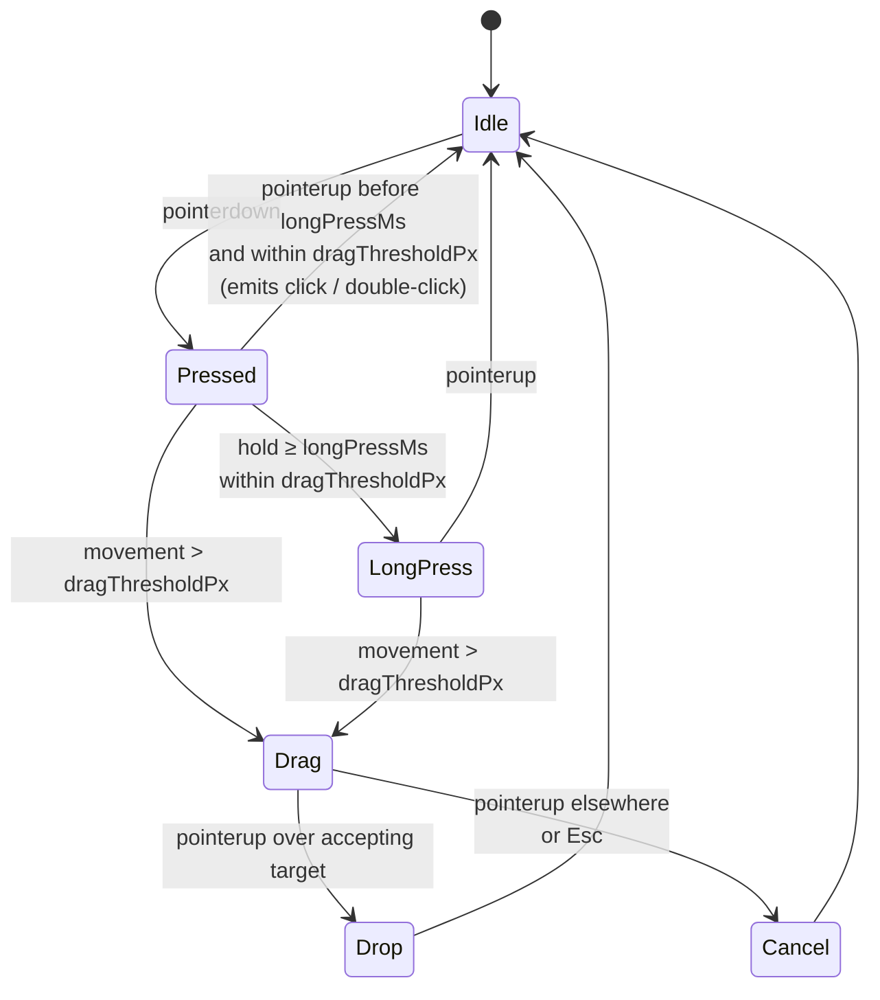

# UI Gesture Taxonomy

Canonical names, detection thresholds, and event sequences for the
gestures every screen package may bind. `interactions.md` files MUST
use these names verbatim — ad-hoc gesture vocabulary in screen
packages fails `validate`.

> Numeric thresholds (`doubleClickWindowMs`, `longPressMs`,
> `dragThresholdPx`, ...) live in
> [`ruleset.schema.json` § ui.timing](../../content-schema/schemas/ruleset.schema.json)
> and are tunable as content. Cancellation is owned by
> [`ui-input-arbitration.md` § Esc Precedence Ladder](ui-input-arbitration.md#esc-precedence-ladder).

---

## Gestures

### `click`

Single primary-button (mouse left, touch tap, gamepad confirm)
press + release within `doubleClickWindowMs` and ≤ `dragThresholdPx`
of pointer movement. Emits one `click` event at `pointerup`.

### `double-click`

Two `click` events on the same target within `doubleClickWindowMs`
(default `400`). The first `click` fires immediately; if a matching
second click arrives in the window, the bound `double-click` action
is fired and the first `click`'s effect is **not** rolled back —
authors who need single-vs-double exclusivity must bind only one of
the two on a given target.

### `right-click` / `context`

Single secondary-button press. On touch devices, mapped to
`long-press` per the modality bridging rule in
[`ui-input-modalities.md`](ui-input-modalities.md). Emits
`right-click` at `pointerdown`; the matching `pointerup` does not
fire a separate event.

### `long-press`

Primary press held ≥ `longPressMs` (default `600`) with
≤ `dragThresholdPx` of movement. Emits
`feedback.long-press.start` at the threshold and `long-press` at
`pointerup`. Releasing before the threshold downgrades the gesture to
`click`.

### `drag`

Primary press + > `dragThresholdPx` of movement before release.
Produces three distinct events:

```text
dragstart  — at the moment the threshold is crossed
dragmove   — every frame while the pointer is held
dragend    — at pointerup
```

Drag emits state under `state.ui.drag.*`:

| Slot                                | Meaning                                                              |
| ----------------------------------- | -------------------------------------------------------------------- |
| `state.ui.drag.sourceId`            | DOM element id (or game-object id) the drag originated from.         |
| `state.ui.drag.sourceKind`          | One of the `DragKind` values declared by the source.                 |
| `state.ui.drag.ghostPosition`       | Current pointer position used to render the drag ghost.              |
| `state.ui.drag.acceptedTargetIds`   | Set of drop targets currently accepting the dragged kind.            |

All `state.ui.drag.*` slots are UI-only; they never enter saves or
replays.

### `pinch`, `pan`, `wheel`

**Viewport-only.** These gestures drive map zoom and scroll; they do
not fire against UI panel controls. Implementations MUST NOT bind
them to button or list-row actions — the gestures are claimed by the
canvas seam (see
[`ui-renderer-seam.md`](ui-renderer-seam.md)) before they reach the
DOM overlay.

---

## Drop Acceptance

Drop targets declare an `accepts: DragKind[]` array in their screen
`spec.md`'s **State Bindings**. While a drag is in flight:

- The renderer highlights every target whose `accepts` array contains
  the active `state.ui.drag.sourceKind`.
- Releasing over a non-highlighted target is a cancel (no command, no
  state change).
- Releasing over a highlighted target dispatches the screen-declared
  drop command with the dragged source id and the target id as
  scalars.

Existing screens that imply drag-and-drop and need explicit `accepts`
declarations:

- `46-hero-screen` — artifact equip / unequip
- `51-split-stack-dialog` — unit drag between army slots
- `52-artifact-combine-dialog` — combine artifact components
- `26-marketplace`, `36-marketplace-artifact-trading` — trade slot
  drops

The per-screen sweep adding `accepts` columns is owned by
[`tasks/mvp/07-ui-shell/13-screen-package-contract-sweep.md`](../../tasks/mvp/07-ui-shell/13-screen-package-contract-sweep.md).

---

## Cancellation

Esc during any gesture cancels it via the ladder in
[`ui-input-arbitration.md` § Esc Precedence Ladder](ui-input-arbitration.md#esc-precedence-ladder).
Release outside the gesture's source target with no accepting drop
target is also a cancel. Cancels never emit a command and never raise
an `ErrorState`.

---

## Gesture FSM



`click`, `double-click`, `right-click`, `long-press`, and the
`drag*` events are the only canonical names; screen packages that
introduce new vocabulary fail validation until the term is added here.

---

## Related Docs

- [`overview.md`](overview.md) — architecture index
- [`ui-input-arbitration.md`](ui-input-arbitration.md) — single-emit,
  Esc ladder
- [`ui-input-modalities.md`](ui-input-modalities.md) — touch / gamepad
  bridging rules
- [`ui-renderer-seam.md`](ui-renderer-seam.md) — pinch / pan / wheel
  routing
- [`wiki/README.md`](wiki/README.md) — `interactions.md` MUST use
  canonical gesture names from this file
