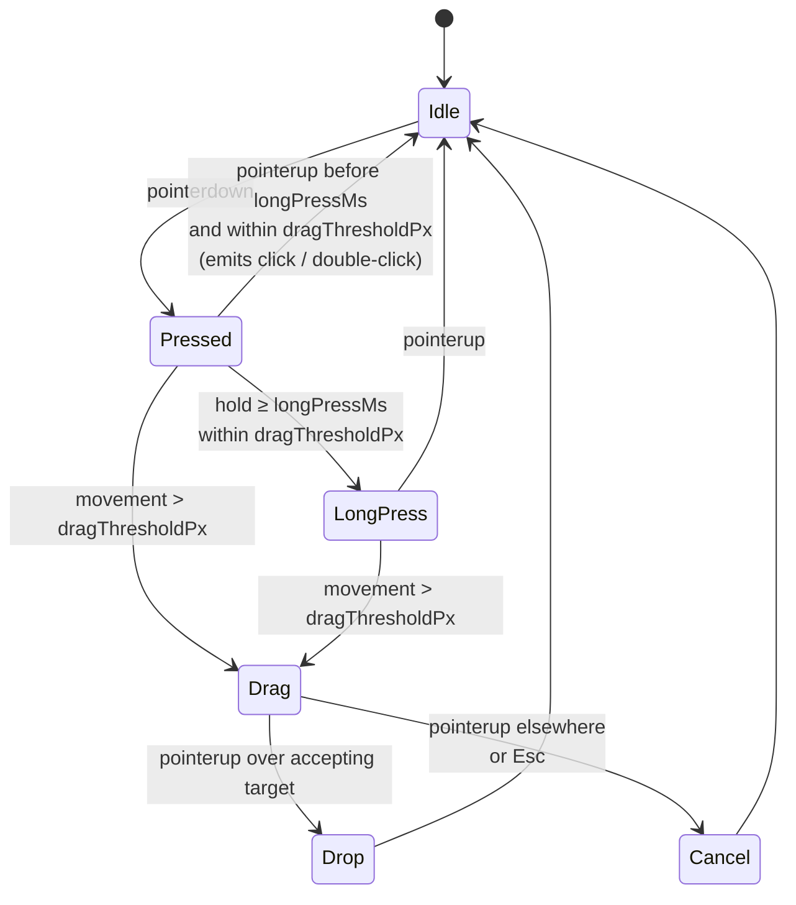

# UI Gesture Taxonomy

Canonical gesture names, detection thresholds, and event sequences
every screen package may bind. `interactions.md` files MUST use these
names verbatim; ad-hoc gesture vocabulary fails `validate`.

> Companions:
> - [`ui-input-arbitration.md`](ui-input-arbitration.md) — single-emit,
>   first-event-wins, animation gates, Esc precedence ladder (drag
>   cancellation is rung 1 of that ladder).
> - [`ui-input-modalities.md`](ui-input-modalities.md) — touch /
>   keyboard / gamepad bridging onto the gestures below.
> - [`ui-renderer-seam.md`](ui-renderer-seam.md) — `pinch` / `pan` /
>   `wheel` routing into the canvas viewport.
> - [`ruleset.schema.json` § ui.timing](../../content-schema/schemas/ruleset.schema.json)
>   — the canonical home of `doubleClickWindowMs`, `longPressMs`,
>   `dragThresholdPx`. Numbers are content-tunable.

---

## 1. Gestures

### `click`

Primary-button press + release (mouse left, touch tap, gamepad
confirm) within `doubleClickWindowMs` and with ≤ `dragThresholdPx` of
pointer movement. Emits one `click` event at `pointerup`.

### `double-click`

Two `click` events on the same target within `doubleClickWindowMs`
(default `400`). The first `click` fires immediately; if a matching
second `click` arrives in the window, the bound `double-click` action
fires and the first `click`'s effect is **not** rolled back. Authors
who need single-vs-double exclusivity must bind only one of the two
on a given target.

### `right-click` / `context`

Single secondary-button press. On touch devices, mapped to
`long-press` per the modality bridging rule in
[`ui-input-modalities.md`](ui-input-modalities.md). Emits
`right-click` at `pointerdown`; the matching `pointerup` does not fire
a separate event.

### `long-press`

Primary press held ≥ `longPressMs` (default `600`) with
≤ `dragThresholdPx` of movement. Emits `feedback.long-press.start` at
the threshold and `long-press` at `pointerup`. Releasing before the
threshold downgrades the gesture to `click`.

### `drag`

Primary press followed by > `dragThresholdPx` (default `8`) of
movement before release. Produces three distinct events:

```text
dragstart  — at the moment the threshold is crossed
dragmove   — every frame while the pointer is held
dragend    — at pointerup
```

Drag exposes the following slots under `state.ui.drag.*`:

| Slot                                | Meaning                                                              |
| ----------------------------------- | -------------------------------------------------------------------- |
| `state.ui.drag.sourceId`            | DOM element id (or game-object id) the drag originated from.         |
| `state.ui.drag.sourceKind`          | One of the `DragKind` values declared by the source.                 |
| `state.ui.drag.ghostPosition`       | Current pointer position used to render the drag ghost.              |
| `state.ui.drag.acceptedTargetIds`   | Set of drop targets currently accepting the dragged kind.            |

All `state.ui.drag.*` slots are UI-only — they never enter saves or
replays.

### `pinch`, `pan`, `wheel` (viewport-only)

These gestures drive map zoom and scroll only; they MUST NOT bind to
DOM panel controls or list-row actions. The canvas seam
([`ui-renderer-seam.md`](ui-renderer-seam.md)) claims them before they
reach the DOM overlay.

### Canonical vocabulary

`click`, `double-click`, `right-click` / `context`, `long-press`,
`drag` (with `dragstart` / `dragmove` / `dragend`), and the
viewport-only `pinch` / `pan` / `wheel` are the only canonical
gesture names. Screen packages that introduce new vocabulary fail
validation until the term is added here.

---

## 2. Drop Acceptance

Drop targets declare an `accepts: DragKind[]` array in their screen
`spec.md`'s **State Bindings**. While a drag is in flight:

- The renderer highlights every target whose `accepts` array contains
  the active `state.ui.drag.sourceKind`.
- Releasing over a non-highlighted target is a cancel — no command,
  no state change.
- Releasing over a highlighted target dispatches the screen-declared
  drop command with the dragged source id and the target id as
  scalars.

Screens that imply drag-and-drop and need explicit `accepts`
declarations:

- `46-hero-screen` — artifact equip / unequip
- `51-split-stack-dialog` — unit drag between army slots
- `52-artifact-combine-dialog` — combine artifact components
- `26-marketplace`, `36-marketplace-artifact-trading` — trade slot
  drops

The per-screen sweep adding `accepts` columns is owned by
[`tasks/mvp/07-ui-shell/13-screen-package-contract-sweep.md`](../../tasks/mvp/07-ui-shell/13-screen-package-contract-sweep.md).

---

## 3. Cancellation

A drag cancels when **any** of these fire:

- `Escape` — handled by rung 1 of the
  [`ui-input-arbitration.md` § Esc Precedence Ladder](ui-input-arbitration.md#esc-precedence-ladder).
- Pointer release outside the source target with no accepting drop
  target underneath.

Cancels clear every `state.ui.drag.*` slot in the same frame, emit
`feedback.drag.cancel`, never dispatch a command, and never raise an
`ErrorState`.

---

## 4. Gesture FSM



---

## Related Docs

- [`overview.md`](overview.md) — architecture index
- [`ui-input-arbitration.md`](ui-input-arbitration.md) — single-emit,
  Esc ladder
- [`ui-input-modalities.md`](ui-input-modalities.md) — touch / gamepad
  bridging rules
- [`ui-renderer-seam.md`](ui-renderer-seam.md) — pinch / pan / wheel
  routing
- [`wiki/README.md`](wiki/README.md) — `interactions.md` MUST use
  canonical gesture names from this file

---

## 🔍 Sync Check

- **UI: ✔** — Screen packages `46-hero-screen`, `51-split-stack-dialog`, `52-artifact-combine-dialog`, `26-marketplace`, `36-marketplace-artifact-trading` all reference drag / drag-ghost prose; canonical names match the [`wiki/_templates/contract-sweep.md`](wiki/_templates/contract-sweep.md) gesture row and the rule in [`wiki/README.md`](wiki/README.md) § Authoring Rules.
- **Schema: ✔** — `doubleClickWindowMs`, `longPressMs`, `dragThresholdPx` are defined in [`ruleset.schema.json` § ui.timing](../../content-schema/schemas/ruleset.schema.json); baseline values (`400` / `600` / `8`) match [`baseline.ruleset.json`](../../content-schema/examples/records/rulesets/baseline.ruleset.json); the `Ruleset` row is registered in [`schema-matrix.md`](schema-matrix.md).
- **Tasks: ✔** — Doc is owned by [`mvp.07-ui-shell.16-gesture-taxonomy`](../../tasks/mvp/07-ui-shell/16-gesture-taxonomy.md); cross-referenced by [`mvp.07-ui-shell.13-screen-package-contract-sweep`](../../tasks/mvp/07-ui-shell/13-screen-package-contract-sweep.md) and [`mvp.07-ui-shell.19-input-modalities`](../../tasks/mvp/07-ui-shell/19-input-modalities.md) Read First blocks.

## ⚠ Issues

- **Sweep `Owned Paths (shared)` does not cover the `accepts`-declaration screens.** This doc claims the per-screen `accepts` sweep is owned by [`mvp.07-ui-shell.13-screen-package-contract-sweep`](../../tasks/mvp/07-ui-shell/13-screen-package-contract-sweep.md), but that task's `Owned Paths (shared)` lists only `01`, `24`, `38`, `46`, `54`, `60` — not `51-split-stack-dialog`, `52-artifact-combine-dialog`, `26-marketplace`, or `36-marketplace-artifact-trading`. Per [`.agents/rules/tasks.md`](../../.agents/rules/tasks.md) ("Owned Paths (shared) are additive extension points"), the sweep task must add those four screen folders to its shared paths before it can land `accepts` columns there. Suggested values: add `docs/architecture/wiki/screens/{26-marketplace,36-marketplace-artifact-trading,51-split-stack-dialog,52-artifact-combine-dialog}/` to the sweep task's `Owned Paths (shared)`. Skill did not edit the sweep task (Hard Prohibition D — never edit cross-checked files).
- **`feedback.long-press.start` and `feedback.drag.cancel` are not registered as commands.** This doc emits both names; [`command-schema.md`](command-schema.md) has no matching entry. They appear to be UI feedback events, not gameplay commands — consistent with the "drops are commands; cancels are not" rule in [`ui-input-arbitration.md` § Drag Cancellation](ui-input-arbitration.md#drag-cancellation). If `command-schema.md` is meant to catalogue UI feedback channels as well, the owning task (UI Shell M1) should register them; otherwise this is a documentation-scope clarification, not a CI gap.
