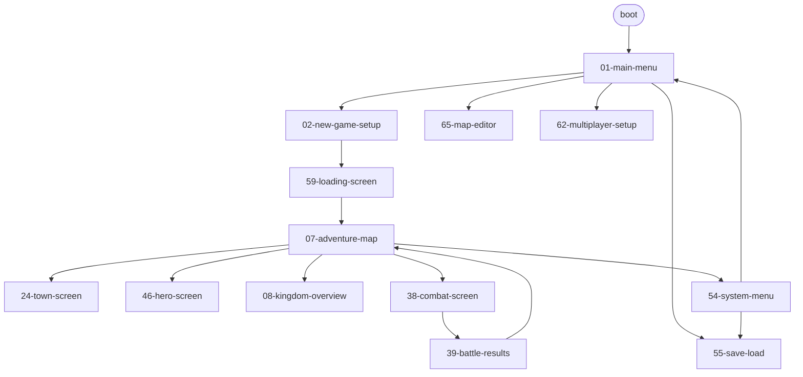

# UI Routing

Cross-screen router contract: the `ScreenRoute` FSM, the aggregated
transition graph, the `ModalEntry[]` stack, and the modal dismissal
policy. Each screen package's `interactions.md` declares its own
"Next Screen" rows; this file is the layer that aggregates them and
pins `RouterState`.

Companion docs:

- [`wiki/README.md`](wiki/README.md) — screen authoring rules.
- [`ui-state-contract.md`](ui-state-contract.md) — cross-cutting UI
  state (selectors, slot inventory, command lifecycle).
- [`ui-input-arbitration.md`](ui-input-arbitration.md) — Esc
  precedence, single-emit, animation gate.
- [`ui-hotkeys.md`](ui-hotkeys.md) — focus order, tab trap, focus
  restoration.

---

## Decision

The UI is a finite-state machine over the closed `ScreenRoute` enum
plus a bounded `ModalEntry[]` stack. Transitions are declarative
records consumed by both the runtime and the
[`screen-transition-graph.json`](screen-transition-graph.json)
generator. `npm run generate:screen-transition-graph` regenerates
the JSON; `npm run validate` rejects orphan screens, dangling
next-screen references, and unresolved transition guards.

> **Status note.** The generator script and the `validate` wiring
> land in
> [`tasks/mvp/07-ui-shell/11-screen-router-fsm.md`](../../tasks/mvp/07-ui-shell/11-screen-router-fsm.md).
> The modal-stack schema, examples, and per-severity dismissal copy
> are owned by
> [`tasks/mvp/07-ui-shell/14-modal-stack.md`](../../tasks/mvp/07-ui-shell/14-modal-stack.md).
> Until those ship, this file is the canonical contract and the
> generated artefact is rebuilt on demand.

---

## Route Enum

`ScreenRoute` is the closed set of screen-package ids, mirroring the
`screens[]` arrays in
[`wiki/screens/index.json`](wiki/screens/index.json). Adding a screen
means:

1. add a numbered package under `wiki/screens/<nn-slug>/`,
2. add the slug to `index.json`,
3. regenerate the transition graph,
4. declare at least one inbound transition in another screen's
   `interactions.md`.

A package with zero inbound transitions fails `validate`
(`01-main-menu` is exempt as the bootstrap route).

---

## RouterState Shape

```text
RouterState = {
  active:     ScreenRoute,
  modalStack: ModalEntry[],   // see content-schema/schemas/modal-entry.schema.json
}
```

- `active` — bottom-of-stack screen, what the user sees behind any
  modals.
- `modalStack` — ordered list of open modals, top last. Caller
  routing on close reads `modalStack[top].callerRoute`; focus
  restoration reads `modalStack[top].previousFocusElementId`.

The router lives in `state.ui.router` (slot reserved). It is
**excluded from saves and replays** per
[`determinism.md` § UI Draft Slice](determinism.md#ui-draft-slice);
re-loading drops back to the post-load route owned by the
persistence layer (typically the adventure map or main menu, never
a transient modal).

---

## Transition Records

Every legal transition is a declarative record:

```text
Transition = {
  from:           ScreenRoute,
  to:             ScreenRoute,
  trigger:        string,     // action id from the source interactions.md
  guard?:         string,     // selector path, e.g. selectors.persistence.canSaveCurrentGame
  exitAnimation?: string,     // animation id played before to-screen mount
}
```

Records are aggregated from each screen's `interactions.md` "Next
Screen" column and emitted to
[`screen-transition-graph.json`](screen-transition-graph.json). The
generator (`scripts/generate-screen-transition-graph.mjs`) reads
each package's interaction table, normalises ids, and writes one
entry per row.

### Group Invariants

- **Battle screens** (`38-combat-screen`, `39-battle-results`,
  `40-pre-battle-dialog`, `41-surrender-cost-dialog`,
  `42-victory-defeat-cinematic`, `43-siege-combat`,
  `44-combat-spell-targeting`, `45-tactics-phase`) are reachable
  only while engine `phase === "battle"`. Entry from outside the
  group MUST go through `40-pre-battle-dialog` or an
  `INITIATE_BATTLE`-equivalent trigger (`adventure.engage`).
- **Editor** (`65-map-editor`) is reachable only from
  `01-main-menu`. The group does not consume gameplay state and
  never pushes a modal onto an in-game stack.
- **Multiplayer** (`62-multiplayer-setup`, `63-hotseat-turn-handoff`,
  `64-network-lobby`, `77-multiplayer-game`) is reachable only from
  `01-main-menu` — except `63-hotseat-turn-handoff`, which is also
  reachable after `END_DAY` in a hotseat session.

---

## Generated Graph

The Mermaid render is regenerated alongside
[`screen-transition-graph.json`](screen-transition-graph.json) and
injected into this section. Until the generator lands, the graph is
the union of every `Next Screen` cell in
`wiki/screens/*/interactions.md`.



The Mermaid block above is a **smoke render** — the JSON is
authoritative. CI compares the regenerated Mermaid against this
section; manual edits to the block alone fail validation.

---

## Validation

`npm run validate` extends to:

1. **Orphan check.** A `ScreenRoute` with zero inbound transitions
   (excluding `01-main-menu`) fails.
2. **Dangling next-screen check.** A `Next Screen` cell that does
   not resolve to an `index.json` package id fails.
3. **Guard resolution.** A transition `guard` MUST reference a
   selector path that exists in the runtime selector index. Until
   selectors land in code, the contract is enforced by string-prefix
   match against the selector vocabulary documented in screen
   `data-contracts.md` files.

---

## Modal Stack

Modals nest. The single-shot `callerRoute` field used by the existing
modal screen packages silently corrupts at depth ≥ 3 (e.g.
`54-system-menu` → `60-confirmation-dialog` → second
`60-confirmation-dialog`). The fix is a stack.

### State Slot

`state.ui.modalStack: ModalEntry[]` — closed shape pinned by
[`modal-entry.schema.json`](../../content-schema/schemas/modal-entry.schema.json).
Each entry carries:

- `id` — `ModalId` (closed enum sourced from the modal entries in
  [`wiki/screens/index.json`](wiki/screens/index.json)).
- `openedAt` — reducer tick at push time.
- `callerRoute` — `ScreenRoute` to return to on close.
- `previousFocusElementId` — focus to restore on close (`null` when
  no control had focus). Captured and restored per
  [`ui-hotkeys.md` § Element-Level Focus Restoration](ui-hotkeys.md#element-level-focus-restoration).
- `severity` — `info | warn | destructive | system`. Drives the
  dismissal policy below.
- `params` — caller-supplied payload; closed shape per modal id is
  defined in the owning screen's `data-contracts.md`.

### Operations

- `MODAL_OPEN` pushes a new entry. The currently focused element id
  is captured into `previousFocusElementId` (or `null`).
- `MODAL_CLOSE` pops the top entry, restores focus to
  `previousFocusElementId`, and routes to `callerRoute` if the
  closing modal was full-screen.
- `MODAL_REPLACE` pops then pushes — used for confirm-on-confirm
  escalations, e.g. an "are you sure?" replacing a passive info
  dialog.

### Maximum Depth

`modalStack.length` MUST NOT exceed **3**. The reducer rejects a 4th
`MODAL_OPEN` and emits an `ErrorState`
(`code: "ui.modalStack.overflow"`, `severity: "warn"`). Three levels
covers the deepest existing flow (`54-system-menu` →
`60-confirmation-dialog` → second `60-confirmation-dialog` for
unsaved-progress acknowledgement); deeper sequences are a design
smell.

### Save / Replay Rule

`state.ui.modalStack` is part of `state.ui.*` and is therefore
**excluded from saves and replays** per
[`determinism.md` § UI Draft Slice](determinism.md#ui-draft-slice).
A save taken with a modal open re-loads onto the modal's
`callerRoute` with an empty stack.

### Per-screen Migration

Screen packages that currently bind `state.ui.<name>.callerRoute`
(modal screens `09`, `20`, `25`, `37`, `40`, `41`, `48`, `51`, `52`,
`54`, `60` per the canonical list in task 13) MUST be swept to read
`state.ui.modalStack[top]` instead. The sweep is owned by
[`tasks/mvp/07-ui-shell/13-screen-package-contract-sweep.md`](../../tasks/mvp/07-ui-shell/13-screen-package-contract-sweep.md).

---

## Dismissal Policy

Modals are dismissed by Esc, by clicking outside the modal frame, or
by the modal's own Cancel control. Behaviour varies by `severity`:

| `severity`     | Esc              | Click-outside                                     | Notes                                                                  |
| -------------- | ---------------- | ------------------------------------------------- | ---------------------------------------------------------------------- |
| `info`         | closes           | closes                                            | Passive notifications (level-up summary, tooltip-detail dialogs).      |
| `warn`         | closes           | closes only if a passive Cancel button is present | Marketplace overspend warnings, building re-build attempts.            |
| `destructive`  | maps to Cancel   | does **not** close                                | Quit-without-saving, surrender, irreversible spend confirmations.      |
| `system`       | closes           | ignored                                           | System menu, recoverable-error panel, network-lobby disconnect notice. |

The policy is enforced by the modal shell, not by individual
screens. Each modal screen's `interactions.md` MUST declare the Esc
binding (usually `confirm.cancel` or `system.resume`) explicitly so
the dismissal contract appears in the per-screen action table.

The Esc precedence ladder (drag → modal → tooltip → system menu)
lives in
[`ui-input-arbitration.md` § Esc Precedence](ui-input-arbitration.md#esc-precedence-ladder).

---

## Related Docs

- [`overview.md`](overview.md) — architecture index.
- [`ui-state-contract.md`](ui-state-contract.md) — cross-screen
  state rules (component-state matrix, selector purity, lifecycle).
- [`ui-input-arbitration.md`](ui-input-arbitration.md) — Esc
  precedence, drag cancel, single-emit.
- [`ui-hotkeys.md`](ui-hotkeys.md) — tab order, focus restoration,
  hotkey scopes.
- [`wiki/README.md`](wiki/README.md) — screen authoring rules.

---

## 🔍 Sync Check

- **UI: ✔** — Every screen id named here resolves in
  [`wiki/screens/index.json`](wiki/screens/index.json) (`01`, `02`,
  `07`, `08`, `24`, `38`, `39`, `40`–`45`, `46`, `54`, `55`,
  `59`–`65`, `77`); the smoke-render Mermaid mirrors the 15
  transitions in [`screen-transition-graph.json`](screen-transition-graph.json).
  Per-screen sweep tracked by
  [`tasks/mvp/07-ui-shell/13-screen-package-contract-sweep.md`](../../tasks/mvp/07-ui-shell/13-screen-package-contract-sweep.md).
- **Schema: ✔** — Required keys, `severity` enum, and
  `additionalProperties: false` in
  [`modal-entry.schema.json`](../../content-schema/schemas/modal-entry.schema.json)
  match § Modal Stack exactly; the row in
  [`schema-matrix.md`](./schema-matrix.md) (`ModalEntry`) cites this
  doc as canonical.
- **Tasks: ⚠** — Host doc primarily owned by
  [`tasks/mvp/07-ui-shell/11-screen-router-fsm.md`](../../tasks/mvp/07-ui-shell/11-screen-router-fsm.md);
  modal-stack content is shared-owned by
  [`tasks/mvp/07-ui-shell/14-modal-stack.md`](../../tasks/mvp/07-ui-shell/14-modal-stack.md)
  (`Owned Paths (shared): docs/architecture/ui-routing.md`); sweep
  owner is
  [`tasks/mvp/07-ui-shell/13-screen-package-contract-sweep.md`](../../tasks/mvp/07-ui-shell/13-screen-package-contract-sweep.md).
  The generator script `scripts/generate-screen-transition-graph.mjs`
  is **not yet on disk** — flagged below.

## ⚠ Issues

- **Generator script not yet present.** The doc and task 11 both
  reference `scripts/generate-screen-transition-graph.mjs` and an
  `npm run generate:screen-transition-graph` script entry; neither
  exists in the tree today. The current
  [`screen-transition-graph.json`](screen-transition-graph.json)
  is hand-authored as a smoke baseline (its own `description`
  field admits this). Per CLAUDE.md root contract on machine-
  checkable invariants, the owning task —
  [`tasks/mvp/07-ui-shell/11-screen-router-fsm.md`](../../tasks/mvp/07-ui-shell/11-screen-router-fsm.md)
  — must land the script and wire it into `npm run validate`
  before the doc's "CI rejects diffs against it" claim is
  enforceable. The Status note already calls out the gap; no
  rewrite needed here, but the doc remains advisory until the
  script ships.

- **Active-focus slot not pinned in `ui-state-contract.md`.** The
  earlier draft named `state.ui.activeFocusElementId` as the slot
  read on `MODAL_OPEN`; that slot is **not** declared in the State
  Slot Inventory of [`ui-state-contract.md` § Command
  Lifecycle](ui-state-contract.md#command-lifecycle), nor anywhere
  else under `docs/architecture/` or `src/`. The rewrite drops the
  explicit slot name and instead references
  [`ui-hotkeys.md` § Element-Level Focus Restoration](ui-hotkeys.md#element-level-focus-restoration),
  which owns the capture/restore semantics. If the runtime needs a
  canonical "current focus" slot, the slot must be added to the
  inventory in `ui-state-contract.md` by the owner of
  `tasks/mvp/07-ui-shell/18-hotkey-registry.md` or the modal-stack
  task. Suggested values:
  Slot=`state.ui.input.focus.activeElementId`,
  Phase=`Always`,
  Notes=`null when no control is focused; captured into
  modalStack[top].previousFocusElementId on MODAL_OPEN`.

- **`modal-entry.schema.json` anchor reference is off-by-one
  word.** The schema's `previousFocusElementId.description` cites
  `ui-hotkeys.md § Focus Restoration`; the actual heading is
  `Element-Level Focus Restoration` (line 100). Cosmetic, but the
  raw anchor `#focus-restoration` does not resolve. Per Hard
  Prohibition D the audit cannot edit the schema; the owner of
  `tasks/mvp/07-ui-shell/14-modal-stack.md` should update the
  description on the next schema-touching change.

- **`MODAL_OPEN` / `MODAL_CLOSE` / `MODAL_REPLACE` are not
  registered in [`command-schema.md`](./command-schema.md).** The
  ops listed in § Operations are dispatched against the UI shell,
  not the deterministic engine reducer, and so should appear under
  the **Consent, Onboarding & Destructive-UX Commands** group (or
  a new "Modal & Routing" group) in `command-schema.md` with the
  `local-ui` qualifier — same convention used for `OPEN_*` /
  `CANCEL_*` tokens today. Per CLAUDE.md root contract ("Screen
  interaction tokens are checked by `screen-command-coverage.json`
  and `npm run validate:commands`"), the omission risks
  `validate:commands` flagging modal-using screens. Owner: the
  modal-stack task. Suggested entries:
  `MODAL_OPEN { modalId, params?, severity }` — pushes a new
  entry; `MODAL_CLOSE { result? }` — pops the top entry and
  restores focus; `MODAL_REPLACE { modalId, params?, severity }` —
  pops + pushes for confirm-on-confirm escalations.
