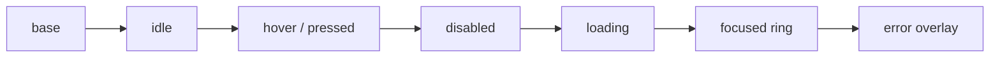

# UI State Contract

Cross-screen rules that every screen package and every UI runtime
implementation must obey. This file is the host doc for selector
purity, the component-state matrix, the tooltip lifecycle, the command
lifecycle, the input-modality slot, and the map-editor undo/redo
contract. Per-screen contracts in
[`wiki/screens/`](wiki/screens/) compose with — they do not override —
the rules pinned here.

> Companions:
> - [`ui-routing.md`](ui-routing.md) — router FSM, transition graph,
>   modal stack, dismissal policy.
> - [`ui-input-arbitration.md`](ui-input-arbitration.md) — single-emit
>   per gesture, debounce, animation gates.
> - [`ui-gestures.md`](ui-gestures.md) — gesture taxonomy and drag
>   contract.
> - [`ui-hotkeys.md`](ui-hotkeys.md) — hotkey registry and focus order.
> - [`ui-input-modalities.md`](ui-input-modalities.md) — touch / mouse
>   / keyboard / gamepad surfaces.

---

## Selector Purity

Every function exported under `selectors.*` MUST be a pure function of
state. The UI layer is "non-deterministic" relative to the engine
([`determinism.md`](determinism.md)) only because it owns hover, drag,
and animation drafts — selectors themselves still obey the deterministic
contract.

**A selector MUST NOT:**

- call `Math.random()`, `Date.now()`, `performance.now()`, or
  `crypto.randomUUID()`;
- read `localStorage`, `sessionStorage`, `IndexedDB`, or any DOM API;
- await an async value or schedule a timer;
- mutate module-level state, including memoization caches keyed on
  anything other than its inputs;
- call into the renderer or the network layer.

**A selector MAY:**

- accept `state` plus pure positional args and return a new value;
- use stable memoization (e.g. `reselect`, Zustand `shallow`) when the
  cache key is derived solely from inputs;
- return a referentially-stable reference when inputs are unchanged so
  React subscribers do not re-render.

**Why this rule:** two players in M5 lockstep observe the same
`(state, command-log)` triple. A selector that consults the wall clock
or local storage will diverge between clients even though the state is
identical, producing apparent UI desync that is invisible to the
hash-based replay check.

**Lint enforcement.** Files matching `src/**/selectors/**` MUST be
covered by an ESLint rule (or equivalent) banning `Math.random()`,
`Date.now()`, `performance.now()`, `crypto.randomUUID()`, and `await`.
The rule lands as part of the
[`tasks/mvp/07-ui-shell/10-selector-purity-lint.md`](../../tasks/mvp/07-ui-shell/10-selector-purity-lint.md)
task; until then, contracts are enforced by code review and the test
contract under `tests/selectors/purity.spec.ts` (a sentinel test that
runs each selector twice on identical input and asserts deep equality).

---

## Component State Matrix

Every interactive control — buttons, list rows, draggable items,
inputs, hexes, anchored tooltips — MUST support the following seven
visual states. Missing visuals fall back to the `idle` baseline; they
do not fall through to "no state" or the renderer's default.

| State      | When                                                                  |
| ---------- | --------------------------------------------------------------------- |
| `idle`     | Pointer is not over the control, no keyboard focus, no command pending. |
| `hover`    | Pointer is over the control or controller focus is on it.             |
| `pressed`  | Primary button held; touch contact active; gamepad confirm held.      |
| `disabled` | A guard rejects the action (resources, ownership, phase, route).      |
| `focused`  | The control has keyboard focus per the focus-order rule in [`ui-hotkeys.md`](ui-hotkeys.md). |
| `error`    | The most recent action against this control raised an `ErrorState`.   |
| `loading`  | A command dispatched from this control is mid-flight (animation, async commit). |

Each screen `spec.md`'s **Animation Contract** MUST enumerate these
seven states for every control listed in the **Component Tree**, or
explicitly waive an inapplicable state with a one-line justification
(e.g. "no `loading` — control resolves synchronously without animation").
The Animation Contract sweep is owned by
[`tasks/mvp/07-ui-shell/13-screen-package-contract-sweep.md`](../../tasks/mvp/07-ui-shell/13-screen-package-contract-sweep.md).

### Precedence

States may stack. When two or more apply at the same time, the
following precedence rules decide what is rendered:

- `disabled` suppresses `hover` and `pressed` but **not** `focused`.
- `error` overlays every state except `loading`.
- `loading` overlays `idle` only; if `error` and `loading` both fire,
  `error` wins.
- `focused` is always rendered when present (a11y rule). The focus ring
  must remain visible under `disabled` so keyboard users can still
  navigate.

### Composition Layers



Read the chain left-to-right: each layer paints on top of the previous
one. The renderer must not collapse two adjacent layers into a single
sprite — they are independent and any one can flicker on or off
without disturbing the others.

---

## Tooltip Lifecycle

Tooltips bind to volatile gameplay objects (creature stacks, hovered
hexes, owned mines) and must handle the underlying object disappearing,
becoming fogged, or changing ownership while the tooltip is on screen.

### Per-tick Re-resolution

On every reducer tick, the tooltip controller MUST re-resolve the
pinned tooltip body against the current state:

```text
publicInfo  = selectors.mapObjects.publicTooltipInfo(state, pinnedObjectId)
hiddenGuard = selectors.scouting.hiddenTooltipFields(state, pinnedObjectId)
```

If `publicInfo` returns `null` (object destroyed, captured into fog,
or hidden by a fogging event), the tooltip auto-dismisses with a
`feedback.tooltip.invalidate` animation. The pin is cleared
(`state.ui.tooltips.pinnedObjectId ← null`); no localized error is
shown — this is a passive change, not a user-visible failure.

If `hiddenGuard` masks a field that was previously visible (e.g. an
army count is now hidden by ownership change), the tooltip body
re-renders against the new visibility scope on the next frame. No
multiplayer information leaks through stale tooltips.

### Numeric Constants

All tooltip timing constants live in
[`ruleset.schema.json` § ui.timing](../../content-schema/schemas/ruleset.schema.json):

| Key                   | Default | Purpose                                                  |
| --------------------- | ------- | -------------------------------------------------------- |
| `tooltipHoldDelayMs`  | 350     | Pointer dwell before the tooltip appears.                |
| `tooltipFadeInMs`     | 120     | Tooltip fade-in duration.                                |
| `tooltipFadeOutMs`    | 80      | Tooltip fade-out duration on close or invalidate.        |

All seven screens that render anchored tooltips
(`18-map-object-tooltip`, `19-status-bar`, `38-combat-screen`,
`46-hero-screen`, `47-spell-book`, `50-creature-info`, and the
generic right-click affordance) MUST consume these constants directly;
hard-coded delays in screen code are forbidden.

---

## Command Lifecycle

The reducer is synchronous, but a single user gesture flows through
four UI-visible phases. Implementations and screen packages MUST
distinguish them; otherwise double-clicks queue duplicate commands and
animations desync from state.

### Phases

1. **Drafting.** The user is composing a command; nothing has
   dispatched yet. UI-only state under `state.ui.<screen>.draft.*`,
   e.g. `state.ui.adventure.pathPreview` for hover-pathing or
   `state.ui.targeting.draft` for spell targeting. Drafts are excluded
   from saves and replays per
   [`determinism.md` § UI Draft Slice](determinism.md#ui-draft-slice).
2. **Pending confirmation.** A `CONFIRM_*` modal is active and
   `state.ui.confirmation.pendingAction` holds a serialized command
   awaiting user OK. The modal stack
   ([`ui-routing.md` § Modal Stack](ui-routing.md#modal-stack))
   guarantees that the bottom caller route survives nesting.
3. **Applied.** The reducer has run; canonical state is final; the
   command is in the command log; no UI flag is needed because the
   selector tree has already updated.
4. **Animating.** The renderer is playing the timeline owned by the
   last applied command. The slot
   `state.ui.animations.activeTimelineId: string | null` holds the
   active timeline id (or `null` when nothing is playing). All
   `END_TURN`, `BATTLE_ACTION`, `SPELL_CAST`, and other turn-affecting
   commands are gated by this slot per
   [`ui-input-arbitration.md` § Animation Gate](ui-input-arbitration.md#animation-gate).

### Single-emit Guarantee

The DOM shell MUST guarantee at most one command per input gesture.
The debounce token is owned by
[`ui-input-arbitration.md` § Single-emit Rule](ui-input-arbitration.md#single-emit-rule);
this section is the cross-reference. A double-click on an attack button
must not produce two `BATTLE_ATTACK` commands; a click + Enter on the
same control within `inputDebounceMs` must produce one command.

### State Slot Inventory (UI-owned)

| Slot                                      | Phase             | Notes                                                            |
| ----------------------------------------- | ----------------- | ---------------------------------------------------------------- |
| `state.ui.<screen>.draft.*`               | Drafting          | Per-screen UI-only fields. Excluded from saves and replays.      |
| `state.ui.confirmation.pendingAction`     | Pending           | Serialized command awaiting confirm.                             |
| `state.ui.modalStack`                     | Pending / shell   | See [`ui-routing.md` § Modal Stack](ui-routing.md#modal-stack).  |
| `state.ui.animations.activeTimelineId`    | Animating         | `null` when no animation is playing. Gates turn-affecting input. |
| `state.ui.input.activeModality`           | Always            | `"mouse" \| "touch" \| "keyboard" \| "gamepad"`. See [`ui-input-modalities.md`](ui-input-modalities.md). |
| `state.ui.loading.errors`                 | Recovery          | Array of `ErrorState` records (see below).                       |

---

## Error State

Cross-screen error pipes (toast tray, recoverable-error panel,
telemetry sink) consume the canonical
[`error-state.schema.json`](../../content-schema/schemas/error-state.schema.json)
record. Every screen `data-contracts.md` that binds `errors.*`
localization keys MUST list this schema in its **Content Schemas And
Registries** table.

`state.ui.loading.errors`, `state.ui.<screen>.errors`, and any future
toast tray MUST be typed as `ErrorState[]`. Stable error codes
(`code` field) survive reformatting; they are the join key for
telemetry.

---

## Undo / Redo (Map Editor)

Undo/redo is **opt-in and editor-only** for MVP. Gameplay commands
flow through the deterministic reducer and are not undoable in-game;
in-game undo is deferred to Phase 2 with no MVP placeholder.

### State Slots

```text
state.editor.history.commandLog: EditorCommand[]
state.editor.history.cursor:     int            // index of next-to-apply
```

`state.editor.history.commandLog` is a separate stream from gameplay
commands; editor commands never enter the gameplay command log, the
state hash, saves, or replays.

### Operations

- `editor.undo` decrements `cursor` and re-applies the prefix
  `commandLog[0 .. cursor)` against the editor document.
- `editor.redo` increments `cursor` and re-applies the next entry.
- Any new `editor.<command>` truncates `commandLog[cursor..]` and
  appends the new entry, then advances `cursor`.

### Bounds

`commandLog.length` is bounded by
[`ruleset.schema.json` § ui.editor.maxHistory](../../content-schema/schemas/ruleset.schema.json)
(default `200`). When the bound is reached, the oldest entry is
dropped and `cursor` is decremented to keep the visible position
stable.

### Hotkeys

`screen.map-editor.undo` defaults to `Control+Z`;
`screen.map-editor.redo` defaults to `Control+Shift+Z`. Both are
listed in the canonical hotkey example
[`hotkey/global-default.hotkey.json`](../../content-schema/examples/records/hotkey/global-default.hotkey.json)
and pinned in [`ui-hotkeys.md`](ui-hotkeys.md).

---

## Related Docs

- [`overview.md`](overview.md) — architecture index
- [`determinism.md`](determinism.md) — deterministic-path rules
- [`state-flow.md`](state-flow.md) — turn loop and reducer/renderer cadence
- [`ui-frame-lag-contract.md`](ui-frame-lag-contract.md) — UI lag bounds
- [`wiki/README.md`](wiki/README.md) — screen-package authoring rules
