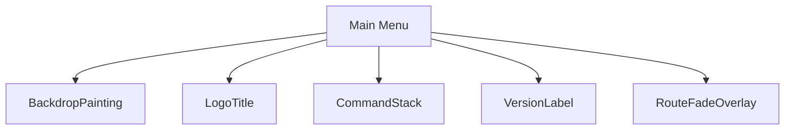
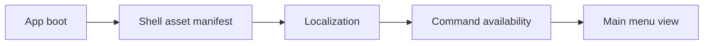
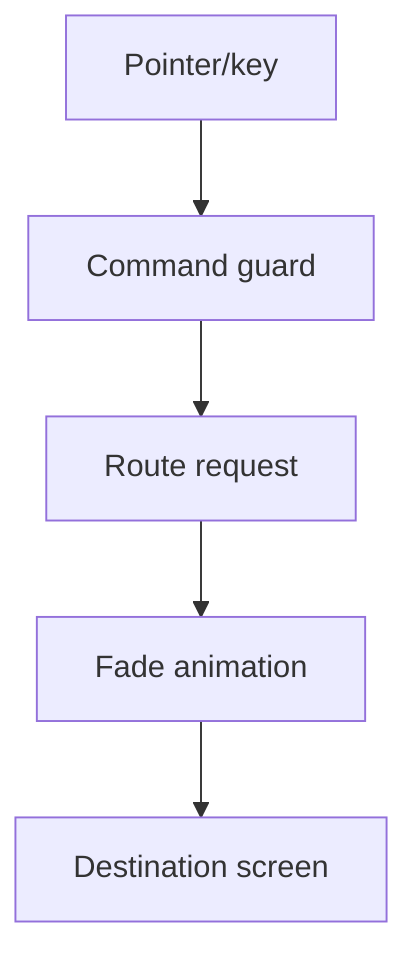
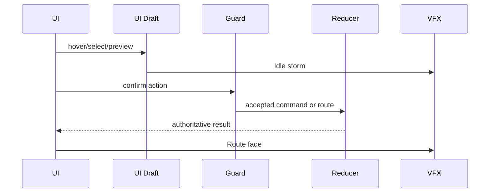
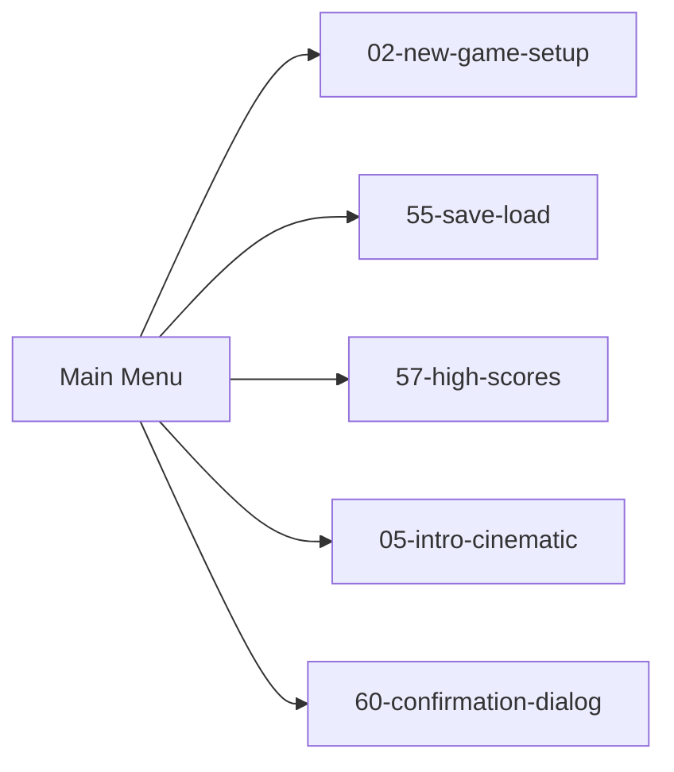

# Screen 01 Architecture: Main Menu

System: menus
Screen ID: main-menu
Visual Archetype: curated-menu
Curation Status: anchor-v1

## Purpose
Boot shell menu with full-bleed fantasy painting, title treatment, icon-backed menu buttons, and no gameplay state loaded.

## Visual Direction
- Original internal UI contract. Do not use third-party captures,
  copied franchise art, or external product pixels as implementation input.

## Visual Composition

## Screen Load And Data Resolution

## Main Interaction Flow

## Animation Flow

## Outgoing Transitions

## State Inputs
- menu.commands -> state.shell.availableCommands
- lastSaveAvailable -> state.persistence.hasLoadableSave
- quitGuard -> state.shell.quitRequiresConfirmation

## Implementation Contract
- Mockup defines visual regions and data hooks only.
- Spec defines the component/state contract.
- Interactions define controls, timing, command routing, disabled states, and error behavior.
- Data contracts define schemas, config, localization, asset, audio, VFX, save, and replay references.
- Diagrams are screen-specific summaries of the same contract and must not introduce hidden behavior.
