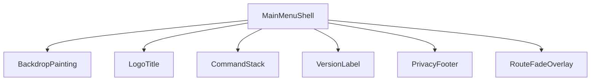
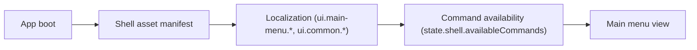
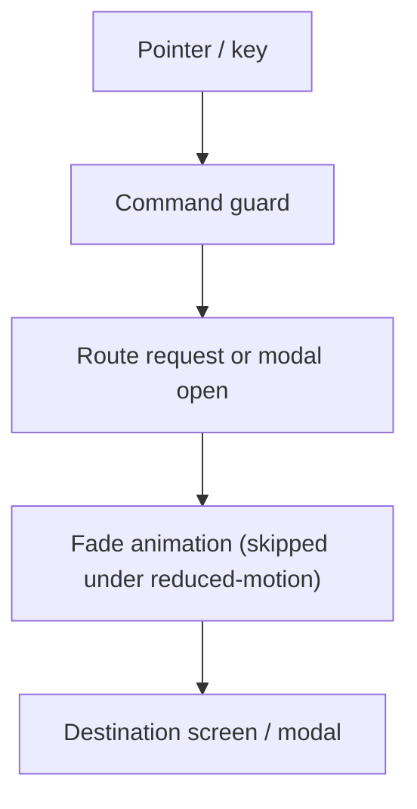
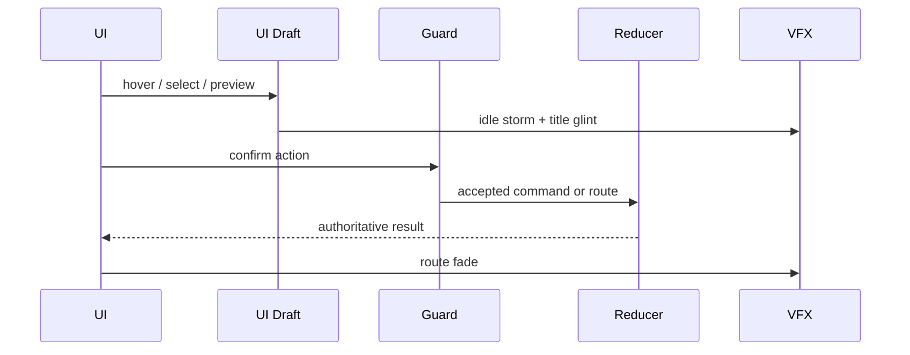
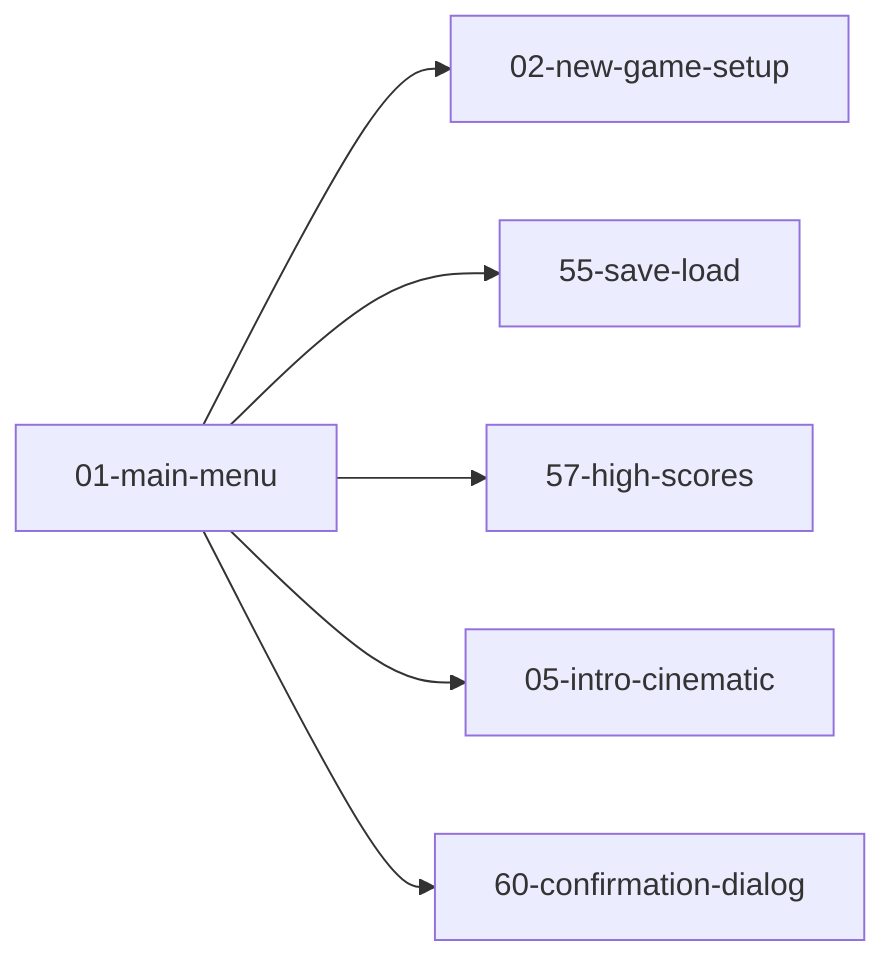

# Screen 01 Architecture: Main Menu

| Field | Value |
| --- | --- |
| System | `menus` |
| Screen ID | `main-menu` |
| Visual Archetype | `curated-menu` |
| Curation Status | `anchor-v1` |

## Companion Files
- [`mockup.html`](./mockup.html) — visual reference (SVG).
- [`spec.md`](./spec.md) — components, bindings, acceptance criteria.
- [`interactions.md`](./interactions.md) — per-control behavior, timing, error paths.
- [`data-contracts.md`](./data-contracts.md) — schemas, config, localization, assets.

## Purpose
Boot shell menu. Full-bleed fantasy painting, title treatment, and
icon-backed command buttons. **No deterministic gameplay state is
created until New Game completes setup.**

## Visual Direction
Original internal UI contract. Do not use third-party captures,
copied franchise art, or external product pixels as implementation
input.

## Visual Composition

## Screen Load & Data Resolution

## Main Interaction Flow

## Animation Flow

## Outgoing Transitions
Top-level route changes only. The `Privacy` footer entry opens a
local-ui modal and does **not** route; see
[`interactions.md` § Actions](./interactions.md#actions).

## State Inputs
All three bindings refresh whenever their authoritative slice
changes. Local hover, focus, selected row, drag ghost, and
animation frame are never persisted.

| Binding handle | Authoritative selector |
| --- | --- |
| `menu.commands` | `state.shell.availableCommands` |
| `lastSaveAvailable` | `state.persistence.hasLoadableSave` |
| `quitGuard` | `state.shell.quitRequiresConfirmation` |

## Implementation Contract
- [`mockup.html`](./mockup.html) defines visual regions and data
  hooks only; it has no logic.
- [`spec.md`](./spec.md) owns static regions, component tree, and
  state bindings.
- [`interactions.md`](./interactions.md) owns controls, command
  routing, disabled states, timing, and error behavior.
- [`data-contracts.md`](./data-contracts.md) owns schemas, config,
  localization, assets, audio, VFX, save, and replay references.
- Diagrams in this file summarize the same contract and **must not
  introduce hidden behavior**.

---

## 🔍 Sync Check

- **UI: ✔** — Component list, transitions, and state bindings match sibling [`spec.md` § Component Tree](./spec.md#component-tree) and [`mockup.html`](./mockup.html). `PrivacyFooter` added to Visual Composition to reconcile a prior drift between this diagram and the sibling files.
- **Schema: ✔** — No schema enums declared in this file; commands referenced (`OPEN_NEW_GAME_SETUP`, `OPEN_LOAD_GAME`, `OPEN_HIGH_SCORES`, `OPEN_CREDITS_OR_INTRO`, `REQUEST_QUIT_CONFIRMATION`, `OPEN_PRIVACY_POLICY`) all resolve to local-ui prefixes per [`screen-command-coverage.json`](../../../screen-command-coverage.json); `OPEN_PRIVACY_POLICY` is explicitly declared in [`command-schema.md` § UGC, Privacy & Content-Report Commands](../../../command-schema.md).
- **Tasks: ✔** — Owning task [`mvp.07-ui-shell.07-main-menu-screen`](../../../../../tasks/mvp/07-ui-shell/07-main-menu-screen.md) reads all five sibling files; additive footer is owned by [`mvp.07-ui-shell.25-privacy-footer-and-disclosure-modal`](../../../../../tasks/mvp/07-ui-shell/25-privacy-footer-and-disclosure-modal.md).

## ⚠ Issues

- **Diagram drift reconciled inline.** The prior Visual Composition diagram listed only five children of `MainMenuShell` (no `PrivacyFooter`), while sibling [`spec.md`](./spec.md), [`interactions.md`](./interactions.md), and [`mockup.html`](./mockup.html) all carry the footer. Added `PrivacyFooter` to the diagram per doc-audit § 8 Option A (target was wrong, system was consistent); no functional change. See sibling [`spec.md` § Component Tree](./spec.md#component-tree) — aligned.
