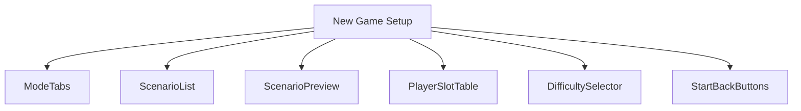
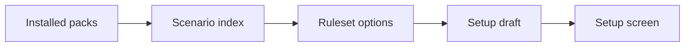
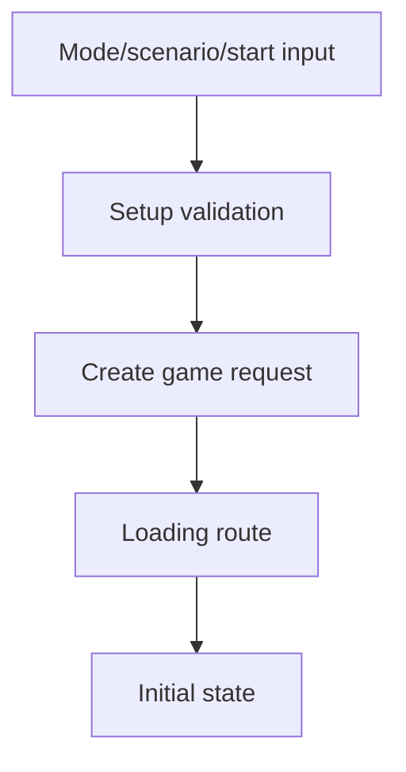
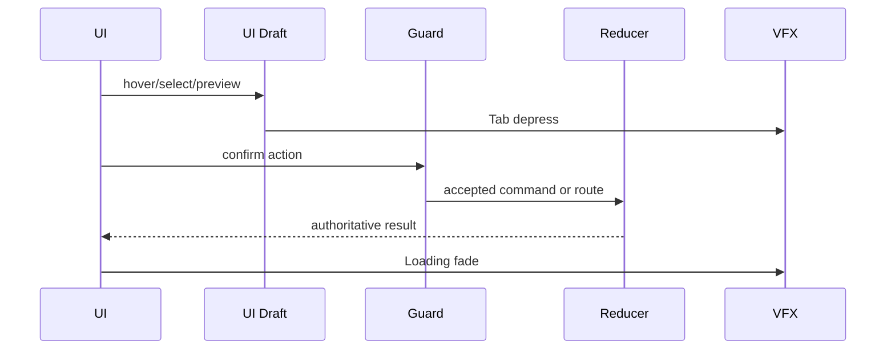
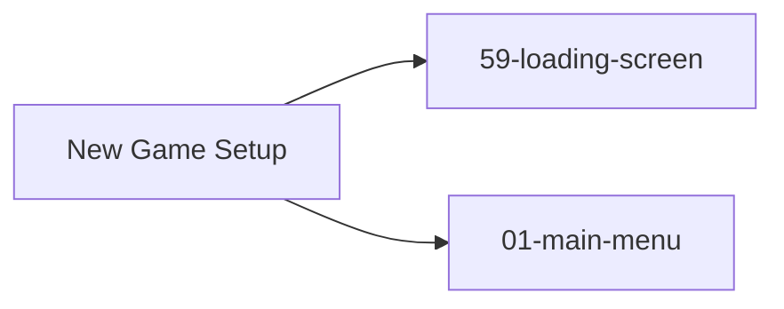

# Screen 02 Architecture: New Game Setup

System: menus
Screen ID: new-game-setup
Visual Archetype: curated-new-game-setup
Curation Status: curated-pass-6

## Purpose
Scenario setup shell for single scenario, campaign, random map, multiplayer, difficulty, player color, and starting options.

## Visual Direction
- Original internal UI contract. Do not use third-party captures,
  copied franchise art, or external product pixels as implementation input.

## Visual Composition

## Screen Load And Data Resolution

## Main Interaction Flow

## Animation Flow

## Outgoing Transitions

## State Inputs
- setupMode -> state.ui.newGame.mode
- scenarioList -> selectors.scenarios.availableScenarios
- selectedScenario -> state.ui.newGame.selectedScenarioId
- playerSlots -> state.ui.newGame.playerSlots
- difficulty -> state.ui.newGame.difficulty

## Implementation Contract
- Mockup defines visual regions and data hooks only.
- Spec defines the component/state contract.
- Interactions define controls, timing, command routing, disabled states, and error behavior.
- Data contracts define schemas, config, localization, asset, audio, VFX, save, and replay references.
- Diagrams are screen-specific summaries of the same contract and must not introduce hidden behavior.
