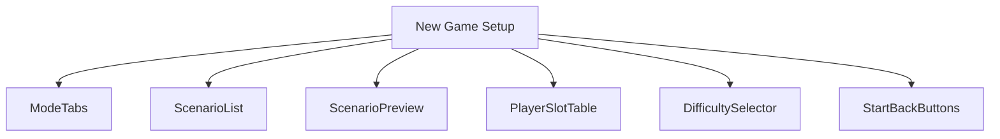
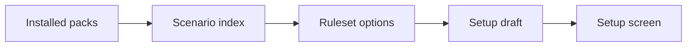
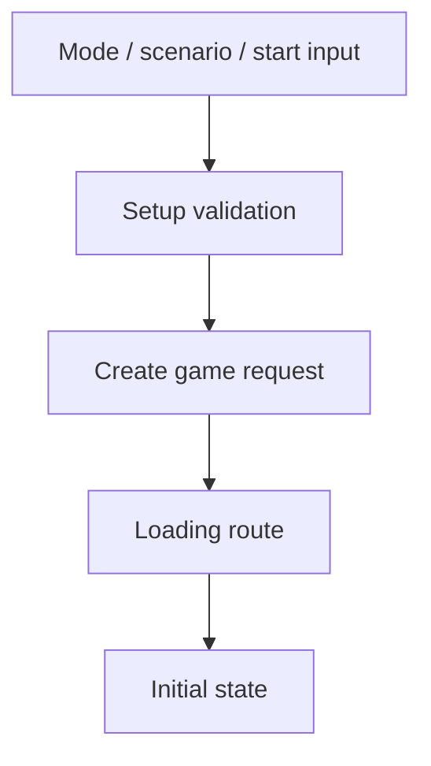
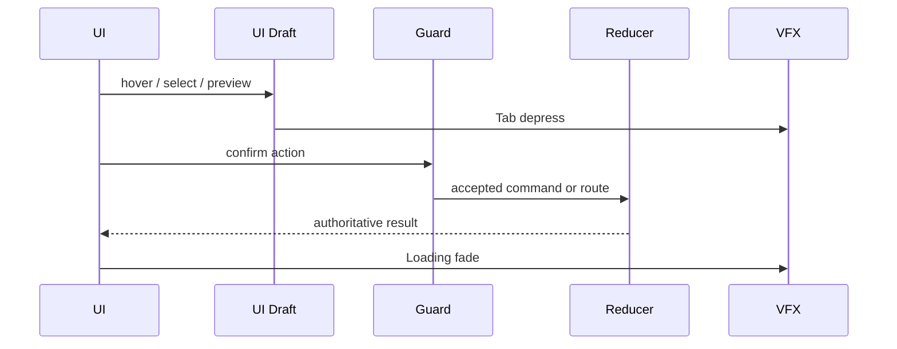
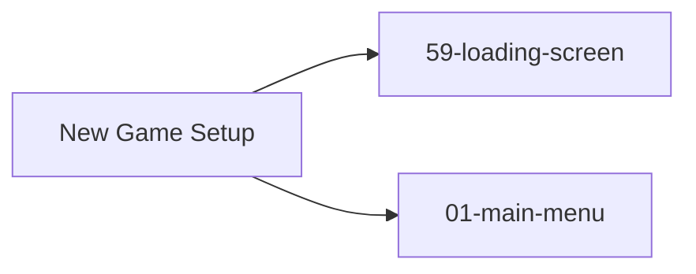

# Screen 02: New Game Setup — Architecture

## Companion Files
- [`mockup.html`](./mockup.html) — visual reference.
- [`spec.md`](./spec.md) — components, bindings.
- [`interactions.md`](./interactions.md) — per-control behavior.
- [`data-contracts.md`](./data-contracts.md) — schemas, config, localization.

## Identity
- System group: `menus`.
- Screen ID: `new-game-setup`.
- Visual archetype: `curated-new-game-setup`.
- Curation status: `curated-pass-6`.

## Purpose
Scenario setup shell for single scenario, campaign, random map,
multiplayer, difficulty, player color, and starting options. Builds a
**local setup draft** that routes into
[`59-loading-screen`](../59-loading-screen/) when the player confirms.

## Visual Direction
Original internal UI contract. Do not use third-party captures,
copied franchise art, or external product pixels as implementation
input.

## Visual Composition

## Screen Load And Data Resolution

## Main Interaction Flow

## Animation Flow

## Outgoing Transitions

## State Inputs
All five slices are runtime-only drafts (not persisted). See
[`data-contracts.md` § 2](./data-contracts.md#2-runtime-state-selectors)
for the canonical table.

- `setupMode` → `state.ui.newGame.mode`
- `scenarioList` → `selectors.scenarios.availableScenarios`
- `selectedScenario` → `state.ui.newGame.selectedScenarioId`
- `playerSlots` → `state.ui.newGame.playerSlots`
- `difficulty` → `state.ui.newGame.difficulty`

## Implementation Contract
- [`mockup.html`](./mockup.html) defines visual regions and data
  hooks only.
- [`spec.md`](./spec.md) defines the component and state contract.
- [`interactions.md`](./interactions.md) owns controls, timing,
  command routing, disabled states, and error behavior.
- [`data-contracts.md`](./data-contracts.md) owns schemas, config,
  localization, assets, audio, VFX, save, and replay references.
- The diagrams above are screen-specific summaries of the same
  contract; they **must not** introduce hidden behavior.

---

## 🔍 Sync Check

- **UI: ✔** — Component tree in § Visual Composition matches sibling [`spec.md` § Component Tree](./spec.md#component-tree); outgoing transitions match the `02-new-game-setup` rows in [`screen-transition-graph.json`](../../../screen-transition-graph.json).
- **Schema: ✔** — State inputs mirror [`data-contracts.md` § 2](./data-contracts.md#2-runtime-state-selectors). The `SCENARIO_LOAD` command the Main Interaction Flow terminates in is defined in [`command-schema.md`](../../../command-schema.md#scenario_load); local-ui tokens follow [`screen-command-coverage.json#localUiPrefixes`](../../../screen-command-coverage.json). No enum drift.
- **Tasks: ✔** — Owning task [`mvp.07-ui-shell.08-new-game-setup-screen`](../../../../../tasks/mvp/07-ui-shell/08-new-game-setup-screen.md) reads this file alongside the three sibling targets; the loading-route consumer is [`mvp.08-persistence.04-scenario-loader`](../../../../../tasks/mvp/08-persistence/04-scenario-loader.md).

## ⚠ Issues

_None._
