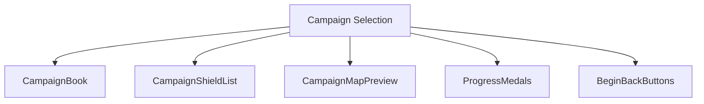
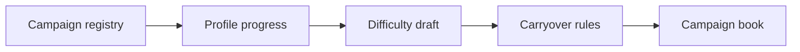
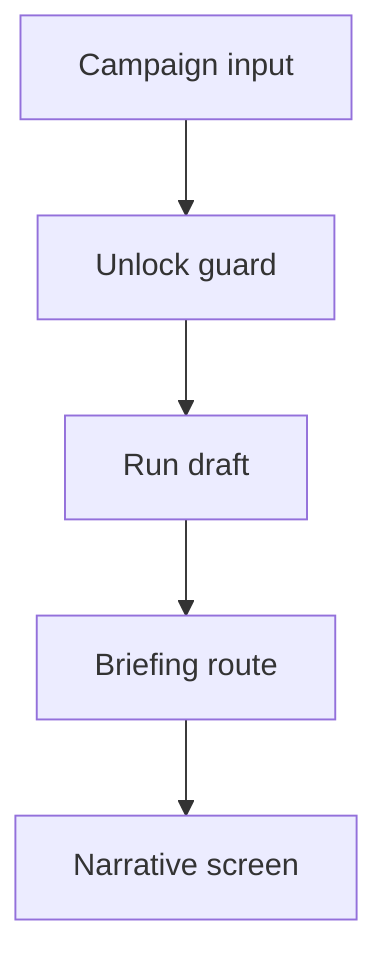
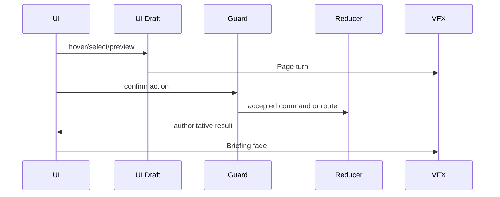
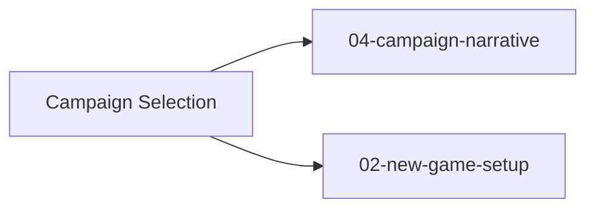

# Screen 03 Architecture: Campaign Selection

System: menus
Screen ID: campaign-selection
Visual Archetype: curated-campaign-selection
Curation Status: curated-pass-6

## Purpose
Campaign book selection with campaign list, faction emblem, progress medals, difficulty, and briefing route.

## Visual Direction
- Original internal UI contract. Do not use third-party captures,
  copied franchise art, or external product pixels as implementation input.

## Visual Composition

## Screen Load And Data Resolution

## Main Interaction Flow

## Animation Flow

## Outgoing Transitions

## State Inputs
- campaigns -> selectors.campaigns.availableCampaigns
- selectedCampaign -> state.ui.campaign.selectedCampaignId
- unlockState -> state.profile.campaignUnlocks
- difficulty -> state.ui.campaign.difficulty
- carryoverPreview -> selectors.campaigns.carryoverPreview

## Implementation Contract
- Mockup defines visual regions and data hooks only.
- Spec defines the component/state contract.
- Interactions define controls, timing, command routing, disabled states, and error behavior.
- Data contracts define schemas, config, localization, asset, audio, VFX, save, and replay references.
- Diagrams are screen-specific summaries of the same contract and must not introduce hidden behavior.
