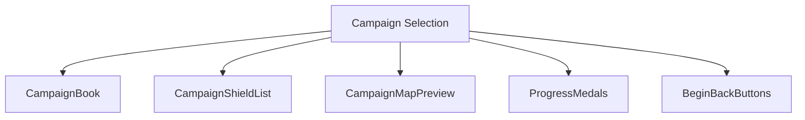
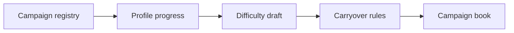
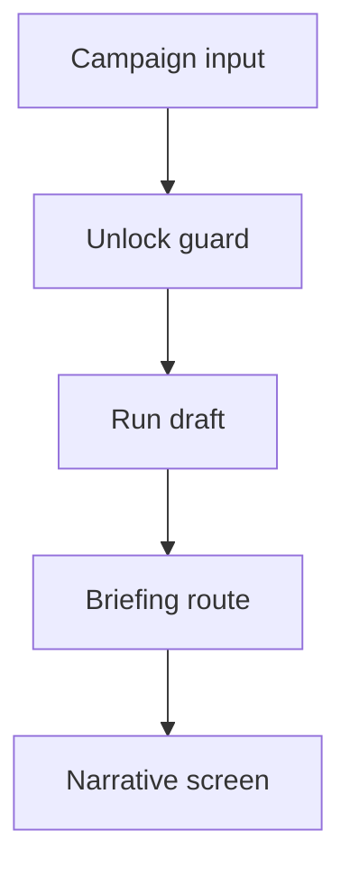
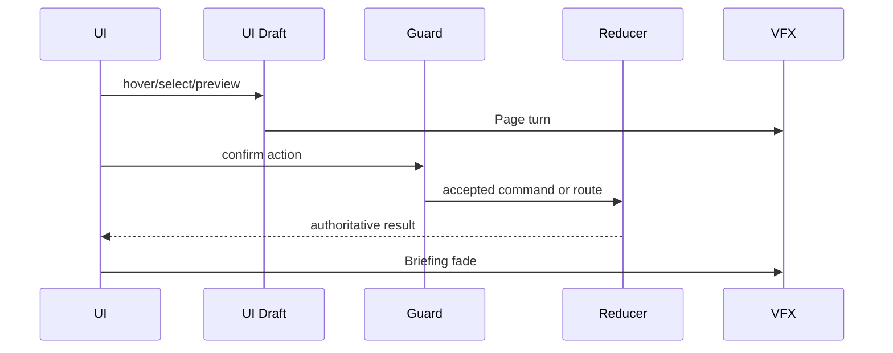
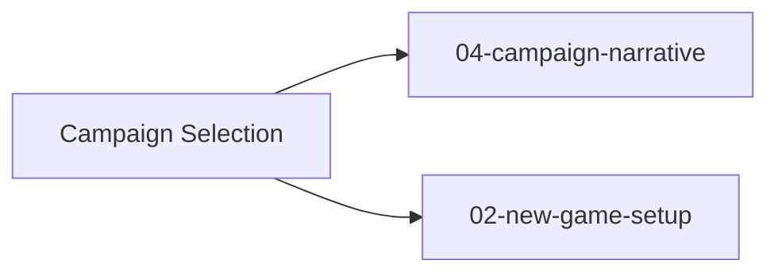

# Screen 03 Architecture: Campaign Selection

System: menus
Screen ID: `campaign-selection`
Visual Archetype: `curated-campaign-selection`
Curation Status: `curated-pass-6`

## Companion Files
- Mockup: [`mockup.html`](./mockup.html)
- Spec: [`spec.md`](./spec.md) — components and state bindings
- Interactions: [`interactions.md`](./interactions.md) — controls,
  timing, command routing
- Data Contracts: [`data-contracts.md`](./data-contracts.md) —
  schemas, config, localization, assets

## Purpose
Pick a campaign from the leather book, review the campaign map and
progress medals for the selected campaign, hold a local difficulty
draft, and route to the inter-mission briefing
([`04-campaign-narrative`](../04-campaign-narrative/)) or back to
[`02-new-game-setup`](../02-new-game-setup/).

## Visual Direction
- Original internal UI contract. Do not use third-party captures,
  copied franchise art, or external product pixels as
  implementation input.

## Visual Composition

## Screen Load And Data Resolution

## Main Interaction Flow

## Animation Flow

## Outgoing Transitions

`BEGIN` routes to `04-campaign-narrative` (sibling
[`interactions.md`](../04-campaign-narrative/interactions.md) routes
back via `narrative.back`); `BACK` routes to `02-new-game-setup`.

## State Inputs
- `campaigns` → `selectors.campaigns.availableCampaigns`
- `selectedCampaign` → `state.ui.campaign.selectedCampaignId`
- `unlockState` → `state.profile.campaignUnlocks` (see `## ⚠ Issues`)
- `difficulty` → `state.ui.campaign.difficulty`
- `carryoverPreview` → `selectors.campaigns.carryoverPreview`

## Implementation Contract
- [`mockup.html`](./mockup.html) defines visual regions and data
  hooks only.
- [`spec.md`](./spec.md) defines the component / state contract.
- [`interactions.md`](./interactions.md) defines controls, timing,
  command routing, disabled states, and error behavior.
- [`data-contracts.md`](./data-contracts.md) defines schemas,
  config, localization, asset, audio, VFX, save, and replay
  references.
- Diagrams in this file are screen-specific summaries of the same
  contract and must not introduce hidden behavior.

---

## 🔍 Sync Check

- **UI: ✔** — `Visual Composition` mirrors the SVG regions in
  [`mockup.html`](./mockup.html); component names and outgoing
  transitions match sibling [`spec.md`](./spec.md) and
  [`interactions.md`](./interactions.md).
- **Schema: ⚠** — State inputs depend on the planned
  `campaign.schema.json`
  ([`mvp.02-content-schemas.17-campaign-schema`](../../../../../tasks/mvp/02-content-schemas/17-campaign-schema.md));
  full detail in sibling [`data-contracts.md`](./data-contracts.md)
  § Issues.
- **Tasks: ✔** — Diagrams cover the flow consumed by
  [`phase-2.07-ui-screen-backlog.03-campaign-selection-screen`](../../../../../tasks/phase-2/07-ui-screen-backlog/03-campaign-selection-screen.md);
  runtime wiring task is
  [`phase-2.08-meta-systems.01-campaign-graph-schema`](../../../../../tasks/phase-2/08-meta-systems/01-campaign-graph-schema.md).

## ⚠ Issues

- **`state.profile.campaignUnlocks` is unregistered in
  [`data-inventory.md`](../../../data-inventory.md).** The
  `unlockState` input is persisted under the `state.profile.*`
  namespace but no inventory row exists. Per CLAUDE.md root
  contract, the campaign-runner owner
  [`phase-2.08-meta-systems.02-campaign-runner`](../../../../../tasks/phase-2/08-meta-systems/02-campaign-runner.md)
  must add the row before the slice can ship. Full row suggestion
  in sibling [`spec.md`](./spec.md) § Issues to avoid duplicating
  the canonical statement.
- **`Main Interaction Flow` includes a "Run draft" step that the
  mockup does not surface.** `state.ui.campaign.difficulty` is held
  in state but no SVG control mutates it (see sibling
  [`interactions.md`](./interactions.md) § Issues). Either the
  mockup must grow a difficulty surface or the draft slot must be
  deferred. Owner:
  `phase-2.07-ui-screen-backlog.03-campaign-selection-screen`.
