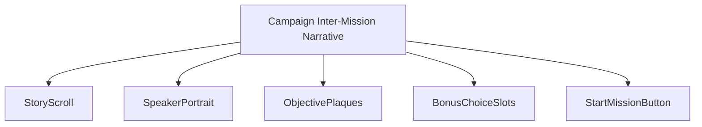
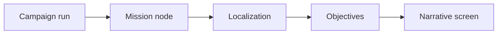
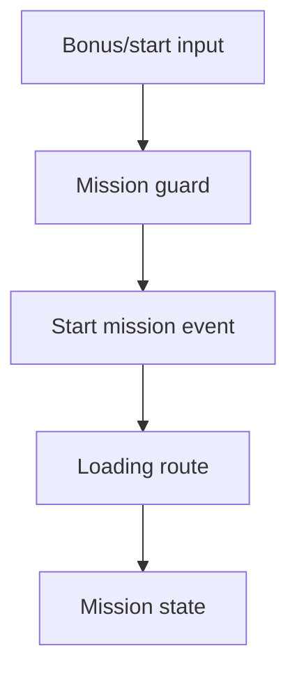
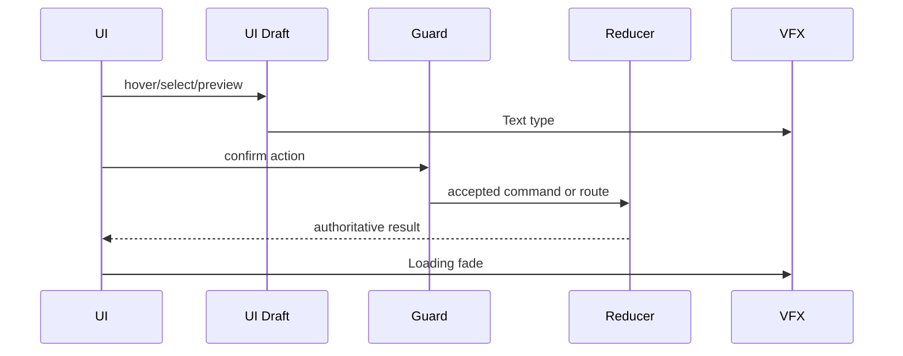
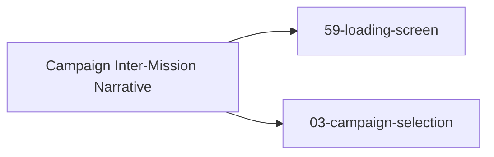

# Screen 04 Architecture: Campaign Inter-Mission Narrative

System: menus
Screen ID: campaign-narrative
Visual Archetype: curated-campaign-narrative
Curation Status: curated-pass-6

## Purpose
Campaign briefing or inter-mission narrative screen with story text, portrait, mission objectives, carryover, and Start Mission control.

## Visual Direction
- Original internal UI contract. Do not use third-party captures,
  copied franchise art, or external product pixels as implementation input.

## Visual Composition

## Screen Load And Data Resolution

## Main Interaction Flow

## Animation Flow

## Outgoing Transitions

## State Inputs
- campaignNode -> state.campaign.currentNodeId
- storyText -> localization.campaign[node].briefing
- objectives -> registries.scenarios.byId[mission].objectives
- bonusChoices -> state.ui.campaignNarrative.selectedBonus
- carryover -> selectors.campaigns.currentCarryover

## Implementation Contract
- Mockup defines visual regions and data hooks only.
- Spec defines the component/state contract.
- Interactions define controls, timing, command routing, disabled states, and error behavior.
- Data contracts define schemas, config, localization, asset, audio, VFX, save, and replay references.
- Diagrams are screen-specific summaries of the same contract and must not introduce hidden behavior.
