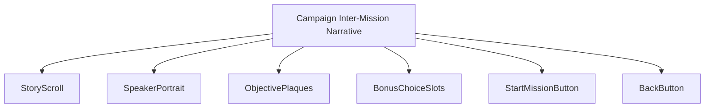
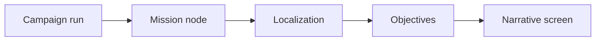
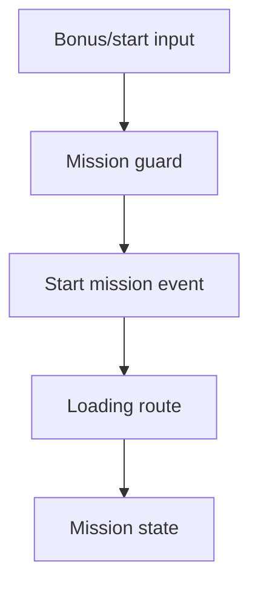
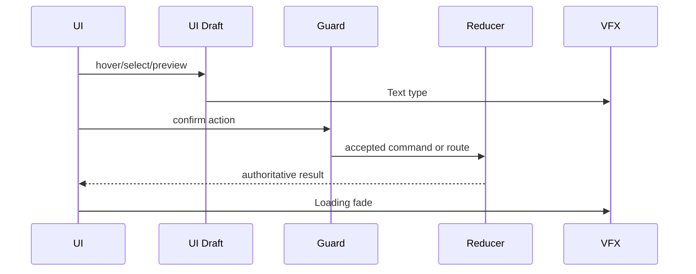
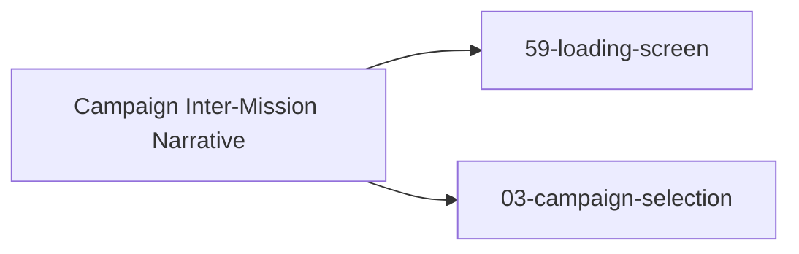

# Screen 04 Architecture: Campaign Inter-Mission Narrative

System: menus
Screen ID: `campaign-narrative`
Visual Archetype: `curated-campaign-narrative`
Curation Status: `curated-pass-6`

## Companion Files
- Mockup: [`mockup.html`](./mockup.html)
- Spec: [`spec.md`](./spec.md) — components and state bindings
- Interactions: [`interactions.md`](./interactions.md) — controls,
  timing, command routing
- Data Contracts: [`data-contracts.md`](./data-contracts.md) —
  schemas, config, localization, assets

## Purpose
Briefing parchment shown between campaign missions: typed narrative
copy, speaker portrait, victory / loss objectives, carry-over
preview, three bonus-choice slots, and `START` / `BACK` buttons that
route to [`59-loading-screen`](../59-loading-screen/) or back to
[`03-campaign-selection`](../03-campaign-selection/).

## Visual Direction
- Original internal UI contract. Do not use third-party captures,
  copied franchise art, or external product pixels as
  implementation input.

## Visual Composition

## Screen Load And Data Resolution

## Main Interaction Flow

## Animation Flow

## Outgoing Transitions

`narrative.start` routes to
[`59-loading-screen`](../59-loading-screen/) after the campaign-runner
accepts `START_CAMPAIGN_MISSION`; `narrative.back` routes to
[`03-campaign-selection`](../03-campaign-selection/) (sibling
[`interactions.md`](../03-campaign-selection/interactions.md) routes
in via `campaign.begin`).

## State Inputs
- `campaignNode` → `state.campaign.currentNodeId` (see `## ⚠ Issues`)
- `storyText` → `localization.campaign[node].briefing`
- `objectives` → `registries.scenarios.byId[mission].objectives`
- `bonusChoices` → `state.ui.campaignNarrative.selectedBonus`
- `carryover` → `selectors.campaigns.currentCarryover`

## Implementation Contract
- [`mockup.html`](./mockup.html) defines visual regions and data
  hooks only.
- [`spec.md`](./spec.md) defines the component / state contract.
- [`interactions.md`](./interactions.md) defines controls, timing,
  command routing, disabled states, and error behavior.
- [`data-contracts.md`](./data-contracts.md) defines schemas,
  config, localization, asset, audio, VFX, save, and replay
  references.
- Diagrams in this file are screen-specific summaries of the same
  contract and must not introduce hidden behavior.

---

## 🔍 Sync Check

- **UI: ✔** — `Visual Composition` mirrors the SVG regions in
  [`mockup.html`](./mockup.html); the `BackButton` row is added to
  match the `data-action="narrative.back"` affordance that the prior
  tree omitted (see sibling [`spec.md`](./spec.md) § Issues).
- **Schema: ⚠** — Campaign-node records this screen consumes come
  from the planned `campaign.schema.json` per
  [`mvp.02-content-schemas.17-campaign-schema`](../../../../../tasks/mvp/02-content-schemas/17-campaign-schema.md);
  sibling [`data-contracts.md`](./data-contracts.md) carries the
  detail.
- **Tasks: ✔** — Diagrams cover the flow consumed by
  [`phase-2.07-ui-screen-backlog.04-campaign-narrative-screen`](../../../../../tasks/phase-2/07-ui-screen-backlog/04-campaign-narrative-screen.md);
  runtime owner of `START_CAMPAIGN_MISSION` and the campaign-node
  slice is
  [`phase-2.08-meta-systems.02-campaign-runner`](../../../../../tasks/phase-2/08-meta-systems/02-campaign-runner.md).

## ⚠ Issues

- **`state.campaign.currentNodeId` is unregistered in
  [`data-inventory.md`](../../../data-inventory.md).** The
  `campaignNode` input is persisted under the `state.campaign.*`
  namespace by the campaign-runner but no inventory row exists. Per
  CLAUDE.md root contract, the campaign-runner owner
  [`phase-2.08-meta-systems.02-campaign-runner`](../../../../../tasks/phase-2/08-meta-systems/02-campaign-runner.md)
  must add the row before the slice can ship. Full row suggestion in
  sibling [`data-contracts.md`](./data-contracts.md) § Issues to
  avoid duplicating the canonical statement.
