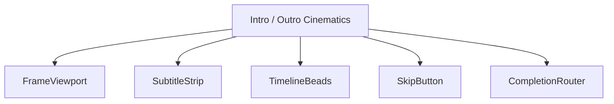
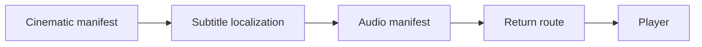
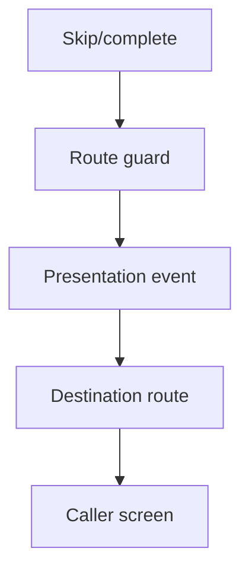
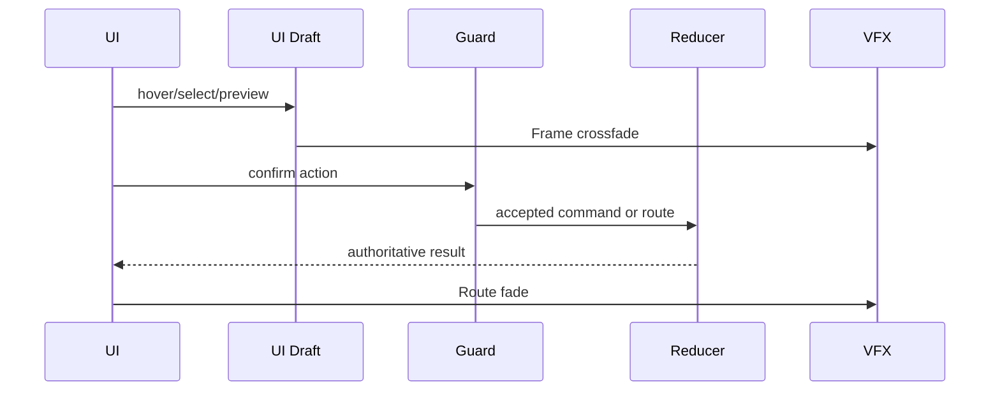
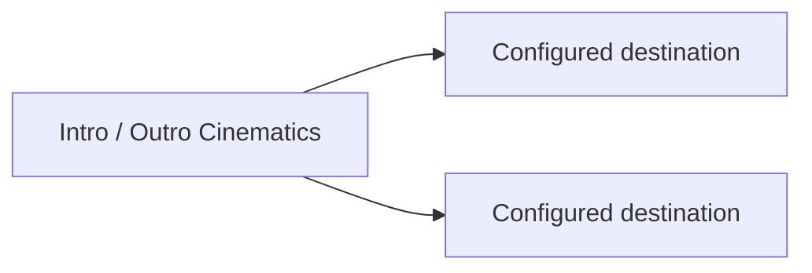

# Screen 05 Architecture: Intro / Outro Cinematics

System: menus
Screen ID: intro-cinematic
Visual Archetype: curated-cinematic
Curation Status: curated-pass-6

## Purpose
Presentation-only cinematic playback shell for intro, outro, credits, victory, defeat, and campaign story clips.

## Visual Direction
- Original internal UI contract. Do not use third-party captures,
  copied franchise art, or external product pixels as implementation input.

## Visual Composition

## Screen Load And Data Resolution

## Main Interaction Flow

## Animation Flow

## Outgoing Transitions

## State Inputs
- cinematicId -> state.ui.cinematic.cinematicId
- playbackState -> state.ui.cinematic.playback
- subtitles -> localization.cinematics[cinematicId]
- skipAllowed -> config.ui.allowSkipCinematics
- destination -> state.ui.cinematic.returnRoute

## Implementation Contract
- Mockup defines visual regions and data hooks only.
- Spec defines the component/state contract.
- Interactions define controls, timing, command routing, disabled states, and error behavior.
- Data contracts define schemas, config, localization, asset, audio, VFX, save, and replay references.
- Diagrams are screen-specific summaries of the same contract and must not introduce hidden behavior.
