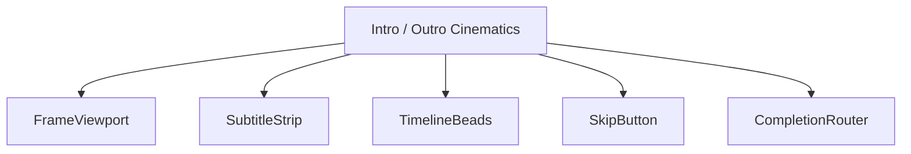
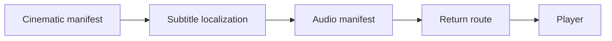
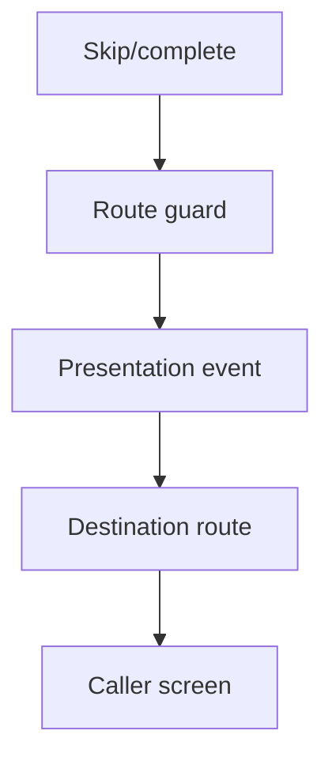
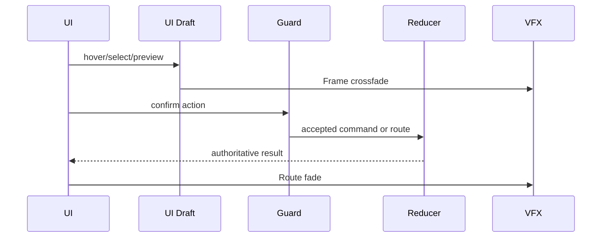
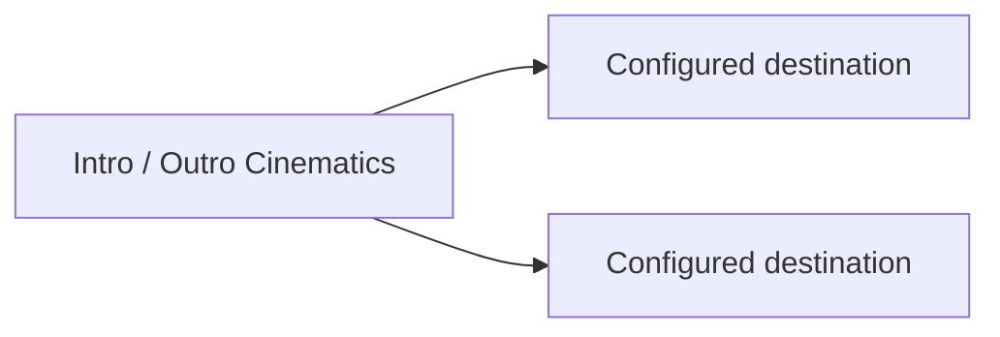

# Screen 05 Architecture: Intro / Outro Cinematics

System: menus
Screen ID: intro-cinematic
Visual Archetype: curated-cinematic
Curation Status: curated-pass-6

## Purpose
Presentation-only playback shell for intro, outro, credits, victory,
defeat, and campaign story clips. Emits route completion events
only; never mutates deterministic gameplay state.

## Visual Direction
Original internal UI contract. Do not use third-party captures,
copied franchise art, or external product pixels as implementation
input.

## Visual Composition

## Screen Load And Data Resolution

## Main Interaction Flow

## Animation Flow

## Outgoing Transitions

## State Inputs
- `cinematicId` → `state.ui.cinematic.cinematicId`
- `playbackState` → `state.ui.cinematic.playback`
- `subtitles` → `localization.cinematics[cinematicId]`
- `skipAllowed` → `config.ui.allowSkipCinematics`
- `destination` → `state.ui.cinematic.returnRoute`

## Implementation Contract
- [`mockup.html`](./mockup.html) defines visual regions and data
  hooks only.
- [`spec.md`](./spec.md) defines the component and state contract.
- [`interactions.md`](./interactions.md) defines controls, timing,
  command routing, disabled states, and error behavior.
- [`data-contracts.md`](./data-contracts.md) defines schemas, config,
  localization, asset, audio, VFX, save, and replay references.
- The diagrams above are screen-specific summaries of the same
  contract and must not introduce hidden behavior.
- Companion external docs:
  [`autoplay-policy.md`](../../../autoplay-policy.md),
  [`animation-contract.md`](../../../animation-contract.md),
  [`asset-loading.md`](../../../asset-loading.md),
  [`fail-loud.md`](../../../fail-loud.md).

---

## 🔍 Sync Check

- **UI: ✔** — Component list, state inputs, and transitions mirror
  [`spec.md`](./spec.md),
  [`interactions.md`](./interactions.md), and
  [`data-contracts.md`](./data-contracts.md). No hidden behavior
  introduced in the diagrams.
- **Schema: ✔** — State inputs map to the selectors defined in
  [`data-contracts.md`](./data-contracts.md); schemas registered in
  [`schema-matrix.md`](../../../schema-matrix.md).
- **Tasks: ✔** — Owning UI task
  [`phase-2.07-ui-screen-backlog.05-intro-cinematic-screen`](../../../../../tasks/phase-2/07-ui-screen-backlog/05-intro-cinematic-screen.md)
  reads this diagram set first; engine task
  [`phase-2.08-meta-systems.03-cinematic-playback-engine`](../../../../../tasks/phase-2/08-meta-systems/03-cinematic-playback-engine.md)
  owns runtime state. Both `planned`.

## ⚠ Issues

- **Autoplay path not represented.** The Screen-Load and Main-
  Interaction diagrams have no node for the click-to-play gate
  flagged in [`autoplay-policy.md` § 2](../../../autoplay-policy.md).
  Once the screen owner of
  [`05-intro-cinematic-screen`](../../../../../tasks/phase-2/07-ui-screen-backlog/05-intro-cinematic-screen.md)
  adds the `ClickToPlayCard` component and the `intro.unlockAndPlay`
  action to `spec.md` / `interactions.md`, the diagrams here must
  add a pre-playback unlock node. Doc-audit did not edit the
  diagrams to add it (anti-cheat rule B — diagrams must mirror, not
  invent, interactions).
- **Outgoing transitions are unspecified.** Both arrows label
  "Configured destination" without resolving to a concrete caller —
  the same placeholder used by sibling
  [`42-victory-defeat-cinematic/architecture.md`](../42-victory-defeat-cinematic/architecture.md).
  Intentional, because the destination is supplied by
  `state.ui.cinematic.returnRoute` at runtime. Flagged for future
  resolution once the engine task lands typed return-route enums.
