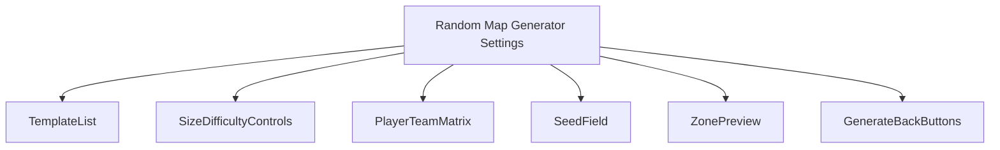
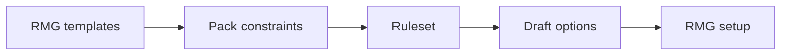
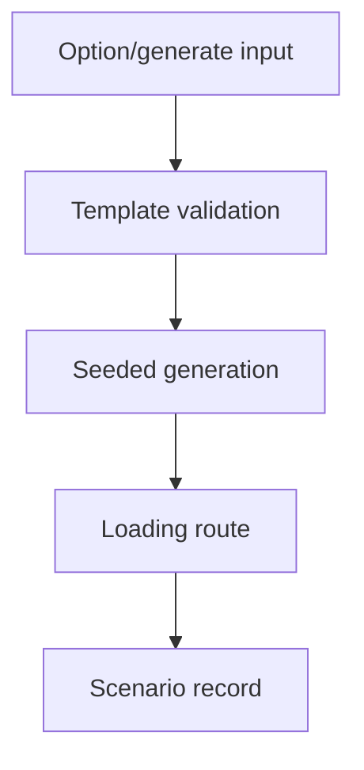
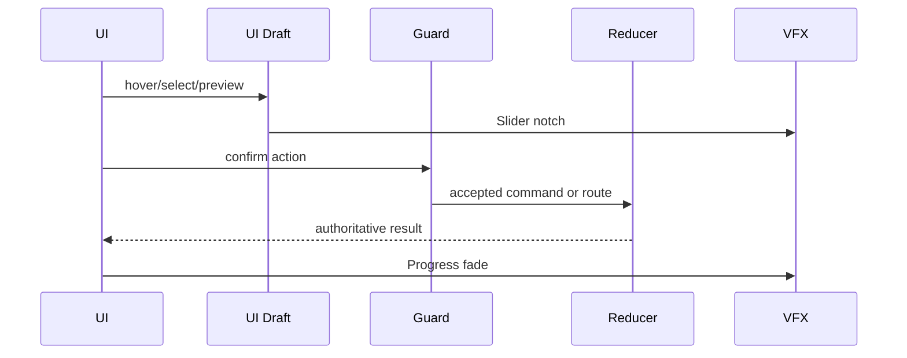
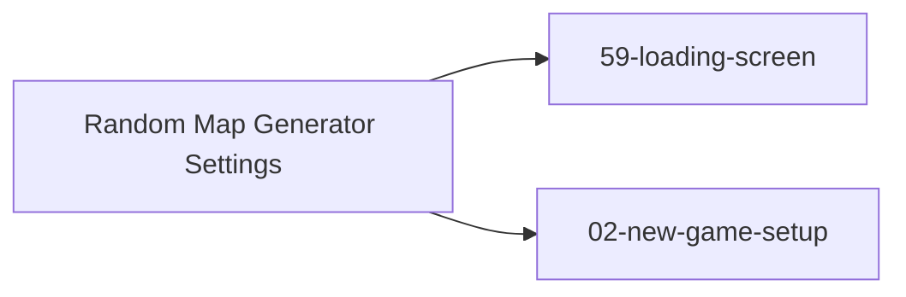

# Screen 06 Architecture: Random Map Generator Settings

System: menus
Screen ID: random-map-setup
Visual Archetype: curated-rmg-setup
Curation Status: curated-pass-6

## Purpose
Random map generator setup for size, template, players, zones, water, monsters, teams, seed, and victory options.

## Visual Direction
- Original internal UI contract. Do not use third-party captures,
  copied franchise art, or external product pixels as implementation input.

## Visual Composition

## Screen Load And Data Resolution

## Main Interaction Flow

## Animation Flow

## Outgoing Transitions

## State Inputs
- templateId -> state.ui.rmg.templateId
- mapSize -> state.ui.rmg.mapSize
- players -> state.ui.rmg.players
- seed -> state.ui.rmg.seed
- zonePreview -> selectors.rmg.templateZonePreview

## Implementation Contract
- Mockup defines visual regions and data hooks only.
- Spec defines the component/state contract.
- Interactions define controls, timing, command routing, disabled states, and error behavior.
- Data contracts define schemas, config, localization, asset, audio, VFX, save, and replay references.
- Diagrams are screen-specific summaries of the same contract and must not introduce hidden behavior.
