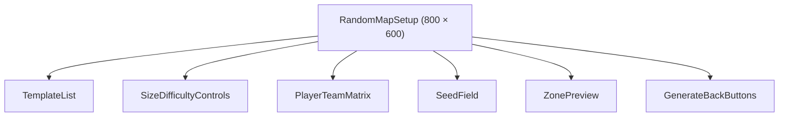
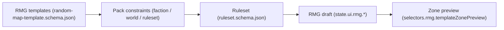
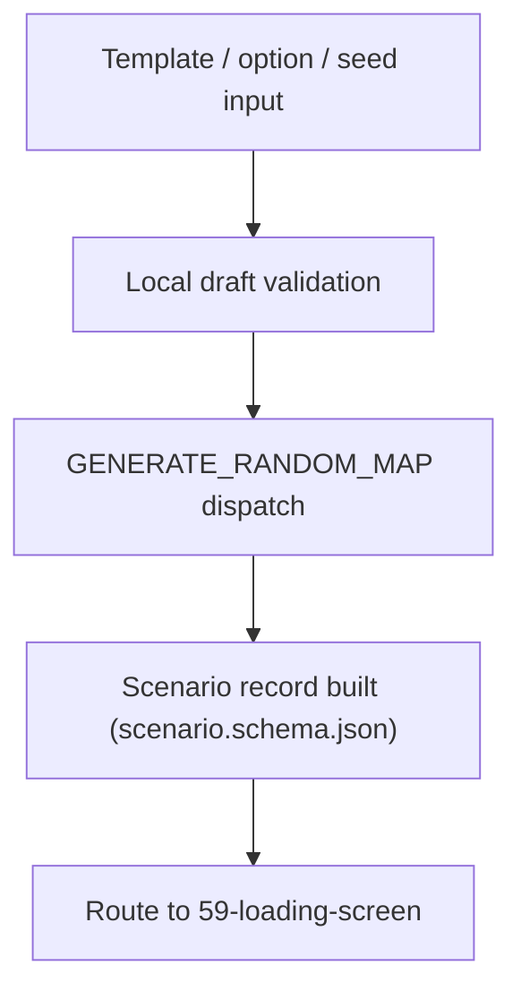
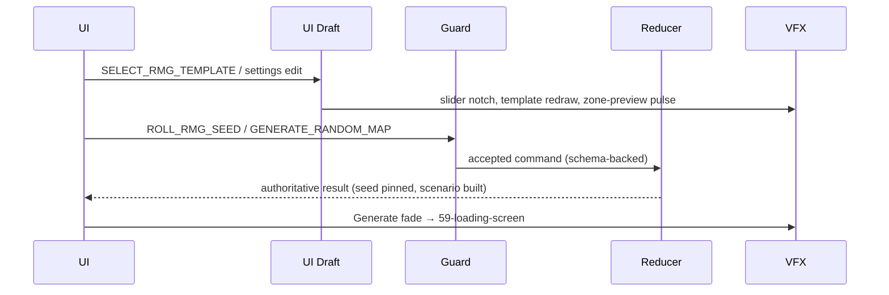
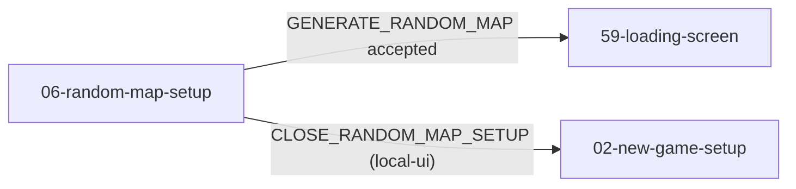

# Screen 06: Random Map Generator Settings — Architecture

System: `menus` · Screen ID: `random-map-setup` · Visual Archetype:
`curated-rmg-setup` · Curation Status: `curated-pass-6`

## Companion Files
- [`mockup.html`](./mockup.html) — visual reference.
- [`spec.md`](./spec.md) — components, bindings.
- [`interactions.md`](./interactions.md) — per-control behavior.
- [`data-contracts.md`](./data-contracts.md) — schemas, config, localization.

## 1. Purpose
Random map generator setup for template, size, player / team matrix,
water, monster strength, seed, and victory options. State bindings,
selectors, and authoritative paths live in
[`spec.md` § 5 State Bindings](./spec.md#5-state-bindings); per-control
behavior and command routing live in
[`interactions.md` § 2 Actions](./interactions.md#2-actions). This file
owns the **screen-specific diagrams** only.

## 2. Visual Direction
Original internal UI contract. Do not use third-party captures, copied
franchise art, or external product pixels as implementation input.

## 3. Visual Composition

## 4. Screen Load & Data Resolution

## 5. Main Interaction Flow

## 6. Animation Flow

## 7. Outgoing Transitions

## 8. Implementation Contract
- [`mockup.html`](./mockup.html) defines visible regions and data hooks
  only.
- [`spec.md`](./spec.md) defines the component / state contract.
- [`interactions.md`](./interactions.md) defines controls, timing,
  command routing, disabled states, and error behavior.
- [`data-contracts.md`](./data-contracts.md) defines schemas, config,
  localization, asset, audio, VFX, save, and replay references.
- Diagrams in this file are screen-specific summaries of the same
  contract; they must not introduce hidden behavior.

---

## 🔍 Sync Check

- **UI: ✔** — § 3 Visual Composition mirrors the component tree in sibling [`spec.md` § 4 Component Tree](./spec.md#4-component-tree) and the visible regions in [`mockup.html`](./mockup.html) (`data-screen="06-random-map-setup"`, `data-archetype="curated-rmg-setup"`, `data-curation="curated-pass-6"`).
- **Schema: ✔** — § 4 Screen Load and § 5 Main Interaction Flow reference only schemas listed in sibling [`data-contracts.md` § 1 Content Schemas & Registries](./data-contracts.md#1-content-schemas--registries) (`random-map-template`, `ruleset`, `scenario`). No closed-enum claims made here.
- **Tasks: ✔** — Owning task [`phase-2.07-ui-screen-backlog.06-random-map-setup-screen`](../../../../../tasks/phase-2/07-ui-screen-backlog/06-random-map-setup-screen.md) reads this file; runtime owner for `ROLL_RMG_SEED` / `GENERATE_RANDOM_MAP` is `mvp.03-map-system.09-random-map-generator-deterministic-runner`.

## ⚠ Issues

- **State-binding duplication demoted to one-line reference.** The previous version of this file carried a § State Inputs block that duplicated the table in sibling [`spec.md` § 5 State Bindings](./spec.md#5-state-bindings). Per [doc-audit § 7](../../../../../.claude/skills/doc-audit/SKILL.md) (no duplicated logic across docs), the canonical statement remains in `spec.md` and this file now only references it in § 1. Meaning preserved; demotion is the only change.
