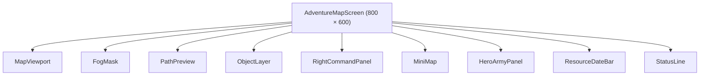
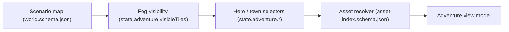
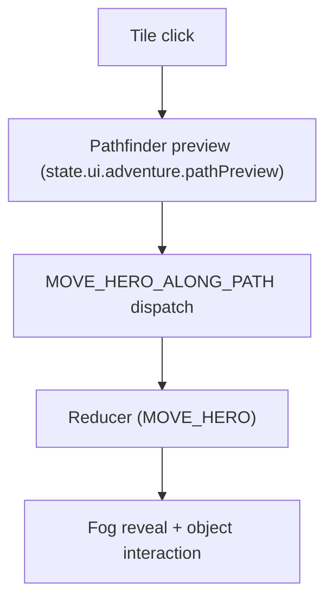
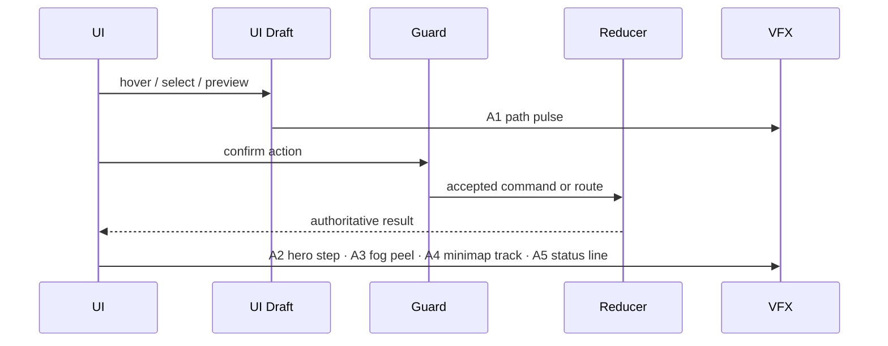
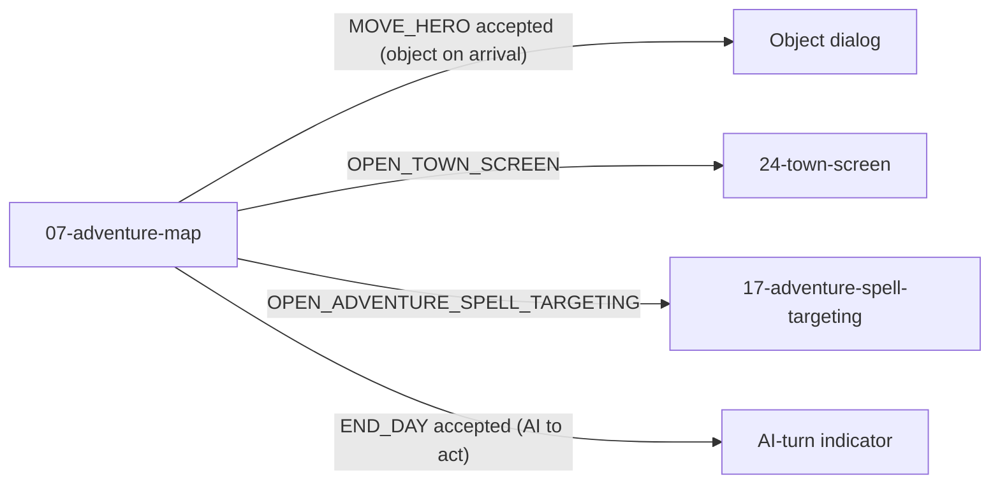

# Screen 07: Adventure Map — Architecture

System: `adventure` · Screen ID: `adventure-map` · Visual Archetype:
`curated-adventure-map` · Curation Status: `anchor-v1`

## Companion Files
- [`mockup.html`](./mockup.html) — visual reference.
- [`spec.md`](./spec.md) — components, bindings.
- [`interactions.md`](./interactions.md) — per-control behavior.
- [`data-contracts.md`](./data-contracts.md) — schemas, config, localization, assets.

## 1. Purpose
Primary strategic map with terrain viewport, fog of war, object
interaction, hero path preview, minimap, hero / army sidebar,
resource bar, and date strip. State bindings and authoritative
paths live in
[`spec.md` § 5 State Bindings](./spec.md#5-state-bindings);
per-control behavior, command routing, and animations live in
[`interactions.md` § 2 Actions](./interactions.md#2-actions). This
file owns the **screen-specific diagrams** only.

## 2. Visual Direction
Original internal UI contract. Do not use third-party captures,
copied franchise art, or external product pixels as implementation
input.

## 3. Visual Composition

## 4. Screen Load & Data Resolution

## 5. Main Interaction Flow

## 6. Animation Flow

The UI Draft / authoritative-result split shown above is the
screen-instance of the global rule in
[`ui-frame-lag-contract.md`](../../../ui-frame-lag-contract.md):
drafts live under `state.ui.adventure.*`, are non-replayed and
non-hashed, and clear when their matching command resolves.
Animation tokens `A1`–`A5` resolve to
[`interactions.md` § 3 Animation](./interactions.md#3-animation).

## 7. Outgoing Transitions

## 8. Implementation Contract
- [`mockup.html`](./mockup.html) defines visible regions and data
  hooks only.
- [`spec.md`](./spec.md) defines the component / state contract.
- [`interactions.md`](./interactions.md) defines controls, timing,
  command routing, disabled states, and error behavior.
- [`data-contracts.md`](./data-contracts.md) defines schemas,
  config, localization, asset, audio, VFX, save, and replay
  references.
- Diagrams in this file are screen-specific summaries of the same
  contract; they must not introduce hidden behavior.

---

## 🔍 Sync Check

- **UI: ✔** — § 3 Visual Composition mirrors the component tree in sibling [`spec.md` § 4 Component Tree](./spec.md#4-component-tree) and the visible regions in [`mockup.html`](./mockup.html) (`data-screen="07-adventure-map"`, `data-archetype="curated-adventure-map"`, `data-curation="anchor-v1"`).
- **Schema: ✔** — § 4 Screen Load and § 5 Main Interaction Flow reference only schemas listed in sibling [`data-contracts.md` § 1 Content Schemas & Registries](./data-contracts.md#1-content-schemas--registries) (`world`, `asset-index`, `command`). `MOVE_HERO` (canonical for `MOVE_HERO_ALONG_PATH`) and `END_DAY` (canonical for `END_PLAYER_TURN`) are defined in [`command.schema.json`](../../../../../content-schema/schemas/command.schema.json) and have dedicated sections in [`command-schema.md`](../../../command-schema.md).
- **Tasks: ✔** — Owning UI tasks ([`mvp.07-ui-shell.01-react-18-app-shell-with-canvas-overlay`](../../../../../tasks/mvp/07-ui-shell/01-react-18-app-shell-with-canvas-overlay.md), `02-zustand-store`, `03-hud-resource-bar-end-turn-button-mini-map-stub`, `06-command-hook-ui-dispatch-re-render`) read this file via the screen-package block in their `Read First`. Runtime owners: [`mvp.05-adventure-map.03-hero-movement`](../../../../../tasks/mvp/05-adventure-map/03-hero-movement.md) for `MOVE_HERO`; [`mvp.05-adventure-map.02-turn-structure`](../../../../../tasks/mvp/05-adventure-map/02-turn-structure.md) for `END_HERO_TURN` / `END_DAY`.

## ⚠ Issues

- **State-input duplication demoted to one-line reference.** The previous version of this file carried a § State Inputs block listing the same five selectors as sibling [`spec.md` § 5 State Bindings](./spec.md#5-state-bindings) and [`data-contracts.md` § 2 Runtime State Selectors](./data-contracts.md#2-runtime-state-selectors). Per [doc-audit § 7](../../../../../.claude/skills/doc-audit/SKILL.md) (no duplicated logic across docs), the canonical statement stays in `spec.md` / `data-contracts.md` and this file now references it from § 1 only. Meaning preserved; demotion is the only change.
