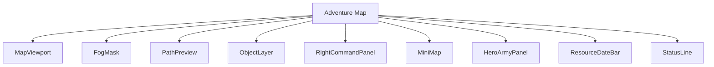
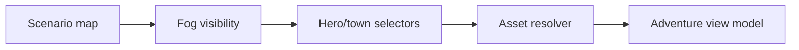
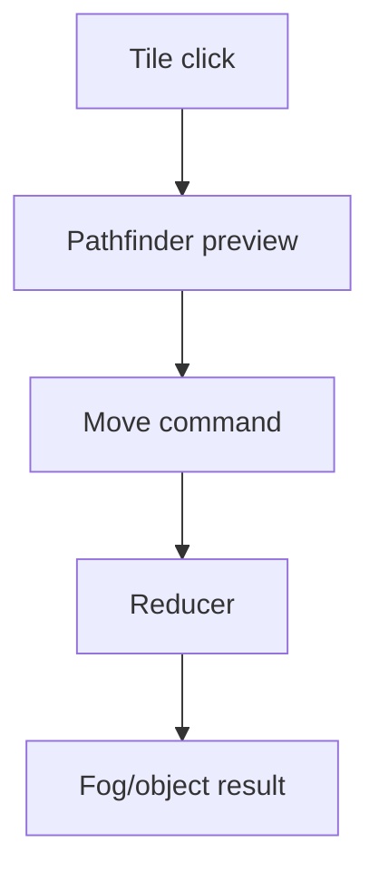
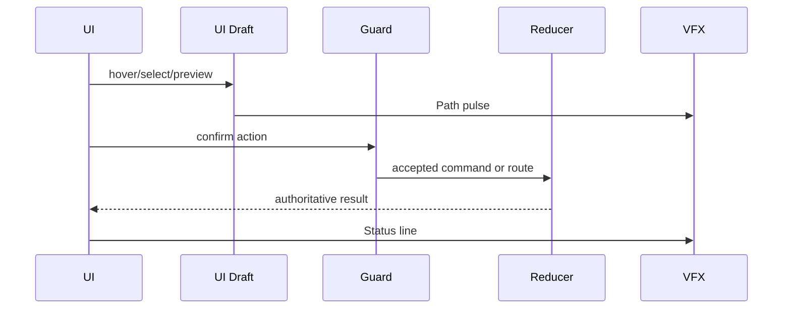
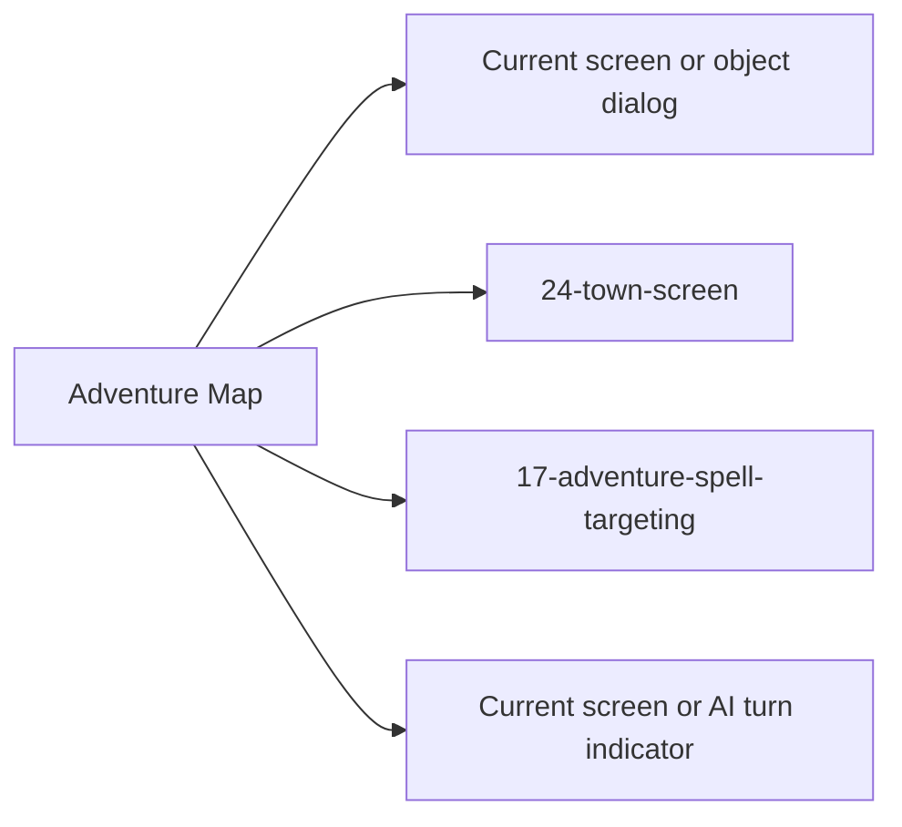

# Screen 07 Architecture: Adventure Map

System: adventure
Screen ID: adventure-map
Visual Archetype: curated-adventure-map
Curation Status: anchor-v1

## Purpose
Primary strategic map with terrain viewport, fog of war, object interaction, hero path preview, minimap, army/hero sidebars, resources, and date.

## Visual Direction
- Original internal UI contract. Do not use third-party captures,
  copied franchise art, or external product pixels as implementation input.

## Visual Composition

## Screen Load And Data Resolution

## Main Interaction Flow

## Animation Flow

## Outgoing Transitions

## State Inputs
- map.tiles -> state.adventure.visibleTiles
- selectedHero -> state.adventure.selectedHeroId
- pathPreview -> state.ui.adventure.pathPreview
- resources -> state.players.active.resources
- date -> state.calendar.currentDate

## Implementation Contract
- Mockup defines visual regions and data hooks only.
- Spec defines the component/state contract.
- Interactions define controls, timing, command routing, disabled states, and error behavior.
- Data contracts define schemas, config, localization, asset, audio, VFX, save, and replay references.
- Diagrams are screen-specific summaries of the same contract and must not introduce hidden behavior.
