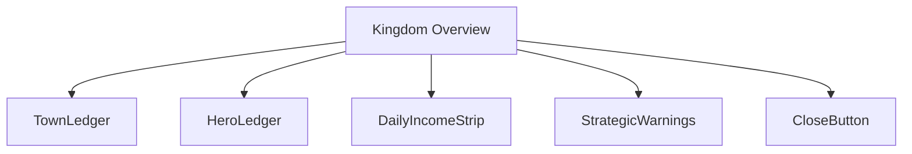
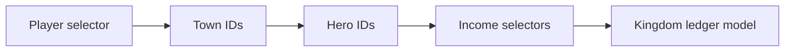
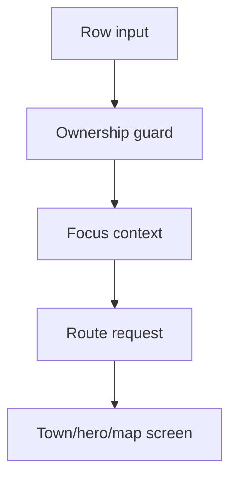
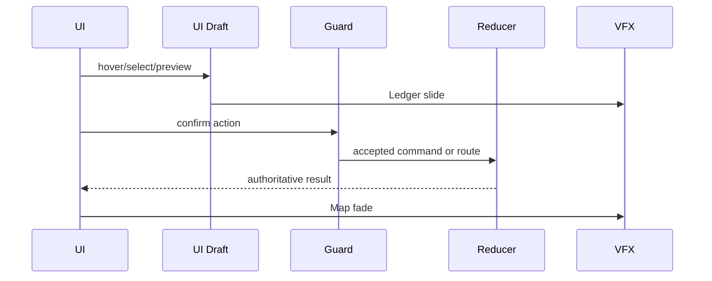
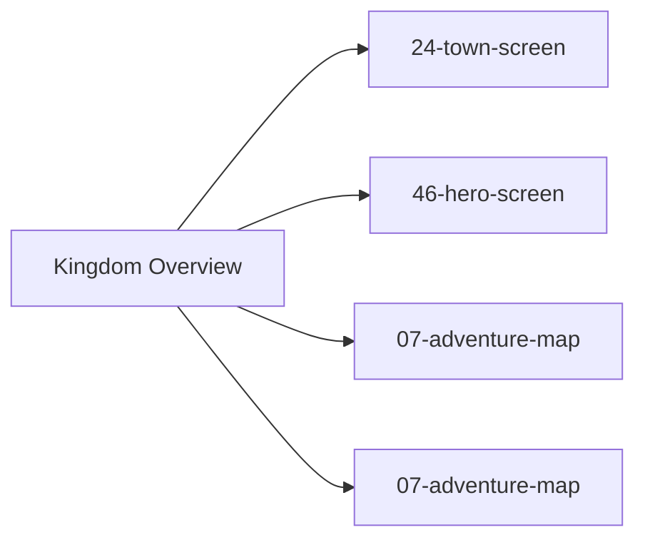

# Screen 08 Architecture: Kingdom Overview

System: adventure
Screen ID: kingdom-overview
Visual Archetype: curated-adventure-ledger
Curation Status: curated-pass-3

## Purpose
Adventure-layer kingdom ledger showing owned towns, heroes, daily income, movement status, and strategic warnings without changing gameplay state.

## Visual Direction
- Original internal UI contract. Do not use third-party captures,
  copied franchise art, or external product pixels as implementation input.

## Visual Composition

## Screen Load And Data Resolution

## Main Interaction Flow

## Animation Flow

## Outgoing Transitions

## State Inputs
- townRows -> state.players.active.townIds
- heroRows -> state.players.active.heroIds
- incomeTotals -> selectors.economy.dailyIncomeByResource
- selectedRow -> state.ui.kingdomOverview.selectedRowId
- warnings -> selectors.adventure.kingdomWarnings

## Implementation Contract
- Mockup defines visual regions and data hooks only.
- Spec defines the component/state contract.
- Interactions define controls, timing, command routing, disabled states, and error behavior.
- Data contracts define schemas, config, localization, asset, audio, VFX, save, and replay references.
- Diagrams are screen-specific summaries of the same contract and must not introduce hidden behavior.
